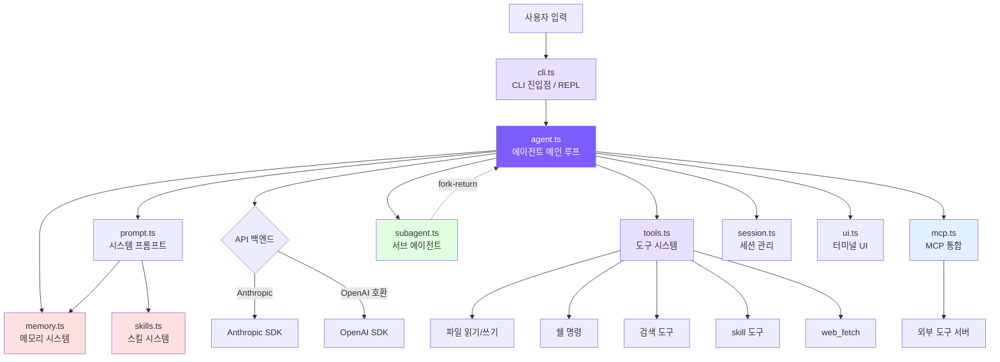

# 소개: 왜 Claude Code를 처음부터 만드는가?

## 챕터 목표

프로젝트의 포지셔닝, 기술 스택 선택, 전체 아키텍처를 이해합니다. 5분 안에 나만의 코딩 에이전트를 실행해 봅니다.

## 왜 처음부터 만드는가?

### AI 프로그래밍의 세 단계

AI 보조 프로그래밍은 대략 세 단계를 거쳐 왔습니다: **코드 완성** (Copilot) -> **채팅 어시스턴트** (Cursor Chat) -> **자율 에이전트** (Claude Code).

앞의 두 단계는 같은 한계를 공유합니다: **모델이 직접 행동할 수 없다**는 점입니다. 제안만 할 수 있을 뿐, 스스로 테스트를 실행하고 결과를 확인할 수 없습니다.

Claude Code는 질적인 도약입니다. "이 프로젝트에 사용자 등록 기능을 추가해줘"라고 말하면, 라우트 정의를 검색하고, 데이터베이스 모델을 읽고, 핸들러 파일을 생성하고, 라우트를 등록하고, 테스트를 작성하고, `npm test`를 실행하고, 실패를 확인하고, 수정하고, 다시 실행하는 과정을 모든 테스트가 통과할 때까지 수십 번 반복합니다.

이것이 바로 **통제된 도구-루프 에이전트**입니다: 모델이 의사결정자이고, 코드는 실행 환경에 불과합니다.

### 에이전트 우선이 의미하는 것

전통적인 프로그램에서는 코드 로직이 동작을 결정합니다. 모든 `if/else`는 프로그래머가 미리 작성합니다. 에이전트 아키텍처는 이를 역전시킵니다: **모델이 다음에 무엇을 할지 결정**하고, 코드는 루프 프레임워크와 도구만 제공합니다.

전체 시스템의 핵심은 `while (true)` 루프입니다:

```
while (true) {
    모델 호출 -> 모델이 응답 반환
    if (응답에 도구 호출 포함) -> 도구 실행 -> 결과를 모델에 피드백 -> 루프 계속
    if (응답이 텍스트만) -> 작업 완료, 루프 종료
}
```

**루프는 모델의 응답에 도구 호출이 없을 때만 종료됩니다** — 작업이 완료됐는지 판단하는 것은 코드 로직이 아닌 모델입니다.

### 소스 코드를 그냥 읽으면 안 되는 이유

Claude Code의 오픈소스 스냅샷은 TypeScript 50만 줄 규모입니다: 66개 이상의 도구, React/Ink TUI, MCP 프로토콜, OAuth 인증, 멀티 에이전트 시스템... 바로 뛰어들면 엣지 케이스와 추상화 레이어에 길을 잃기 쉽습니다.

우리의 접근법: **최소한의 필수 구성 요소만 유지**하여 핵심 기능(메모리, 스킬, 멀티 에이전트, 권한 규칙, 단계적 압축, 예산 제어, Plan Mode)을 약 3400줄의 코드로 재현하고, 각 단계를 실제 소스 코드와 대조하며 설명합니다. 자동차의 원리를 이해하기 위해 카트를 만드는 것과 같습니다 — 엔진, 핸들, 브레이크는 모두 있지만 에어컨과 오디오는 나중에.

## 핵심 개념 한눈에 보기

**에이전트 루프**: 생각-행동-관찰의 사이클. 요청을 받은 후 모델은 어떤 도구를 호출할지 결정합니다. 시스템이 도구를 실행하고 결과를 모델에 피드백하면, 모델은 도구 호출이 없을 때까지 계속 생각합니다.

**도구 시스템**: 도구는 에이전트와 실제 세계를 연결하는 다리입니다. 각 도구의 이름과 파라미터를 시스템 프롬프트에 설명합니다. 모델이 도구가 필요하면 구조화된 도구 호출 요청을 반환하고, 코드가 이를 실행하여 결과를 피드백합니다.

**컨텍스트 엔지니어링**: 모델의 성능은 전적으로 모델이 무엇을 보느냐에 달려 있습니다. 컨텍스트 창은 제한적(200K 토큰)이지만 복잡한 작업은 수십 번의 라운드를 필요로 할 수 있으므로 압축이 필요합니다. 우리는 4단계 압축을 구현합니다: 대용량 출력 트리밍 -> 도구 결과 요약 -> 모델의 전체 대화 요약. 각 단계는 이전 단계보다 적극적이며, 시스템은 가장 가벼운 방법으로 문제를 해결하려 합니다.

**시스템 프롬프트**: 모든 API 호출 전에 조립되는 첫 번째 메시지로, 모델에게 현재 운영 체제, 작업 디렉터리, Git 상태, 프로젝트 규칙(CLAUDE.md), 사용 가능한 도구 목록을 알려줍니다. 이 컨텍스트가 모델 의사결정의 품질에 직접 영향을 미칩니다.

**권한과 보안**: 임의의 쉘 명령을 실행할 수 있는 에이전트에는 안전 제어가 필요합니다. 우리는 "모든 것 허용"에서 "모든 것 사용자에게 묻기"까지 5가지 권한 모드를 구현합니다 — 쓰기 작업 전에 허용 여부를 확인하고, 위험한 작업은 사용자 확인을 요청합니다.

## 아키텍처 개요



메인 플로우는 명확합니다: **사용자 입력 -> CLI -> 에이전트 루프 -> 모델 결정 -> 도구 실행 -> 결과 피드백 -> 완료될 때까지 반복**

컴포넌트 역할:

- **`cli.ts`**: 커맨드라인 인수를 파싱하고 인터랙티브 REPL을 제공합니다
- **`agent.ts`**: 핵심 엔진(~1263줄). 메시지를 조립하고, API를 호출하고, 응답을 파싱하고, 도구를 실행하고, 컨텍스트를 압축하고, 예산을 제어합니다
- **`prompt.ts`**: 정적 프롬프트 템플릿과 동적 환경 정보(OS, 디렉터리, Git 상태, 메모리, 스킬)를 결합하여 시스템 프롬프트를 생성합니다
- **`tools.ts`**: 13개 도구의 정의 + 실행 로직 + 권한 확인 + 지연 로딩
- **`memory.ts` / `skills.ts`**: 메모리는 에이전트가 세션 간에 정보를 기억할 수 있게 합니다(시맨틱 회상 포함). 스킬은 재사용 가능한 액션 시퀀스를 제공합니다. 둘 다 시작 시 시스템 프롬프트에 주입됩니다
- **`subagent.ts`**: 작업이 단일 컨텍스트 창을 초과하면 서브 에이전트를 분기하여 하위 작업을 처리하고 결과를 반환합니다
- **`mcp.ts`**: MCP 프로토콜 클라이언트로, stdio를 통한 JSON-RPC로 외부 도구 서버에 연결합니다
- **`session.ts`**: 대화 기록을 디스크에 쓰고 `--resume`으로 복원을 지원합니다
- **`ui.ts`**: 터미널 색상 및 형식화된 출력

| 파일 | 줄 수 | 역할 |
|------|-------|------|
| `agent.ts` | ~1263 | 에이전트 메인 루프: 메시지 구성, API 호출, 도구 오케스트레이션, 스트리밍 실행, 서브 에이전트, 4단계 압축, 예산 제어, Plan Mode |
| `tools.ts` | ~850 | 도구 정의 + 실행: 13개 도구 + 5가지 권한 모드 + mtime 보호 + 지연 로딩 |
| `cli.ts` | ~371 | CLI 진입점, 인수 파싱, REPL 인터랙션 |
| `memory.ts` | ~325 | 메모리 시스템: 4가지 타입 + 파일 저장소 + 시맨틱 회상 + 비동기 프리페치 |
| `mcp.ts` | ~266 | MCP 클라이언트: stdio를 통한 JSON-RPC, 도구 검색 및 호출 전달 |
| `ui.ts` | ~211 | 터미널 출력: 색상, 형식 |
| `skills.ts` | ~175 | 스킬 시스템: 디렉터리 검색 + 프론트매터 파싱 + 인라인/포크 이중 모드 |
| `subagent.ts` | ~199 | 서브 에이전트 구성 (3가지 내장 + 커스텀 에이전트 검색) |
| `prompt.ts` | ~154 | 시스템 프롬프트 구성: 템플릿 + @include + 변수 치환 + 메모리/스킬 주입 |
| `session.ts` | ~63 | 세션 지속성: JSON 파일 저장 |
| `frontmatter.ts` | ~41 | YAML 프론트매터 파서 |
| `python/` | -- | 완전한 Python 구현 (`mini_claude/` 패키지, ~2920줄) |

## 기술 스택

TypeScript와 Python 버전이 각각 구현되어 있습니다 — 편한 것을 선택하면 됩니다.

<!-- tabs:start -->
#### **TypeScript**

```
TypeScript           -- 타입 안전성, Claude Code와 같은 언어
@anthropic-ai/sdk    -- Anthropic 공식 SDK
openai               -- OpenAI 호환 백엔드 지원
chalk                -- 터미널 색상 출력
glob                 -- 파일 패턴 매칭
```

#### **Python**

```
Python 3.11+         -- 간결하고 읽기 쉬움
anthropic            -- Anthropic 공식 SDK
openai               -- OpenAI 호환 백엔드 지원
```
<!-- tabs:end -->

프레임워크도, 빌드 툴체인도 없습니다 — 가장 기본적인 의존성만 사용합니다.

## 빠른 시작

<!-- tabs:start -->
#### **TypeScript**

```bash
git clone https://github.com/Windy3f3f3f3f/claude-code-from-scratch.git
cd claude-code-from-scratch
npm install
export ANTHROPIC_API_KEY=sk-ant-xxx
npm run dev
```

#### **Python**

```bash
git clone https://github.com/Windy3f3f3f3f/claude-code-from-scratch.git
cd claude-code-from-scratch/python
pip install -e .
export ANTHROPIC_API_KEY=sk-ant-xxx
mini-claude-py "hello"
```
<!-- tabs:end -->

시작 후:

```
  Mini Claude Code — A minimal coding agent

  Type your request, or 'exit' to quit.
  Commands: /clear /cost /compact /memory /skills /plan

>
```

`read src/agent.ts and explain the main loop`를 입력해 보세요.

### 기타 옵션

```bash
mini-claude --yolo "run all tests"          # 모든 확인 건너뜀
mini-claude --plan "analyze this codebase"  # 분석만, 수정 없음
mini-claude --accept-edits "refactor"       # 파일 편집 자동 승인
mini-claude --dont-ask "check style"        # 확인 필요한 작업 자동 거부
mini-claude --thinking "analyze this bug"   # Extended Thinking 활성화
mini-claude --resume                        # 마지막 세션 재개
mini-claude --max-cost 0.50 --max-turns 20  # 예산 제어
```

## 챕터 개요

| 챕터 | mini-claude 파일 | 대응하는 Claude Code 소스 |
|------|-----------------|--------------------------|
| **1단계: 동작하는 코딩 에이전트 만들기** | | |
| [1. 에이전트 루프](/en/docs/01-agent-loop.md) | `agent.ts`의 `chatAnthropic()` | `src/query.ts`의 `queryLoop` |
| [2. 도구 시스템](/en/docs/02-tools.md) | `tools.ts` | `src/Tool.ts` + `src/tools/` (66개 이상 도구) |
| [3. 시스템 프롬프트](/en/docs/03-system-prompt.md) | `prompt.ts` | `src/constants/prompts.ts` |
| [4. CLI와 세션](/en/docs/04-cli-session.md) | `cli.ts` + `session.ts` | `src/entrypoints/cli.tsx` |
| [5. 스트리밍 출력](/en/docs/05-streaming.md) | `agent.ts`의 두 스트림 메서드 | `src/services/api/claude.ts` |
| [6. 권한과 보안](/en/docs/06-permissions.md) | `tools.ts`의 `checkPermission()` + 규칙 설정 | `src/utils/permissions/` (52KB) |
| [7. 컨텍스트 관리](/en/docs/07-context.md) | `agent.ts`의 `checkAndCompact()` | `src/services/compact/` |
| **2단계: 고급 기능** | | |
| [8. 메모리 시스템](/en/docs/08-memory.md) | `memory.ts` | `src/utils/memory.ts` |
| [9. 스킬 시스템](/en/docs/09-skills.md) | `skills.ts` | `src/utils/skills.ts` + `src/tools/SkillTool/` |
| [10. Plan Mode](/en/docs/10-plan-mode.md) | `agent.ts` + `tools.ts` + `cli.ts` | `EnterPlanMode` / `ExitPlanMode` |
| [11. 멀티 에이전트](/en/docs/11-multi-agent.md) | `subagent.ts` + `agent.ts` | `src/tools/AgentTool/` |
| [12. MCP 통합](/en/docs/12-mcp.md) | `mcp.ts` | `src/services/mcpClient.ts` |
| [13. 아키텍처 비교](/en/docs/13-whats-next.md) | 전체 비교 | 전체 비교 |

---

> **다음 챕터**: 가장 중요한 부분부터 시작합니다 — 전체 코딩 에이전트의 심장인 에이전트 루프.
