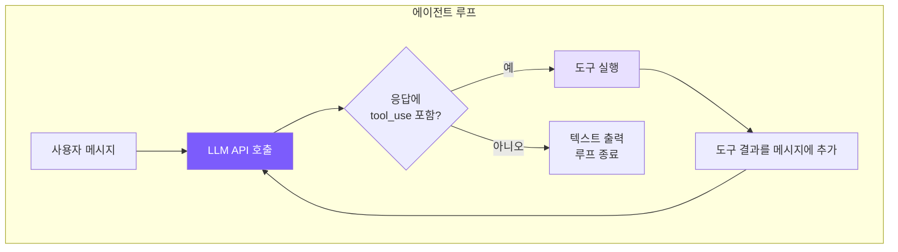

# 1. 에이전트 루프 — 핵심 사이클

## 챕터 목표

코딩 에이전트의 핵심을 구현합니다: LLM을 지속적으로 호출하고 -> 도구 실행이 필요한지 확인하고 -> 도구를 실행하고 -> 결과를 LLM에 피드백하고 -> LLM이 작업이 완료됐다고 판단할 때까지 반복하는 while 루프.



## Claude Code의 구현 방식

### 2계층 아키텍처

Claude Code는 에이전트 루프를 두 계층으로 분리합니다:

- **QueryEngine** (~1155줄): 세션 레벨로, 전체 대화 생명주기를 관리합니다 — 사용자 입력 처리, USD 예산 확인, 토큰 계산, 세션 복구
- **queryLoop** (~1728줄): 단일 턴 레벨로, 하나의 쿼리 실행을 관리합니다 — 메시지 압축, API 호출, 도구 실행, 오류 복구

이 분리의 장점은 관심사 분리입니다: QueryEngine은 "PTL 오류를 어떻게 복구하는가"를 알 필요가 없고, queryLoop는 "사용자 입력을 어떻게 파싱하는가"를 알 필요가 없습니다.

### queryLoop: 비동기 제너레이터

queryLoop의 시그니처는 `async function*`입니다 — 비동기 제너레이터입니다. 콜백/이벤트 대신 이것을 선택한 이유:

1. **백프레셔 제어**: 컨슈머가 처리를 완료할 때까지 프로듀서가 계속 진행하지 않아 자연스럽게 이벤트 누적을 방지합니다
2. **선형 제어 흐름**: 모든 루프 분기가 단순한 `continue` / `break`로 표현되어 상태 머신이 필요 없습니다

### 7가지 계속 이유

루프에는 7가지 계속 지점이 있으며, 각각 7가지 다른 시나리오에 대응합니다:

| # | 이름 | 트리거 시나리오 | 처리 전략 |
|---|------|---------------|-----------|
| 1 | `next_turn` | 모델이 도구를 호출함 | 도구 실행, 결과를 메시지에 추가, 계속 |
| 2 | `collapse_drain_retry` | PTL 오류, 보류 중인 축소 작업 | 축소를 커밋하여 공간 확보, 재시도 |
| 3 | `reactive_compact_retry` | PTL 오류, 축소 공간 부족 | 전체 요약 압축 강제 실행, 재시도 |
| 4 | `max_output_tokens_escalate` | 출력 토큰 잘림, 첫 번째 발생 | 더 높은 토큰 한도로 에스컬레이션(16K->64K), 재시도 |
| 5 | `max_output_tokens_recovery` | 출력 토큰 잘림, 에스컬레이션 불가 | 계속 프롬프트 주입, 최대 3번 재시도 |
| 6 | `stop_hook_blocking` | 작업 완료 후 Stop Hook이 차단 | 실행 루프 계속 |
| 7 | `token_budget_continuation` | API 측 토큰 예산 소진 | 생성 계속 |

우리의 단순화된 구현은 케이스 1만 처리합니다: tool_use가 있으면 계속, 없으면 종료.

### 오류 보류 전략

이 설계는 특별히 주목할 만합니다: **복구 가능한 오류는 즉시 상위 계층에 노출되지 않습니다**.

출력 토큰이 잘렸을 때 바로 오류를 QueryEngine에 전달하면 UI에 오류가 표시되겠지만, 사실 queryLoop의 후속 복구 로직이 이를 자동으로 처리할 수 있습니다. 그래서 Claude Code의 접근법은 먼저 오류를 "보류"하고 복구 로직을 실행한 뒤, 성공하면 사용자는 아무것도 알아채지 못합니다. 복구에 실패한 경우에만 오류가 노출됩니다. 대부분의 `max_output_tokens`와 `prompt_too_long` 오류는 이렇게 자동으로 처리됩니다.

### 병렬 도구 실행

Claude Code는 `StreamingToolExecutor`를 사용하여 API 스트리밍 응답 중에 도구를 병렬로 실행합니다:

```
직렬 실행 (우리 구현):
  [========= API 스트리밍 응답 =========][tool1][tool2][tool3]

병렬 실행 (Claude Code):
  [========= API 스트리밍 응답 =========]
       ^ tool1의 JSON 완성 -> 즉시 실행
            ^ tool2의 JSON 완성 -> 즉시 실행
```

일반적인 API 응답의 스트리밍 창은 5~30초이며, 이 동안 여러 도구가 동시에 완료될 수 있습니다.

## 우리의 구현

두 계층 아키텍처를 단일 `Agent` 클래스로 통합하고, `chatAnthropic()`을 핵심 메서드로 사용합니다:

<!-- tabs:start -->
#### **TypeScript**
```typescript
// agent.ts -- chatAnthropic 메서드 (핵심 에이전트 루프)

private async chatAnthropic(userMessage: string): Promise<void> {
  this.anthropicMessages.push({ role: "user", content: userMessage });
  // 턴 경계에서 자동 압축 트리거: 마지막 메시지가 이제
  // 일반 사용자 텍스트이므로 compactAnthropic의 slice(0, -1)이
  // tool_use <-> tool_result 쌍을 끊지 않습니다 (7장 참고).
  await this.checkAndCompact();

  while (true) {
    if (this.abortController?.signal.aborted) break;

    const response = await this.callAnthropicStream();

    // 토큰 사용량 누적
    this.totalInputTokens += response.usage.input_tokens;
    this.totalOutputTokens += response.usage.output_tokens;
    this.lastInputTokenCount = response.usage.input_tokens;

    // tool_use 블록 추출
    const toolUses: Anthropic.ToolUseBlock[] = [];
    for (const block of response.content) {
      if (block.type === "tool_use") toolUses.push(block);
    }

    // 어시스턴트 응답을 기록에 추가
    this.anthropicMessages.push({ role: "assistant", content: response.content });

    // 도구 호출 없음 -> 작업 완료
    if (toolUses.length === 0) {
      printCost(this.totalInputTokens, this.totalOutputTokens);
      break;
    }

    // 각 도구를 직렬로 실행
    const toolResults: Anthropic.ToolResultBlockParam[] = [];
    for (const toolUse of toolUses) {
      if (this.abortController?.signal.aborted) break;

      const input = toolUse.input as Record<string, any>;
      printToolCall(toolUse.name, input);

      // 권한 확인 (6장 참고)
      const perm = checkPermission(toolUse.name, input, this.permissionMode, this.planFilePath);
      if (perm.action === "deny") {
        toolResults.push({ type: "tool_result", tool_use_id: toolUse.id,
          content: `Action denied: ${perm.message}` });
        continue;
      }
      if (perm.action === "confirm" && perm.message && !this.confirmedPaths.has(perm.message)) {
        const confirmed = await this.confirmDangerous(perm.message);
        if (!confirmed) {
          toolResults.push({ type: "tool_result", tool_use_id: toolUse.id,
            content: "User denied this action." });
          continue;
        }
        this.confirmedPaths.add(perm.message);
      }

      const result = await executeTool(toolUse.name, input);
      printToolResult(toolUse.name, result);
      toolResults.push({ type: "tool_result", tool_use_id: toolUse.id, content: result });
    }

    // 도구 결과를 사용자 메시지로 추가 (Anthropic API 요구사항)
    this.anthropicMessages.push({ role: "user", content: toolResults });
  }
}
```
#### **Python**
```python
# agent.py -- _chat_anthropic 메서드 (핵심 에이전트 루프)

async def _chat_anthropic(self, user_message: str) -> None:
    self._anthropic_messages.append({"role": "user", "content": user_message})
    # 턴 경계에서 자동 압축 트리거: 마지막 메시지가 이제
    # 일반 사용자 텍스트이므로 _compact_anthropic의 [:-1]이
    # tool_use <-> tool_result 쌍을 끊지 않습니다 (7장 참고).
    await self._check_and_compact()

    while True:
        if self._aborted:
            break

        self._run_compression_pipeline()
        response = await self._call_anthropic_stream()

        self.total_input_tokens += response.usage.input_tokens
        self.total_output_tokens += response.usage.output_tokens
        self.last_input_token_count = response.usage.input_tokens

        tool_uses = [b for b in response.content if b.type == "tool_use"]

        self._anthropic_messages.append({
            "role": "assistant",
            "content": [self._block_to_dict(b) for b in response.content],
        })

        if not tool_uses:
            if not self.is_sub_agent:
                print_cost(self.total_input_tokens, self.total_output_tokens)
            break

        tool_results = []
        for tu in tool_uses:
            if self._aborted:
                break
            inp = dict(tu.input) if hasattr(tu.input, 'items') else tu.input
            print_tool_call(tu.name, inp)

            # 권한 확인 (6장 참고)
            perm = check_permission(tu.name, inp, self.permission_mode, self._plan_file_path)
            if perm["action"] == "deny":
                tool_results.append({"type": "tool_result", "tool_use_id": tu.id,
                                     "content": f"Action denied: {perm.get('message', '')}"})
                continue
            if perm["action"] == "confirm" and perm.get("message") \
               and perm["message"] not in self._confirmed_paths:
                confirmed = await self._confirm_dangerous(perm["message"])
                if not confirmed:
                    tool_results.append({"type": "tool_result", "tool_use_id": tu.id,
                                         "content": "User denied this action."})
                    continue
                self._confirmed_paths.add(perm["message"])

            result = await self._execute_tool_call(tu.name, inp)
            print_tool_result(tu.name, result)
            tool_results.append({"type": "tool_result", "tool_use_id": tu.id, "content": result})

        self._anthropic_messages.append({"role": "user", "content": tool_results})
```
<!-- tabs:end -->

### 메시지 배열이 성장하는 방식

에이전트 루프를 이해하는 핵심은 메시지 배열이 어떻게 성장하는지 파악하는 것입니다.

```
턴 1:
  messages = [
    { role: "user",      content: "버그 수정 도와줘" }
    { role: "assistant", content: [텍스트 + tool_use(read_file)] }
    { role: "user",      content: [tool_result("파일 내용...")] }
  ]

턴 2 (LLM이 파일 내용을 보고 편집을 결정):
  messages = [
    ...첫 3개 메시지,
    { role: "assistant", content: [텍스트 + tool_use(edit_file)] }
    { role: "user",      content: [tool_result("편집 성공")] }
  ]

턴 3 (LLM이 작업 완료로 판단):
  messages = [
    ...첫 5개 메시지,
    { role: "assistant", content: [text("수정됐습니다!")] }  <- tool_use 없음 -> break
  ]
```

각 루프 반복은 배열에 메시지를 두 개씩 추가합니다: 어시스턴트 메시지 하나, 사용자 메시지 하나(도구 결과). 모델은 매번 전체 기록을 보기 때문에 이전에 무엇을 했는지 "기억"할 수 있습니다. Anthropic API 프로토콜 요구사항에 따라 도구 결과는 `role: "user"`로 추가되며, `tool_use_id`를 통해 결과와 해당 호출을 연결해야 합니다.

### AbortController: 우아한 중단

<!-- tabs:start -->
#### **TypeScript**
```typescript
async chat(userMessage: string): Promise<void> {
  this.abortController = new AbortController();
  try {
    await this.chatAnthropic(userMessage);
  } finally {
    this.abortController = null;
  }
  printDivider();
  this.autoSave();
}

abort() {
  this.abortController?.abort();
}
```
#### **Python**
```python
async def chat(self, user_message: str) -> None:
    self._aborted = False
    try:
        if self.use_openai:
            await self._chat_openai(user_message)
        else:
            await self._chat_anthropic(user_message)
    finally:
        pass
    if not self.is_sub_agent:
        print_divider()
        self._auto_save()

def abort(self) -> None:
    self._aborted = True
```
<!-- tabs:end -->

`AbortController`는 표준 중단 메커니즘입니다: `abort()`가 호출되면 신호가 `aborted` 상태가 되고, 다음 체크포인트에서 루프가 종료됩니다. 신호는 API 호출에도 전달되어 네트워크 요청도 취소될 수 있습니다.

---

> **다음 챕터**: 루프를 구동하는 것은 도구입니다 — 도구 없이 LLM은 그저 챗봇에 불과합니다. 도구 시스템 구현을 살펴봅니다.
