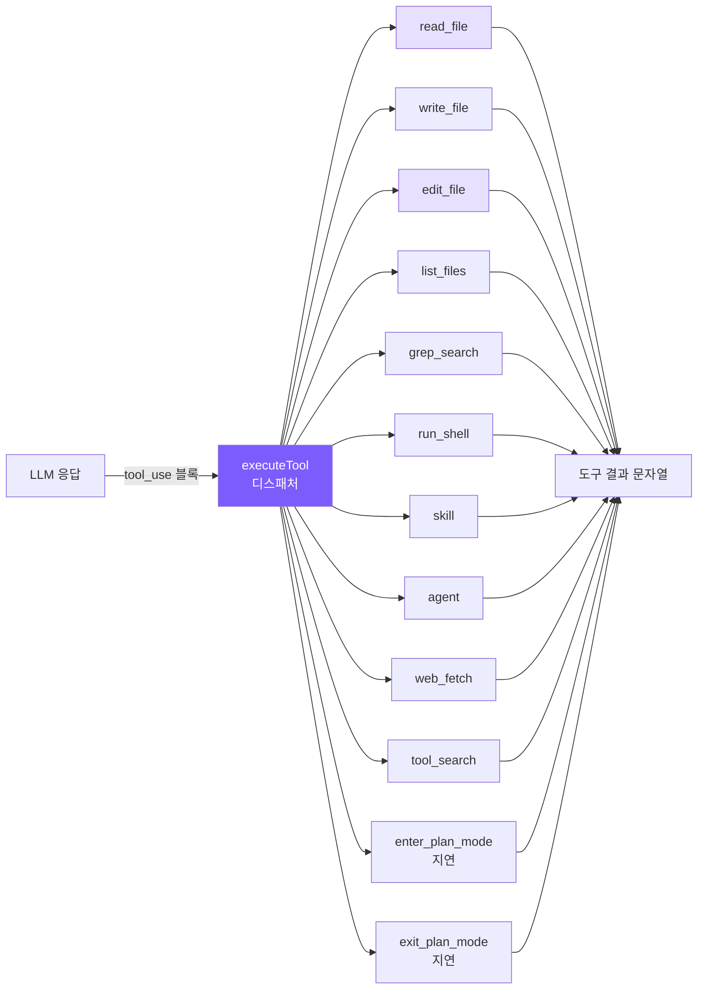
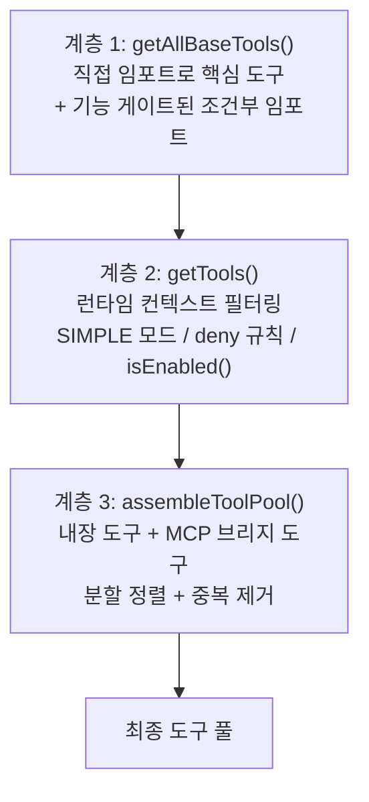
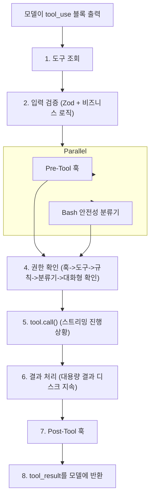

# 2. 도구 시스템

## 챕터 목표

6개의 핵심 도구(파일 읽기, 파일 쓰기, 파일 편집, 파일 목록, 검색, 쉘) + 5개의 확장 도구(skill, agent, web_fetch, tool_search, plan mode)를 정의하여 LLM이 실제로 코드베이스를 조작할 수 있게 합니다. 편집 안전장치(읽기 후 편집 + mtime 확인)와 지연 도구(지연 로딩) 메커니즘을 구현합니다.



## Claude Code의 구현 방식

### 도구 인터페이스 — 각 도구의 완전한 계약

Claude Code의 모든 도구는 통일된 `Tool` 제네릭 인터페이스를 따릅니다 — 단순한 함수 시그니처가 아닌 완전한 동작 계약입니다:

```typescript
type Tool<Input, Output, P extends ToolProgressData> = {
  name: string
  aliases?: string[]              // 원활한 마이그레이션을 위한 deprecated 별칭
  maxResultSizeChars: number      // 초과 시 디스크에 지속

  call(args, context, canUseTool, parentMessage, onProgress?): Promise<ToolResult<Output>>

  description(input, options): Promise<string>  // API에 전송되는 도구 설명
  prompt(options): Promise<string>              // 시스템 프롬프트에 주입되는 사용 가이드

  inputSchema: Input              // Zod Schema (런타임 검증 + 타입 추론)
  inputJSONSchema?: ToolInputJSONSchema

  isConcurrencySafe(input): boolean   // 입력을 받음: 같은 도구도 인수에 따라 다른 안전 의미론 가능
  isReadOnly(input): boolean
  isDestructive?(input): boolean
  checkPermissions(input, context): Promise<PermissionResult>

  renderToolUseMessage(input, options): React.ReactNode  // 각 도구가 자체 렌더링
  renderToolResultMessage?(content, progress, options): React.ReactNode
}
```

몇 가지 주목할 설계 포인트:

**`isConcurrencySafe(input)`이 파라미터를 받습니다** — 같은 도구도 다른 입력에 대해 다른 안전 의미론을 가질 수 있습니다. BashTool은 `ls`에는 `isReadOnly: true`를, `rm`에는 `false`를 반환합니다. 전체 도구에 레이블을 붙이는 것보다 훨씬 정밀합니다.

**`prompt()` 메서드** — 각 도구가 자체 사용 가이드를 시스템 프롬프트에 주입할 수 있습니다. FileEditTool은 "정확한 매칭" 규칙을, BashTool은 안전 실행 알림을 주입합니다. 도구 동작 지침이 도구 정의와 긴밀하게 결합되어 전역 프롬프트 파일에 분산되지 않습니다.

**렌더링 메서드** — 각 도구가 자체 렌더링 로직을 보유하므로 새 도구를 추가할 때 전역 렌더링 코드를 수정할 필요가 없습니다.

### buildTool 팩토리 — 안전 폐쇄 기본값

```typescript
const TOOL_DEFAULTS = {
  isConcurrencySafe: () => false,    // 기본값은 동시성 안전하지 않음
  isReadOnly: () => false,           // 기본값은 쓰기 사이드 이펙트 있음
  isDestructive: () => false,
  checkPermissions: () => ({ behavior: 'allow', updatedInput }),
}
```

이것은 **안전 폐쇄** 설계입니다: "읽기 전용" 도구를 "비읽기 전용"으로 잘못 표시하면 불필요한 권한 프롬프트가 발생합니다(성가시지만 안전합니다). 반대 오류 — "쓰기" 도구를 "읽기 전용"으로 잘못 표시하면 권한 확인 없이 동시 실행될 수 있습니다(위험하고 파악하기 어렵습니다). 기본값은 안전한 방향으로만 갈 수 있습니다.

### 도구 등록 — 3계층 파이프라인



계층 1의 기능 게이트된 도구는 조건부 `require()`를 통해 로드됩니다:

```typescript
const SleepTool = feature('PROACTIVE') || feature('KAIROS')
  ? require('./tools/SleepTool/SleepTool.js').SleepTool
  : null
```

`feature()`는 Bun 번들러용 컴파일 타임 매크로입니다. 외부 빌드에서는 `false`로 평가되어 전체 `require()`가 데드 코드로 제거됩니다 — 내부 도구는 외부 바이너리에 물리적으로 존재하지 않습니다.

계층 3의 분할 정렬: 내장 도구가 알파벳 순서로 먼저 오고, MCP 도구가 그 다음에 추가되며 전역 정렬은 없습니다. 이유는 API 서버가 마지막 내장 도구 뒤에 캐시 중단점을 설정하므로, 분할하면 MCP 도구 추가가 내장 도구의 캐시 적중에 영향을 주지 않습니다.

### 도구 실행 생명주기 — 8단계



주목할 만한 단계들:

**2단계 2단계 검증**: 1단계는 Zod Schema(필드 타입), 2단계는 비즈니스 로직(예: FileEditTool은 old_string의 유일성 확인). 분리하면 비용이 낮은 검사가 먼저 실행되어 불필요한 디스크 I/O를 줄입니다.

**3단계 병렬 시작**: Pre-Tool 훅과 Bash 분류기가 동시에 시작되어 각각 수십에서 수백 밀리초가 걸립니다. 병렬화로 총 권한 확인 지연이 줄어듭니다.

**6단계 대용량 결과 처리**: 결과가 `maxResultSizeChars`를 초과하면 전체 내용이 `~/claude-code/tool-results/`에 저장되고, 모델은 파일 경로 + 잘림 표시를 받습니다. 필요 시 FileReadTool로 내용을 직접 가져올 수 있습니다.

> **핵심 설계 철학: 오류는 예외가 아닌 데이터입니다.** 어느 단계에서든 오류는 `is_error: true`를 포함한 `tool_result`로 변환되어 모델에 반환되고, 모델이 스스로 수정합니다.

### 동시성 제어

```typescript
private canExecuteTool(isConcurrencySafe: boolean): boolean {
  const executingTools = this.tools.filter(t => t.status === 'executing')
  return (
    executingTools.length === 0 ||
    (isConcurrencySafe && executingTools.every(t => t.isConcurrencySafe))
  )
}
```

규칙은 간단합니다: 동시성 안전하지 않은 도구는 단독으로 실행해야 하고, 동시성 안전한 도구는 여러 개가 동시에 실행될 수 있습니다. `StreamingToolExecutor`는 모델이 모든 tool_use 블록 출력을 완료할 때까지 기다리지 않습니다 — 완전한 블록이 감지되는 즉시 실행을 시작합니다. 도구 실행 지연은 약 1초이고, 모델 스트리밍 출력은 5~30초이므로 대부분의 도구가 스트리밍 창 내에서 완전히 숨겨질 수 있습니다.

동시성 한도: `MAX_TOOL_USE_CONCURRENCY = 10`.

### edit_file의 핵심 설계

FileEditTool은 실행 전 14단계의 검증을 거칩니다(I/O 비용 순서로 정렬: 인메모리 상태를 먼저 확인한 후 디스크 접근). 세 가지가 가장 중요합니다:

**읽기 선행 조건 확인**: 프롬프트 제안이 아닌 코드 레벨의 하드 제약입니다. 파일을 먼저 읽지 않으면 실행이 거부되어 모델이 오래된 메모리가 아닌 파일의 현재 상태를 기반으로 편집하게 합니다.

**외부 수정 감지**: mtime을 사용하여 파일이 읽힌 후 외부에서 수정됐는지 감지합니다(예: 사용자가 IDE에서 같은 파일을 편집한 경우). 실제 경쟁 조건을 해결합니다.

**설정 파일 보호**: `.claude/settings.json` 같은 파일에 대해 편집을 시뮬레이션하고 JSON Schema 검증을 실행하여 합리적으로 보이는 편집이 설정 형식을 손상시키는 것을 방지합니다.

### 검색-대체 방식을 선택한 이유

검색-대체 방식으로 정착하기 전에 여러 대안을 검토했습니다:

| 방식 | 치명적 결함 |
|------|-----------|
| 줄 번호 편집 | 위치 의존적: 첫 번째에 3줄을 삽입하면 모든 후속 줄 번호가 이동하여 다단계 편집 시 복잡한 재계산 필요 |
| AST 편집 | 구문 오류가 있는 파일이 가장 편집이 필요한 경우인데, AST 파서는 구문 오류에서 실패 |
| 통합 diff | LLM은 엄격한 형식 생성에 성능이 낮음: 헌크 헤더 줄 번호, `+`/`-`/공백 접두사에 오류가 있으면 패치 적용 불가 |
| 전체 파일 재작성 | 대용량 파일에서 토큰 낭비; 모델이 변경되지 않은 코드를 생략할 수 있음; 사용자가 빠르게 검토할 수 없음 |
| **문자열 교체** | 위의 결함 없음 |

검색-대체의 가장 과소평가된 장점은 **환각 안전성**입니다: 모델이 파일에 존재하지 않는 문자열을 제공하면 도구가 단순히 실패하고, 모델은 파일을 다시 읽어 기억을 수정합니다. 전체 파일 재작성은 잘못된 내용을 파일에 자동으로 쓸 수 있습니다.

## 우리의 단순화 결정

| Claude Code의 설계 | 우리의 단순화 | 이유 |
|------------------|-------------|------|
| 66개 이상 도구 클래스, 각자 디렉터리 | 1개 파일 + 6개 함수 | 튜토리얼에 산업 수준의 모듈화 불필요 |
| 8단계 생명주기 | 직접 switch 디스패치 + 실행 | 훅, 권한 확인, 분류기 생략 |
| StreamingToolExecutor 동시성 | 하나씩 직렬 실행 | 동시성 복잡도 회피 |
| 14단계 검증 파이프라인 | 유일성 확인 + 따옴표 허용 | 가장 중요한 2가지 검증만 유지 |
| 3단계 대용량 결과 한도 | 단일 50K 잘림 계층 | 컨텍스트 폭발 방지에 충분 |
| MCP 7가지 전송 + OAuth | MCP 지원 없음 | 튜토리얼은 핵심 개념에 집중 |

핵심 원칙: **설계 철학은 보존하고, 엔지니어링 복잡도는 제거합니다**.

## 우리의 구현

### 도구 정의: 정적 배열

<!-- tabs:start -->
#### **TypeScript**
```typescript
// tools.ts -- 도구 정의 (Anthropic Tool 스키마 형식)

export const toolDefinitions: ToolDef[] = [
  {
    name: "read_file",
    description: "Read the contents of a file. Returns the file content with line numbers.",
    input_schema: {
      type: "object",
      properties: {
        file_path: { type: "string", description: "The path to the file to read" },
      },
      required: ["file_path"],
    },
  },
  {
    name: "write_file",
    description: "Write content to a file. Creates the file if it doesn't exist, overwrites if it does.",
    input_schema: {
      type: "object",
      properties: {
        file_path: { type: "string", description: "The path to the file to write" },
        content: { type: "string", description: "The content to write to the file" },
      },
      required: ["file_path", "content"],
    },
  },
  {
    name: "edit_file",
    description: "Edit a file by replacing an exact string match with new content. The old_string must match exactly.",
    input_schema: {
      type: "object",
      properties: {
        file_path: { type: "string", description: "The path to the file to edit" },
        old_string: { type: "string", description: "The exact string to find and replace" },
        new_string: { type: "string", description: "The string to replace it with" },
      },
      required: ["file_path", "old_string", "new_string"],
    },
  },
  // ... list_files, grep_search, run_shell
];
```
#### **Python**
```python
# tools.py -- 도구 정의 (Anthropic Tool 스키마 형식)

tool_definitions: list[ToolDef] = [
    {
        "name": "read_file",
        "description": "Read the contents of a file. Returns the file content with line numbers.",
        "input_schema": {
            "type": "object",
            "properties": {
                "file_path": {"type": "string", "description": "The path to the file to read"},
            },
            "required": ["file_path"],
        },
    },
    # ... write_file, edit_file, list_files, grep_search, run_shell
]
```
<!-- tabs:end -->

이 정의들은 Anthropic API의 `tools` 파라미터에 직접 전달됩니다 — 형식이 동일하여 변환이 필요 없습니다.

**클래스 대신 정적 배열을 사용하는 이유?** Claude Code는 66개 이상의 도구에 상속, 다형성, 독립적인 테스트가 필요하기 때문에 클래스 계층을 사용합니다. 6개 도구에는 배열 + switch 문으로 충분합니다 — 단순함 자체가 가치입니다.

### 도구 실행: Switch 디스패처

<!-- tabs:start -->
#### **TypeScript**
```typescript
export async function executeTool(
  name: string,
  input: Record<string, any>
): Promise<string> {
  let result: string;
  switch (name) {
    case "read_file":   result = readFile(input as { file_path: string }); break;
    case "write_file":  result = writeFile(input as { file_path: string; content: string }); break;
    case "edit_file":   result = editFile(input as { file_path: string; old_string: string; new_string: string }); break;
    case "list_files":  result = await listFiles(input as { pattern: string; path?: string }); break;
    case "grep_search": result = grepSearch(input as { pattern: string; path?: string; include?: string }); break;
    case "run_shell":   result = runShell(input as { command: string; timeout?: number }); break;
    default: return `Unknown tool: ${name}`;
  }
  return truncateResult(result);  // <- 50K 문자 보호
}
```
#### **Python**
```python
async def execute_tool(name: str, inp: dict) -> str:
    handlers = {
        "read_file": _read_file,
        "write_file": _write_file,
        "edit_file": _edit_file,
        "list_files": _list_files,
        "grep_search": _grep_search,
        "run_shell": _run_shell,
    }
    handler = handlers.get(name)
    if not handler:
        return f"Unknown tool: {name}"
    return _truncate_result(handler(inp))
```
<!-- tabs:end -->

`default` 분기는 예외를 던지는 대신 `Unknown tool: ${name}`을 반환합니다 — "오류는 데이터" 설계를 구현하여 모델이 환각으로 만든 도구 이름을 스스로 수정할 수 있게 합니다.

### 도구별 상세 설명

#### read_file

<!-- tabs:start -->
#### **TypeScript**
```typescript
function readFile(input: { file_path: string }): string {
  try {
    const content = readFileSync(input.file_path, "utf-8");
    const lines = content.split("\n");
    const numbered = lines
      .map((line, i) => `${String(i + 1).padStart(4)} | ${line}`)
      .join("\n");
    return numbered;
  } catch (e: any) {
    return `Error reading file: ${e.message}`;
  }
}
```
#### **Python**
```python
def _read_file(inp: dict) -> str:
    try:
        content = Path(inp["file_path"]).read_text()
        lines = content.split("\n")
        numbered = "\n".join(f"{i+1:4d} | {line}" for i, line in enumerate(lines))
        return numbered
    except Exception as e:
        return f"Error reading file: {e}"
```
<!-- tabs:end -->

줄 번호를 추가하여 LLM이 코드 위치를 파악할 수 있게 합니다. 다만 `edit_file`은 줄 번호가 아닌 실제 내용 문자열로 매칭합니다.

#### edit_file — 가장 중요한 도구

<!-- tabs:start -->
#### **TypeScript**
```typescript
function editFile(input: {
  file_path: string;
  old_string: string;
  new_string: string;
}): string {
  try {
    const content = readFileSync(input.file_path, "utf-8");

    // 유일성 확인
    const count = content.split(input.old_string).length - 1;
    if (count === 0)
      return `Error: old_string not found in ${input.file_path}`;
    if (count > 1)
      return `Error: old_string found ${count} times. Must be unique.`;

    const newContent = content.replace(input.old_string, input.new_string);
    writeFileSync(input.file_path, newContent);
    return `Successfully edited ${input.file_path}`;
  } catch (e: any) {
    return `Error editing file: ${e.message}`;
  }
}
```
#### **Python**
```python
def _edit_file(inp: dict) -> str:
    try:
        path = Path(inp["file_path"])
        content = path.read_text()

        # 따옴표 허용 매칭
        actual = _find_actual_string(content, inp["old_string"])
        if not actual:
            return f"Error: old_string not found in {inp['file_path']}"

        count = content.count(actual)
        if count > 1:
            return f"Error: old_string found {count} times in {inp['file_path']}. Must be unique."

        new_content = content.replace(actual, inp["new_string"], 1)
        path.write_text(new_content)

        diff = _generate_diff(content, actual, inp["new_string"])
        quote_note = " (matched via quote normalization)" if actual != inp["old_string"] else ""
        return f"Successfully edited {inp['file_path']}{quote_note}\n\n{diff}"
    except Exception as e:
        return f"Error editing file: {e}"
```
<!-- tabs:end -->

유일성 확인이 핵심입니다: 0개는 모델의 파일 내용 기억이 틀렸음을 의미하고(환각 감지), 1개 초과는 모델이 편집 지점을 유일하게 식별할 더 많은 컨텍스트를 제공해야 한다는 의미입니다. "추측보다는 실패가 낫다" — 첫 번째 매칭을 자동으로 교체하는 것은 실패를 보고하는 것보다 훨씬 위험합니다.

#### 따옴표 허용 + diff 출력

LLM 토크나이제이션이 직선 따옴표를 곱슬 따옴표로 매핑할 수 있습니다(`"` -> `"`). 허용 메커니즘 없이는 이런 편집이 100% 실패합니다.

<!-- tabs:start -->
#### **TypeScript**
```typescript
function normalizeQuotes(s: string): string {
  return s
    .replace(/[‘’′]/g, "'")   // 곱슬 단따옴표 -> 직선
    .replace(/[“”″]/g, '"');   // 곱슬 쌍따옴표 -> 직선
}

function findActualString(fileContent: string, searchString: string): string | null {
  if (fileContent.includes(searchString)) return searchString;
  const normSearch = normalizeQuotes(searchString);
  const normFile = normalizeQuotes(fileContent);
  const idx = normFile.indexOf(normSearch);
  if (idx !== -1) return fileContent.substring(idx, idx + searchString.length);
  return null;
}
```
#### **Python**
```python
def _normalize_quotes(s: str) -> str:
    s = re.sub("[‘’′]", "'", s)
    s = re.sub('[“”″]', '"', s)
    return s

def _find_actual_string(file_content: str, search_string: str) -> str | None:
    if search_string in file_content:
        return search_string
    norm_search = _normalize_quotes(search_string)
    norm_file = _normalize_quotes(file_content)
    idx = norm_file.find(norm_search)
    if idx != -1:
        return file_content[idx:idx + len(search_string)]
    return None
```
<!-- tabs:end -->

핵심 세부사항: 매칭 성공 후 정규화된 버전이 아닌 **파일의 원본 문자열**을 반환하여 교체 시 파일의 원래 문자 스타일을 보존합니다.

편집 성공 후 간단한 diff가 생성됩니다. 줄 번호는 `old_string` 앞의 `\n` 문자를 세어 계산됩니다:

```
Successfully edited src/app.ts (matched via quote normalization)

@@ -15,1 +15,1 @@
- const msg = "hello";
+ const msg = "world";
```

#### write_file

<!-- tabs:start -->
#### **TypeScript**
```typescript
function writeFile(input: { file_path: string; content: string }): string {
  try {
    const dir = dirname(input.file_path);
    if (!existsSync(dir)) mkdirSync(dir, { recursive: true });
    writeFileSync(input.file_path, input.content);
    return `Successfully wrote to ${input.file_path}`;
  } catch (e: any) {
    return `Error writing file: ${e.message}`;
  }
}
```
#### **Python**
```python
def _write_file(inp: dict) -> str:
    try:
        path = Path(inp["file_path"])
        path.parent.mkdir(parents=True, exist_ok=True)
        path.write_text(inp["content"])
        lines = inp["content"].split("\n")
        line_count = len(lines)
        preview = "\n".join(f"{i+1:4d} | {l}" for i, l in enumerate(lines[:30]))
        trunc = f"\n  ... ({line_count} lines total)" if line_count > 30 else ""
        return f"Successfully wrote to {inp['file_path']} ({line_count} lines)\n\n{preview}{trunc}"
    except Exception as e:
        return f"Error writing file: {e}"
```
<!-- tabs:end -->

상위 디렉터리를 자동으로 생성하여(`mkdir -p` 효과) 모델이 추가 쉘 명령을 실행할 필요가 없습니다. 시스템 프롬프트는 LLM에게 `edit_file`을 선호하고 새 파일에만 `write_file`을 사용하도록 알려줍니다.

#### grep_search

<!-- tabs:start -->
#### **TypeScript**
```typescript
function grepSearch(input: {
  pattern: string;
  path?: string;
  include?: string;
}): string {
  try {
    const args = ["--line-number", "--color=never", "-r"];
    if (input.include) args.push(`--include=${input.include}`);
    args.push(input.pattern);
    args.push(input.path || ".");
    const result = execSync(`grep ${args.join(" ")}`, {
      encoding: "utf-8",
      maxBuffer: 1024 * 1024,
      timeout: 10000,
    });
    const lines = result.split("\n").filter(Boolean);
    return lines.slice(0, 100).join("\n") +
      (lines.length > 100 ? `\n... and ${lines.length - 100} more matches` : "");
  } catch (e: any) {
    if (e.status === 1) return "No matches found.";
    return `Error: ${e.message}`;
  }
}
```
#### **Python**
```python
def _grep_search(inp: dict) -> str:
    pattern = inp["pattern"]
    path = inp.get("path") or "."
    include = inp.get("include")

    try:
        args = ["grep", "--line-number", "--color=never", "-r"]
        if include:
            args.append(f"--include={include}")
        args.extend(["--", pattern, path])
        result = subprocess.run(args, capture_output=True, text=True, timeout=10)
        if result.returncode == 1:
            return "No matches found."
        if result.returncode != 0:
            return f"Error: {result.stderr}"
        lines = [l for l in result.stdout.split("\n") if l]
        output = "\n".join(lines[:100])
        if len(lines) > 100:
            output += f"\n... and {len(lines) - 100} more matches"
        return output
    except Exception as e:
        return f"Error: {e}"
```
<!-- tabs:end -->

`--color=never`는 ANSI 색상 코드를 비활성화합니다(출력은 사람이 아닌 모델을 위한 것입니다). Python 버전의 `--` 구분자는 `-`로 시작하는 패턴이 grep 옵션으로 잘못 해석되지 않게 합니다.

grep 종료 코드 1은 "매칭 없음"을 의미하며 오류가 아닙니다; 2 이상이 실제 오류입니다 — 별도로 처리해야 합니다. 결과는 처음 100개로 잘리며 `... and N more matches` 메모가 추가됩니다.

Claude Code는 ripgrep(`rg`)을 사용합니다. 우리는 시스템 `grep`을 사용합니다 — 기능적으로 충분하고 의존성이 하나 적습니다.

#### run_shell

<!-- tabs:start -->
#### **TypeScript**
```typescript
function runShell(input: { command: string; timeout?: number }): string {
  try {
    const result = execSync(input.command, {
      encoding: "utf-8",
      maxBuffer: 5 * 1024 * 1024,
      timeout: input.timeout || 30000,
      stdio: ["pipe", "pipe", "pipe"],
    });
    return result || "(no output)";
  } catch (e: any) {
    const stderr = e.stderr ? `\nStderr: ${e.stderr}` : "";
    const stdout = e.stdout ? `\nStdout: ${e.stdout}` : "";
    return `Command failed (exit code ${e.status})${stdout}${stderr}`;
  }
}
```
#### **Python**
```python
def _run_shell(inp: dict) -> str:
    try:
        timeout = inp.get("timeout", 30)
        result = subprocess.run(
            inp["command"],
            shell=True,
            capture_output=True,
            text=True,
            timeout=timeout,
        )
        if result.returncode != 0:
            stderr = f"\nStderr: {result.stderr}" if result.stderr else ""
            stdout = f"\nStdout: {result.stdout}" if result.stdout else ""
            return f"Command failed (exit code {result.returncode}){stdout}{stderr}"
        return result.stdout or "(no output)"
    except subprocess.TimeoutExpired:
        return f"Command timed out after {inp.get('timeout', 30)}s"
    except Exception as e:
        return f"Error: {e}"
```
<!-- tabs:end -->

실패 시 stdout과 stderr 모두 반환합니다 — 많은 컴파일러가 stderr에 오류를 출력하면서 stdout에 유용한 부분 출력이 있을 수 있습니다. `"(no output)"`은 명령이 성공하지만 출력이 없을 때(`mkdir`, `touch`) 모델이 혼란스러워하는 것을 방지합니다.

Claude Code의 BashTool은 18개의 소스 파일에 걸쳐 AST 명령 파싱, 샌드박스 실행, 23가지 안전 확인을 포함합니다. 우리는 타임아웃 보호만 합니다(안전 메커니즘은 6장에서 자세히 다룹니다).

### 도구 결과 잘림

<!-- tabs:start -->
#### **TypeScript**
```typescript
const MAX_RESULT_CHARS = 50000;

function truncateResult(result: string): string {
  if (result.length <= MAX_RESULT_CHARS) return result;
  const keepEach = Math.floor((MAX_RESULT_CHARS - 60) / 2);
  return (
    result.slice(0, keepEach) +
    "\n\n[... truncated " + (result.length - keepEach * 2) + " chars ...]\n\n" +
    result.slice(-keepEach)
  );
}
```
#### **Python**
```python
MAX_RESULT_CHARS = 50000

def _truncate_result(result: str) -> str:
    if len(result) <= MAX_RESULT_CHARS:
        return result
    keep_each = (MAX_RESULT_CHARS - 60) // 2
    return (
        result[:keep_each]
        + f"\n\n[... truncated {len(result) - keep_each * 2} chars ...]\n\n"
        + result[-keep_each:]
    )
```
<!-- tabs:end -->

앞부분만 유지하지 않고 앞뒤 모두 유지합니다. 많은 명령이 끝부분에 중요한 출력을 생성하기 때문입니다(컴파일 오류 요약, 테스트 결과 통계). 잘림 알림은 모델에게 내용이 잘렸음을 명시적으로 알려 전체 내용을 가져오기 위해 `grep_search`나 `read_file`을 사용할지 결정할 수 있게 합니다.

### WebFetch 도구

에이전트가 URL에 접근하여 내용을 가져올 수 있게 합니다 — 문서 조회, API 응답 읽기, 웹 정보 스크래핑:

<!-- tabs:start -->
#### **TypeScript**
```typescript
// tools.ts -- web_fetch 정의
{
  name: "web_fetch",
  description: "Fetch a URL and return its content as text. For HTML pages, tags are stripped.",
  input_schema: {
    type: "object",
    properties: {
      url: { type: "string", description: "The URL to fetch" },
      max_length: { type: "number", description: "Maximum content length (default 50000)" },
    },
    required: ["url"],
  },
}

// tools.ts -- web_fetch 실행
case "web_fetch": {
  const url = input.url as string;
  const maxLength = (input.max_length as number) || 50000;
  const controller = new AbortController();
  const timeout = setTimeout(() => controller.abort(), 30000);
  try {
    const res = await fetch(url, {
      signal: controller.signal,
      headers: { "User-Agent": "mini-claude/1.0" },
    });
    clearTimeout(timeout);
    if (!res.ok) { result = `HTTP error: ${res.status} ${res.statusText}`; break; }
    let text = await res.text();
    if (contentType.includes("html")) {
      // script/style 태그 제거, HTML 태그를 공백으로 변환, HTML 엔티티 처리
      text = text
        .replace(/<script[\s\S]*?<\/script>/gi, "")
        .replace(/<style[\s\S]*?<\/style>/gi, "")
        .replace(/<[^>]*>/g, " ")
        .replace(/&nbsp;/g, " ").replace(/&amp;/g, "&")
        .replace(/\s{2,}/g, " ").replace(/\n{3,}/g, "\n\n").trim();
    }
    if (text.length > maxLength) {
      text = text.slice(0, maxLength) + `\n\n[... truncated at ${maxLength} characters]`;
    }
    result = text || "(empty response)";
  } catch (err: any) {
    clearTimeout(timeout);
    result = err.name === "AbortError"
      ? "Error: Request timed out (30s)"
      : `Error fetching ${url}: ${err.message}`;
  }
  break;
}
```
<!-- tabs:end -->

설계 선택:
- **30초 타임아웃**: 느리거나 응답하지 않는 URL에서 전체 루프가 차단되는 것을 방지합니다
- **HTML 태그 제거**: LLM은 HTML 태그를 볼 필요가 없습니다; 일반 텍스트가 더 효율적입니다
- **50KB 제한**: 웹 내용이 컨텍스트 창을 점유하는 것을 방지합니다
- `CONCURRENCY_SAFE_TOOLS`로 표시됨(읽기 전용, 사이드 이펙트 없음), 병렬 실행 가능

### 읽기 후 편집 + mtime 보호

Claude Code의 중요한 안전 메커니즘: **파일을 편집하기 전에 반드시 읽어야 합니다**. 이는 모델이 파일의 현재 내용을 모르고 맹목적으로 수정하는 것을 방지하고, 외부 수정을 감지하여 사용자의 수동 편집을 덮어쓰지 않게 합니다.

<!-- tabs:start -->
#### **TypeScript**
```typescript
// tools.ts -- executeTool의 mtime 추적

export async function executeTool(
  name: string,
  input: Record<string, any>,
  readFileState?: Map<string, number>  // filepath -> mtimeMs
): Promise<string> {
  switch (name) {
    case "read_file":
      result = readFile(input as { file_path: string });
      // 파일의 수정 시간 기록
      if (readFileState && !result.startsWith("Error")) {
        const absPath = resolve(input.file_path);
        try { readFileState.set(absPath, statSync(absPath).mtimeMs); } catch {}
      }
      break;

    case "write_file": {
      const absPath = resolve(input.file_path);
      // 기존 파일은 먼저 읽어야 함
      if (readFileState && existsSync(absPath)) {
        if (!readFileState.has(absPath)) {
          return "Error: You must read this file before writing. Use read_file first.";
        }
        // mtime 변경은 파일이 외부에서 수정됐음을 의미
        const cur = statSync(absPath).mtimeMs;
        if (cur !== readFileState.get(absPath)!) {
          return "Warning: file was modified externally. Please read_file again.";
        }
      }
      result = writeFile(input as { file_path: string; content: string });
      // mtime 업데이트
      if (readFileState && !result.startsWith("Error")) {
        try { readFileState.set(absPath, statSync(absPath).mtimeMs); } catch {}
      }
      break;
    }
    // edit_file도 같은 패턴을 따름...
  }
}
```
<!-- tabs:end -->

세 가지 핵심 포인트:
- **readFileState Map**은 Agent 인스턴스에서 관리되며, 절대 경로를 키로, 마지막 읽기 시의 `mtimeMs`를 값으로 사용합니다
- **새 파일은 확인 생략**: `existsSync(absPath)`가 false이면 먼저 읽을 필요가 없습니다 — 새 파일 생성에는 선행 읽기가 필요하지 않습니다
- **mtime 비교**: 읽기 시점의 mtime을 기록하고 쓰기 전에 비교합니다. 일치하지 않으면 에이전트가 읽은 후 사용자나 다른 프로세스가 파일을 수정했다는 의미로, 자동 덮어쓰기 대신 경고를 반환합니다

이는 Claude Code의 `readFileTimestamps` 메커니즘과 일치합니다 — 편집은 알려진 상태를 기반으로 해야 하며, "맹목적 쓰기"는 없습니다.

### ToolSearch 지연 로딩

도구 수가 많아지면(66개 이상), 모든 도구 스키마를 API에 전송하면 상당한 토큰이 낭비됩니다. Claude Code의 접근법은 **지연 로딩**입니다: 자주 사용되지 않는 도구는 이름만 전송하고, 모델이 필요 시 `ToolSearch`를 통해 활성화합니다.

<!-- tabs:start -->
#### **TypeScript**
```typescript
// tools.ts -- deferred 플래그
{
  name: "enter_plan_mode",
  description: "Enter plan mode to switch to a read-only planning phase...",
  input_schema: { type: "object", properties: {} },
  deferred: true,  // <- 지연으로 표시
},

// tools.ts -- tool_search 도구
{
  name: "tool_search",
  description: "Search for available tools by name or keyword. Returns full schemas for matching deferred tools.",
  input_schema: {
    type: "object",
    properties: { query: { type: "string", description: "Tool name or search keywords" } },
    required: ["query"],
  },
}

// tools.ts -- 활성화 로직
const activatedTools = new Set<string>();

export function getActiveToolDefinitions(allTools?: ToolDef[]): Anthropic.Tool[] {
  const tools = allTools || toolDefinitions;
  return tools
    .filter(t => !t.deferred || activatedTools.has(t.name))
    .map(({ deferred, ...rest }) => rest);
}

// tool_search 실행: 매칭 -> 활성화 -> 스키마 반환
case "tool_search": {
  const query = (input.query as string || "").toLowerCase();
  const deferred = toolDefinitions.filter(t => t.deferred);
  const matches = deferred.filter(t =>
    t.name.toLowerCase().includes(query) ||
    (t.description || "").toLowerCase().includes(query)
  );
  if (matches.length === 0) return "No matching deferred tools found.";
  for (const m of matches) activatedTools.add(m.name);
  return JSON.stringify(matches.map(t => ({
    name: t.name, description: t.description, input_schema: t.input_schema,
  })), null, 2);
}
```
<!-- tabs:end -->

워크플로우:
1. API 호출 중 `getActiveToolDefinitions()`가 활성화되지 않은 지연 도구를 필터링합니다(이름만 전송, 스키마 없음)
2. 시스템 프롬프트는 `getDeferredToolNames()`를 사용하여 `tool_search`를 통해 활성화할 수 있는 도구를 모델에 알립니다
3. 필요 시 모델이 `tool_search`를 호출하고, 매칭 도구가 `activatedTools` Set에 추가됩니다
4. 다음 API 호출 시 활성화된 도구의 전체 스키마가 자동으로 포함됩니다

우리는 지연 도구가 2개(plan mode)뿐이지만, 도구가 20개 이상으로 확장될 때 이 메커니즘이 중요해집니다.

## 단순화 비교

| 차원 | Claude Code | mini-claude |
|------|------------|-------------|
| **도구 수** | 66개 이상 | 13개 (6개 핵심 + web_fetch + tool_search + skill + agent + 2개 plan mode) |
| **실행 모드** | 동시 실행 + 스트리밍 조기 시작 | 병렬 실행(concurrencySafe) + 스트리밍 조기 시작 |
| **검색 엔진** | ripgrep (rg) | 시스템 grep |
| **편집 검증** | 14단계 파이프라인 + readFileTimestamps | 따옴표 허용 + 유일성 + diff + 읽기 후 편집 + mtime |
| **쉘 안전** | AST 파싱 + 샌드박스 | 정규식 매칭 + 확인 |
| **결과 잘림** | 선택적 트리밍 + 디스크 지속 | 앞뒤 50K + 30KB 디스크 지속 |
| **지연 로딩** | deferred 도구 + ToolSearch | deferred 플래그 + tool_search |
| **네트워크 접근** | WebFetch (태그 제거 + 타임아웃) | web_fetch (태그 제거 + 30초 타임아웃 + 50KB 제한) |

---

> **다음 챕터**: 도구 정의가 에이전트의 기능을 결정하지만, 시스템 프롬프트는 동작을 정의합니다 — 이 도구들을 어떻게 사용하고 언제 주의해야 하는가.
