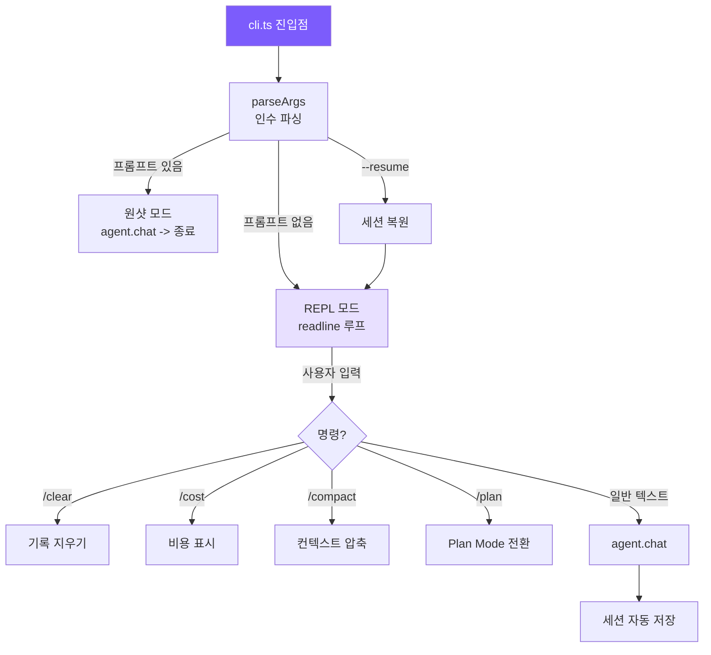

# 4. CLI와 세션

## 챕터 목표

사용자 인터페이스 레이어를 구축합니다: 커맨드라인 인수 파싱, 인터랙티브 REPL, Ctrl+C 인터럽트 처리, 세션 지속성과 복구.



## Claude Code의 구현 방식

Claude Code의 진입점은 `src/entrypoints/cli.tsx`입니다 — React/Ink를 사용하여 컴포넌트 모델을 터미널로 가져와 스트리밍 마크다운 렌더링, Vim 모드, 멀티 탭, 키보드 커스터마이징을 지원합니다. 세션은 추가 전용 쓰기 방식의 JSONL 형식을 사용하여 충돌에도 안전합니다.

### 터미널 네이티브 vs GUI

이것은 의도적인 선택입니다. 개발자의 워크플로우는 터미널에서 이루어집니다 — 브라우저를 열면 컨텍스트 전환이 발생합니다. 터미널 네이티브로 만들면 `git`, `grep` 등과 함께 기존 워크플로우에 자연스럽게 녹아드는 또 하나의 커맨드라인 도구가 됩니다. 구체적인 장점: SSH를 통해 작동하고, 파이프를 받을 수 있으며(`echo "fix" | claude`), tmux 멀티 인스턴스 병렬화를 지원하고, 메모리 오버헤드가 거의 없습니다.

React/Ink의 역할은 터미널의 인터랙션 한계를 보완하는 것입니다 — 컴포넌트 모델을 통해 스트리밍 출력, diff 뷰 같은 복잡한 UI를 유지보수 가능하게 만듭니다.

### 관찰 가능한 자율성

Claude Code의 핵심 UX 원칙: **에이전트는 자유롭게 행동하지만, 사용자가 모든 단계를 실시간으로 볼 수 있게 합니다**.

```
read_file src/app.ts
  1 | import express from ...
  ... (1234 chars total)

edit_file src/app.ts
  - const port = 3000
  + const port = process.env.PORT
```

중단 비용이 실행 취소 비용보다 훨씬 낮습니다. 에이전트가 잘못된 방향으로 가는 경우 20초를 기다린 후 더 많은 시간을 들여 되돌리는 것보다, 3초 안에 Ctrl+C를 누를 수 있습니다. 각 도구에는 4가지 렌더링 메서드(시작/완료/거부/오류)가 있으며, 오래 실행되는 도구는 완료 후 표시하지 않고 실시간으로 stdout을 스트리밍합니다.

### JSONL 세션 저장

전체 JSON 덮어쓰기에는 두 가지 문제가 있습니다: 쓰기 중 충돌이 발생하면 전체 파일이 손상되고, 대화가 길어질수록 각 저장이 느려집니다.

JSONL은 턴당 한 줄씩 추가하여 O(1) 쓰기를 수행하고, 충돌 시 마지막 줄만 손실됩니다. 파일 시스템의 추가 작업은 일반적으로 원자적입니다. 복구는 줄별로 파싱하며 끝의 불완전한 줄은 건너뜁니다.

## 우리의 구현

### 인수 파싱

<!-- tabs:start -->
#### **TypeScript**
```typescript
// cli.ts -- parseArgs

function parseArgs(): ParsedArgs {
  const args = process.argv.slice(2);
  let permissionMode: PermissionMode = "default";
  let thinking = false;
  let model = process.env.MINI_CLAUDE_MODEL || "claude-opus-4-6";
  let apiBase: string | undefined;
  let resume = false;
  let maxCost: number | undefined;
  let maxTurns: number | undefined;
  const positional: string[] = [];

  for (let i = 0; i < args.length; i++) {
    if (args[i] === "--yolo" || args[i] === "-y") {
      permissionMode = "bypassPermissions";
    } else if (args[i] === "--plan") {
      permissionMode = "plan";
    } else if (args[i] === "--accept-edits") {
      permissionMode = "acceptEdits";
    } else if (args[i] === "--dont-ask") {
      permissionMode = "dontAsk";
    } else if (args[i] === "--thinking") {
      thinking = true;
    } else if (args[i] === "--model" || args[i] === "-m") {
      model = args[++i] || model;
    } else if (args[i] === "--api-base") {
      apiBase = args[++i];
    } else if (args[i] === "--resume") {
      resume = true;
    } else if (args[i] === "--max-cost") {
      const v = parseFloat(args[++i]);
      if (!isNaN(v)) maxCost = v;
    } else if (args[i] === "--max-turns") {
      const v = parseInt(args[++i], 10);
      if (!isNaN(v)) maxTurns = v;
    } else if (args[i] === "--help" || args[i] === "-h") {
      console.log(`Usage: mini-claude [options] [prompt] ...`);
      process.exit(0);
    } else {
      positional.push(args[i]);
    }
  }

  return {
    permissionMode, model, apiBase, resume, thinking, maxCost, maxTurns,
    prompt: positional.length > 0 ? positional.join(" ") : undefined,
  };
}
```
#### **Python**
```python
# __main__.py -- parse_args

def parse_args() -> argparse.Namespace:
    parser = argparse.ArgumentParser(prog="mini-claude", add_help=False)
    parser.add_argument("prompt", nargs="*")
    parser.add_argument("--yolo", "-y", action="store_true")
    parser.add_argument("--plan", action="store_true")
    parser.add_argument("--accept-edits", action="store_true")
    parser.add_argument("--dont-ask", action="store_true")
    parser.add_argument("--thinking", action="store_true")
    parser.add_argument("--model", "-m", default=None)
    parser.add_argument("--api-base", default=None)
    parser.add_argument("--resume", action="store_true")
    parser.add_argument("--max-cost", type=float, default=None)
    parser.add_argument("--max-turns", type=int, default=None)
    parser.add_argument("--help", "-h", action="store_true")
    return parser.parse_args()


def _resolve_permission_mode(args: argparse.Namespace) -> str:
    if args.yolo: return "bypassPermissions"
    if args.plan: return "plan"
    if args.accept_edits: return "acceptEdits"
    if args.dont_ask: return "dontAsk"
    return "default"
```
<!-- tabs:end -->

TypeScript 버전은 commander.js 대신 직접 작성한 루프를 사용합니다. 인수가 11개뿐이어서 의존성 없이 더 가볍습니다. 값을 가져오는 인수(`--model claude-sonnet`)가 다음 요소로 건너뛰기 위해 `++i`가 필요하므로 `forEach` 대신 `for`를 사용합니다. Python 버전은 표준 라이브러리 `argparse`를 직접 사용합니다.

### 두 가지 실행 모드

<!-- tabs:start -->
#### **TypeScript**
```typescript
// cli.ts -- main

async function main() {
  const { permissionMode, model, apiBase, prompt, resume, thinking, maxCost, maxTurns } = parseArgs();

  // API 키는 환경 변수에서 가져옴, 커맨드라인 아님 (쉘 기록에 유출 방지)
  // 우선순위: OPENAI_API_KEY + OPENAI_BASE_URL -> ANTHROPIC_API_KEY -> OPENAI_API_KEY
  const resolvedApiKey = resolveApiKey(apiBase);
  if (!resolvedApiKey) {
    printError(`API key is required. Set ANTHROPIC_API_KEY or OPENAI_API_KEY env var.`);
    process.exit(1);
  }

  const agent = new Agent({ permissionMode, model, apiBase, apiKey: resolvedApiKey, thinking, maxCost, maxTurns });

  if (resume) {
    const sessionId = getLatestSessionId();
    if (sessionId) {
      const session = loadSession(sessionId);
      if (session) agent.restoreSession(session);
    }
  }

  if (prompt) {
    await agent.chat(prompt);       // 원샷 모드: 실행 후 종료
  } else {
    await runRepl(agent);           // REPL 모드: 인터랙티브 루프
  }
}
```
#### **Python**
```python
# __main__.py -- main

def main() -> None:
    args = parse_args()
    permission_mode = _resolve_permission_mode(args)
    model = args.model or os.environ.get("MINI_CLAUDE_MODEL", "claude-opus-4-6")

    resolved_api_key: str | None = None
    resolved_use_openai = bool(args.api_base)
    if os.environ.get("OPENAI_API_KEY") and os.environ.get("OPENAI_BASE_URL"):
        resolved_api_key = os.environ["OPENAI_API_KEY"]
        resolved_use_openai = True
    elif os.environ.get("ANTHROPIC_API_KEY"):
        resolved_api_key = os.environ["ANTHROPIC_API_KEY"]
    elif os.environ.get("OPENAI_API_KEY"):
        resolved_api_key = os.environ["OPENAI_API_KEY"]
        resolved_use_openai = True

    if not resolved_api_key:
        print_error("API key is required.")
        sys.exit(1)

    agent = Agent(permission_mode=permission_mode, model=model, thinking=args.thinking,
                  max_cost_usd=args.max_cost, max_turns=args.max_turns, api_key=resolved_api_key)

    if args.resume:
        session_id = get_latest_session_id()
        if session_id:
            session = load_session(session_id)
            if session: agent.restore_session(session)

    prompt = " ".join(args.prompt) if args.prompt else None
    if prompt:
        asyncio.run(agent.chat(prompt))
    else:
        asyncio.run(run_repl(agent))
```
<!-- tabs:end -->

### REPL 구현

<!-- tabs:start -->
#### **TypeScript**
```typescript
// cli.ts -- runRepl

async function runRepl(agent: Agent) {
  const rl = readline.createInterface({ input: process.stdin, output: process.stdout });

  let sigintCount = 0;
  process.on("SIGINT", () => {
    if (agent.isProcessing) {
      agent.abort();
      console.log("\n  (interrupted)");
      sigintCount = 0;
      printUserPrompt();
    } else {
      sigintCount++;
      if (sigintCount >= 2) { console.log("\nBye!\n"); process.exit(0); }
      console.log("\n  Press Ctrl+C again to exit.");
      printUserPrompt();
    }
  });

  printWelcome();

  // rl.once 사용: 엄격한 직렬화 보장, 여러 chat이 동시에 메시지 기록을 수정하는 것 방지
  const askQuestion = (): void => {
    printUserPrompt();
    rl.once("line", async (line) => {
      const input = line.trim();
      sigintCount = 0;

      if (!input) { askQuestion(); return; }
      if (input === "exit" || input === "quit") { console.log("\nBye!\n"); process.exit(0); }

      if (input === "/clear") { agent.clearHistory(); askQuestion(); return; }
      if (input === "/cost")  { agent.showCost(); askQuestion(); return; }
      if (input === "/compact") {
        try { await agent.compact(); } catch (e: any) { printError(e.message); }
        askQuestion(); return;
      }
      if (input === "/plan") { agent.togglePlanMode(); askQuestion(); return; }

      try {
        await agent.chat(input);
      } catch (e: any) {
        if (e.name !== "AbortError" && !e.message?.includes("aborted")) printError(e.message);
      }

      askQuestion();
    });
  };

  askQuestion();
}
```
#### **Python**
```python
# __main__.py -- run_repl

async def run_repl(agent: Agent) -> None:
    sigint_count = 0

    def handle_sigint(sig, frame):
        nonlocal sigint_count
        if agent._aborted is False and agent._output_buffer is not None:
            agent.abort()
            print("\n  (interrupted)")
            sigint_count = 0
            print_user_prompt()
        else:
            sigint_count += 1
            if sigint_count >= 2: print("\nBye!\n"); sys.exit(0)
            print("\n  Press Ctrl+C again to exit.")
            print_user_prompt()

    signal.signal(signal.SIGINT, handle_sigint)
    print_welcome()

    while True:
        print_user_prompt()
        try:
            line = input()
        except (EOFError, KeyboardInterrupt):
            print("\nBye!\n"); break

        inp = line.strip()
        sigint_count = 0
        if not inp: continue
        if inp in ("exit", "quit"): print("\nBye!\n"); break

        if inp == "/clear": agent.clear_history(); continue
        if inp == "/cost": agent.show_cost(); continue
        if inp == "/compact": await agent.compact(); continue
        if inp == "/plan": agent.toggle_plan_mode(); continue

        try:
            await agent.chat(inp)
        except Exception as e:
            if "abort" not in str(e).lower(): print_error(str(e))
```
<!-- tabs:end -->

**Ctrl+C의 이중 의미**: 처리 중에 누르면 -> 현재 작업을 중단하고 입력 프롬프트로 돌아감; 대기 중에 누르면 -> 첫 번째는 알림 표시, 두 번째는 종료. 두 가지 바람직하지 않은 시나리오를 방지합니다: 실수로 Ctrl+C를 눌러 전체 세션을 잃는 것, 에이전트가 잘못된 방향으로 가는 것을 무기력하게 지켜보는 것.

**`rl.once` vs `rl.on`**: `rl.on`으로 등록된 핸들러는 `await agent.chat()`이 완료될 때까지 기다리지 않고 다음 입력 줄에 응답하여, 여러 chat이 동시에 메시지 기록을 수정하게 됩니다. `rl.once`는 한 번에 한 줄만 수신하고, 처리 후 재귀적으로 다시 등록합니다 — 자연스럽게 직렬화됩니다. Python의 `while + input() + await`는 이 문제가 없습니다.

### 세션 지속성

<!-- tabs:start -->
#### **TypeScript**
```typescript
// session.ts

const SESSION_DIR = join(homedir(), ".mini-claude", "sessions");

export function saveSession(id: string, data: SessionData): void {
  ensureDir();
  writeFileSync(join(SESSION_DIR, `${id}.json`), JSON.stringify(data, null, 2));
}

export function getLatestSessionId(): string | null {
  const sessions = listSessions();
  if (sessions.length === 0) return null;
  sessions.sort((a, b) => new Date(b.startTime).getTime() - new Date(a.startTime).getTime());
  return sessions[0].id;
}
```
#### **Python**
```python
# session.py

SESSION_DIR = Path.home() / ".mini-claude" / "sessions"

def save_session(session_id: str, data: dict[str, Any]) -> None:
    SESSION_DIR.mkdir(parents=True, exist_ok=True)
    (SESSION_DIR / f"{session_id}.json").write_text(json.dumps(data, indent=2, default=str))

def get_latest_session_id() -> str | None:
    sessions = list_sessions()
    if not sessions: return None
    sessions.sort(key=lambda s: s.get("startTime", ""), reverse=True)
    return sessions[0].get("id")
```
<!-- tabs:end -->

각 `agent.chat()` 완료 후 자동 저장됩니다. 저장 실패는 무시됩니다(디스크 꽉 참이 전체 대화를 충돌시켜선 안 됩니다). 복구는 단순히 메시지 배열을 에이전트에 다시 로드합니다:

<!-- tabs:start -->
#### **TypeScript**
```typescript
// agent.ts
private autoSave() {
  try {
    saveSession(this.sessionId, {
      metadata: { id: this.sessionId, model: this.model, cwd: process.cwd(),
                  startTime: this.sessionStartTime, messageCount: this.getMessageCount() },
      anthropicMessages: this.useOpenAI ? undefined : this.anthropicMessages,
      openaiMessages: this.useOpenAI ? this.openaiMessages : undefined,
    });
  } catch {}
}

restoreSession(data: { anthropicMessages?: any[]; openaiMessages?: any[] }) {
  if (data.anthropicMessages) this.anthropicMessages = data.anthropicMessages;
  if (data.openaiMessages) this.openaiMessages = data.openaiMessages;
  printInfo(`Session restored (${this.getMessageCount()} messages).`);
}
```
#### **Python**
```python
# agent.py
def _auto_save(self) -> None:
    try:
        save_session(self.session_id, {
            "metadata": { "id": self.session_id, "model": self.model,
                          "cwd": str(Path.cwd()), "startTime": self.session_start_time,
                          "messageCount": self._get_message_count() },
            "anthropicMessages": self._anthropic_messages if not self.use_openai else None,
            "openaiMessages": self._openai_messages if self.use_openai else None,
        })
    except Exception:
        pass

def restore_session(self, data: dict) -> None:
    if data.get("anthropicMessages"): self._anthropic_messages = data["anthropicMessages"]
    if data.get("openaiMessages"): self._openai_messages = data["openaiMessages"]
    print_info(f"Session restored ({self._get_message_count()} messages).")
```
<!-- tabs:end -->

### 터미널 UI — ui.ts

모든 출력은 `ui.ts`를 통해 통일된 형식으로 출력됩니다:

<!-- tabs:start -->
#### **TypeScript**
```typescript
// ui.ts (chalk 사용)

export function printToolCall(name: string, input: Record<string, any>) {
  const icon = getToolIcon(name);      // read_file -> 책 아이콘, run_shell -> 컴퓨터 아이콘
  const summary = getToolSummary(name, input);
  console.log(chalk.yellow(`\n  ${icon} ${name}`) + chalk.gray(` ${summary}`));
}

export function printToolResult(name: string, result: string) {
  const maxLen = 500;
  const truncated = result.length > maxLen
    ? result.slice(0, maxLen) + chalk.gray(`\n  ... (${result.length} chars total)`)
    : result;
  console.log(chalk.dim(truncated.split("\n").map((l) => "  " + l).join("\n")));
}
```
#### **Python**
```python
# ui.py (rich 사용)

def print_tool_call(name: str, inp: dict) -> None:
    icon = _get_tool_icon(name)
    summary = _get_tool_summary(name, inp)
    console.print(f"\n  [yellow]{icon} {name}[/yellow][dim] {summary}[/dim]")

def print_tool_result(name: str, result: str) -> None:
    max_len = 500
    truncated = result[:max_len] + f"\n  ... ({len(result)} chars total)" if len(result) > max_len else result
    lines = "\n".join("  " + l for l in truncated.split("\n"))
    console.print(f"[dim]{lines}[/dim]")
```
<!-- tabs:end -->

도구 결과는 UI 레이어에서 500자로 잘립니다 — 이 표시는 사람을 위한 것이고, 완전한 결과는 이미 메시지 기록에 있습니다.

> **다음 챕터**: 에이전트의 출력을 실시간으로 표시하기 — 스트리밍 출력과 듀얼 백엔드 지원.
