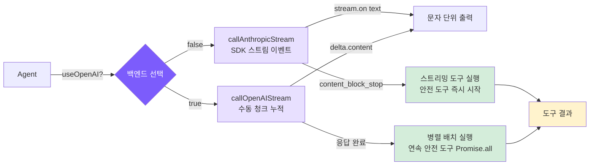

# 5. 스트리밍 출력과 이중 백엔드

## 챕터 목표

스트리밍 출력을 구현하여 응답이 문자 단위로 나타나도록 하고, Anthropic과 OpenAI API 백엔드를 모두 지원합니다.



## Claude Code의 구현 방식

### 스트리밍 출력이 필요한 이유

모델은 초당 약 30-80 토큰을 생성하므로 긴 응답은 10-30초가 걸립니다. 사용자가 빈 화면을 견딜 수 있는 시간은 약 2-3초가 최대입니다. 스트리밍 출력은 첫 번째 문자가 수백 밀리초 안에 나타나도록 만들어, "30초 기다리기"를 "내용이 점점 써지는 것을 보기"로 바꿔줍니다 -- 인지되는 대기 시간이 거의 0에 가까워지고, 방향이 어긋나면 일찍 중단할 수도 있습니다.

내부적으로는 SSE(Server-Sent Events)를 사용합니다: 서버는 단일 영속 HTTP 연결을 통해 `data:` 줄을 밀어내며, 몇 토큰마다 `content_block_delta` 이벤트를 보냅니다. WebSocket보다 단순하고, LLM 애플리케이션에는 단방향 푸시로 충분합니다.

### 스트리밍 처리와 병렬 도구 실행

Claude Code의 핵심 최적화: `StreamingToolExecutor`는 모델이 후속 내용을 생성하는 중에도 완전히 파싱된 tool_use 블록을 실행하기 시작합니다. 직렬 방식에서는 전체 API 응답이 도착한 후에야 도구 실행이 가능하지만, 스트리밍 병렬 처리 방식에서는 첫 번째 tool_use 블록이 완전히 파싱되는 순간 두 번째를 기다리지 않고 바로 디스패치됩니다.

일반적인 5-30초 API 스트림 윈도우 안에서 파일 읽기(< 100ms)는 거의 완전히 맞아 들어갈 수 있어, 스트림이 끝날 때 도구 결과가 이미 준비되어 있는 경우가 많습니다.

### 오류 재시도

모든 오류가 재시도할 가치가 있는 것은 아닙니다: 429/503/529와 일시적인 네트워크 장애(ECONNRESET)는 재시도 가능합니다; 400/401/404는 코드나 설정 문제를 반영하므로 재시도해도 의미가 없습니다.

지수 백오프(고정 간격 대신)를 사용하는 이유: 서비스가 과부하 상태일 때 많은 클라이언트가 고정 1초 지연 후 동시에 재시도하면 오버로드를 악화시키는 "재시도 폭풍"이 만들어집니다. 지수 백오프는 매 라운드마다 간격을 두 배로 늘리고(1s -> 2s -> 4s), 무작위 지터를 추가하면 클라이언트 동기화가 깨집니다 -- 이는 표준적인 분산 장애 허용 관행입니다.

## 우리의 구현

### Anthropic 백엔드: SDK 내장 스트림

<!-- tabs:start -->
#### **TypeScript**
```typescript
// agent.ts -- callAnthropicStream

private async callAnthropicStream(): Promise<Anthropic.Message> {
  return withRetry(async (signal) => {
    const createParams: any = {
      model: this.model,
      max_tokens: this.thinkingMode !== "disabled" ? maxOutput : 16384,
      system: this.systemPrompt,
      tools: toolDefinitions,
      messages: this.anthropicMessages,
    };

    if (this.thinkingMode === "enabled") {
      createParams.thinking = { type: "enabled", budget_tokens: maxOutput - 1 };
    } else if (this.thinkingMode === "adaptive") {
      createParams.thinking = { type: "enabled", budget_tokens: 10000 };
    }

    const stream = this.anthropicClient!.messages.stream(createParams, { signal });

    let firstText = true;
    stream.on("text", (text) => {
      if (firstText) { printAssistantText("\n"); firstText = false; }
      printAssistantText(text);
    });

    const finalMessage = await stream.finalMessage();

    // 사고 블록은 컨텍스트 윈도우 낭비를 피하기 위해 히스토리에 저장하지 않음
    if (this.thinkingMode !== "disabled") {
      finalMessage.content = finalMessage.content.filter(
        (block: any) => block.type !== "thinking"
      );
    }

    return finalMessage;
  }, this.abortController?.signal);
}
```
#### **Python**
```python
# agent.py -- _call_anthropic_stream

async def _call_anthropic_stream(self):
    async def _do():
        create_params: dict[str, Any] = {
            "model": self.model,
            "max_tokens": _get_max_output_tokens(self.model) if self._thinking_mode != "disabled" else 16384,
            "system": self._system_prompt,
            "tools": self.tools,
            "messages": self._anthropic_messages,
        }

        if self._thinking_mode in ("adaptive", "enabled"):
            create_params["thinking"] = {"type": "enabled", "budget_tokens": _get_max_output_tokens(self.model) - 1}

        first_text = True
        async with self._anthropic_client.messages.stream(**create_params) as stream:
            async for event in stream:
                if hasattr(event, 'type') and event.type == "content_block_delta":
                    delta = event.delta
                    if hasattr(delta, 'text'):
                        if first_text:
                            stop_spinner()
                            self._emit_text("\n")
                            first_text = False
                        self._emit_text(delta.text)

            final_message = await stream.get_final_message()

        final_message.content = [b for b in final_message.content if b.type != "thinking"]
        return final_message

    return await _with_retry(_do)
```
<!-- tabs:end -->

Anthropic SDK는 모든 SSE 파싱 세부 사항을 캡슐화합니다: `stream.on("text")`는 텍스트 델타를 직접 전달하고, `stream.finalMessage()`는 비스트리밍 버전과 동일한 `Message` 객체를 반환합니다. `{ signal }`은 AbortController를 전달하여 Ctrl+C로 네트워크 요청을 중단할 수 있게 합니다.

### OpenAI 호환 백엔드: 수동 청크 누적

OpenAI 스트리밍은 여러 청크에 걸쳐 tool_calls 파라미터를 전달하므로 수동으로 누적하고 재조립해야 합니다.

<!-- tabs:start -->
#### **TypeScript**
```typescript
// agent.ts -- callOpenAIStream

private async callOpenAIStream(): Promise<OpenAI.ChatCompletion> {
  return withRetry(async (signal) => {
    const stream = await this.openaiClient!.chat.completions.create({
      model: this.model,
      max_tokens: 16384,
      tools: toOpenAITools(),
      messages: this.openaiMessages,
      stream: true,
      stream_options: { include_usage: true },
    }, { signal });

    let content = "";
    let firstText = true;
    const toolCalls: Map<number, { id: string; name: string; arguments: string }> = new Map();
    let finishReason = "";
    let usage: { prompt_tokens: number; completion_tokens: number } | undefined;

    for await (const chunk of stream) {
      const delta = chunk.choices[0]?.delta;

      if (chunk.usage) {
        usage = { prompt_tokens: chunk.usage.prompt_tokens, completion_tokens: chunk.usage.completion_tokens };
      }

      if (!delta) continue;

      if (delta.content) {
        if (firstText) { printAssistantText("\n"); firstText = false; }
        printAssistantText(delta.content);
        content += delta.content;
      }

      // tool_calls 파라미터는 조각으로 도착하며 index로 누적됨
      if (delta.tool_calls) {
        for (const tc of delta.tool_calls) {
          const existing = toolCalls.get(tc.index);
          if (existing) {
            if (tc.function?.arguments) existing.arguments += tc.function.arguments;
          } else {
            toolCalls.set(tc.index, {
              id: tc.id || "",
              name: tc.function?.name || "",
              arguments: tc.function?.arguments || "",
            });
          }
        }
      }

      if (chunk.choices[0]?.finish_reason) finishReason = chunk.choices[0].finish_reason;
    }

    const assembledToolCalls = toolCalls.size > 0
      ? Array.from(toolCalls.entries())
          .sort(([a], [b]) => a - b)
          .map(([_, tc]) => ({
            id: tc.id, type: "function" as const,
            function: { name: tc.name, arguments: tc.arguments },
          }))
      : undefined;

    return {
      id: "stream", object: "chat.completion", created: Date.now(), model: this.model,
      choices: [{
        index: 0,
        message: { role: "assistant" as const, content: content || null, tool_calls: assembledToolCalls, refusal: null },
        finish_reason: finishReason || "stop", logprobs: null,
      }],
      usage: usage || { prompt_tokens: 0, completion_tokens: 0, total_tokens: 0 },
    } as OpenAI.ChatCompletion;
  }, this.abortController?.signal);
}
```
#### **Python**
```python
# agent.py -- _call_openai_stream

async def _call_openai_stream(self) -> dict:
    async def _do():
        stream = await self._openai_client.chat.completions.create(
            model=self.model,
            max_tokens=16384,
            tools=_to_openai_tools(self.tools),
            messages=self._openai_messages,
            stream=True,
            stream_options={"include_usage": True},
        )

        content = ""
        first_text = True
        tool_calls: dict[int, dict] = {}
        finish_reason = ""
        usage = None

        async for chunk in stream:
            if chunk.usage:
                usage = {"prompt_tokens": chunk.usage.prompt_tokens, "completion_tokens": chunk.usage.completion_tokens}

            if not chunk.choices:
                continue
            delta = chunk.choices[0].delta

            if delta and delta.content:
                if first_text:
                    stop_spinner()
                    self._emit_text("\n")
                    first_text = False
                self._emit_text(delta.content)
                content += delta.content

            if delta and delta.tool_calls:
                for tc in delta.tool_calls:
                    existing = tool_calls.get(tc.index)
                    if existing:
                        if tc.function and tc.function.arguments:
                            existing["arguments"] += tc.function.arguments
                    else:
                        tool_calls[tc.index] = {
                            "id": tc.id or "",
                            "name": (tc.function.name if tc.function else "") or "",
                            "arguments": (tc.function.arguments if tc.function else "") or "",
                        }

            if chunk.choices[0].finish_reason:
                finish_reason = chunk.choices[0].finish_reason

        assembled = [
            {"id": tc["id"], "type": "function", "function": {"name": tc["name"], "arguments": tc["arguments"]}}
            for _, tc in sorted(tool_calls.items())
        ] if tool_calls else None

        return {
            "choices": [{"message": {"role": "assistant", "content": content or None, "tool_calls": assembled},
                         "finish_reason": finish_reason or "stop"}],
            "usage": usage or {"prompt_tokens": 0, "completion_tokens": 0},
        }

    return await _with_retry(_do)
```
<!-- tabs:end -->

OpenAI tool_calls의 경우 `id`와 `name`은 첫 번째 청크에만 나타나고, 이후 청크는 증분 `arguments` 조각만 포함합니다. 여러 tool_calls의 청크가 뒤섞여 도착하며 `index` 필드로 구분됩니다 -- 누적이 완료된 후에야 `JSON.parse()`할 수 있습니다.

### 도구 형식 변환

두 API의 도구 정의는 거의 동일하며, 필드 이름만 다릅니다:

<!-- tabs:start -->
#### **TypeScript**
```typescript
function toOpenAITools(): OpenAI.ChatCompletionTool[] {
  return toolDefinitions.map((t) => ({
    type: "function" as const,
    function: { name: t.name, description: t.description, parameters: t.input_schema as Record<string, unknown> },
  }));
}
```
#### **Python**
```python
def _to_openai_tools(tools: list[ToolDef]) -> list[dict]:
    return [{"type": "function", "function": {"name": t["name"], "description": t["description"], "parameters": t["input_schema"]}} for t in tools]
```
<!-- tabs:end -->

Anthropic은 `input_schema`를 사용하고, OpenAI는 `parameters`를 사용합니다 -- 내용은 동일합니다.

### 재시도 메커니즘

<!-- tabs:start -->
#### **TypeScript**
```typescript
function isRetryable(error: any): boolean {
  const status = error?.status || error?.statusCode;
  if ([429, 503, 529].includes(status)) return true;
  if (error?.code === "ECONNRESET" || error?.code === "ETIMEDOUT") return true;
  if (error?.message?.includes("overloaded")) return true;
  return false;
}

async function withRetry<T>(
  fn: (signal?: AbortSignal) => Promise<T>,
  signal?: AbortSignal,
  maxRetries = 3
): Promise<T> {
  for (let attempt = 0; ; attempt++) {
    try {
      return await fn(signal);
    } catch (error: any) {
      if (signal?.aborted) throw error;
      if (attempt >= maxRetries || !isRetryable(error)) throw error;
      const delay = Math.min(1000 * Math.pow(2, attempt), 30000) + Math.random() * 1000;
      const reason = error?.status ? `HTTP ${error.status}` : error?.code || "network error";
      printRetry(attempt + 1, maxRetries, reason);
      await new Promise((r) => setTimeout(r, delay));
    }
  }
}
```
#### **Python**
```python
def _is_retryable(error: Exception) -> bool:
    status = getattr(error, "status_code", None) or getattr(error, "status", None)
    if status in (429, 503, 529):
        return True
    msg = str(error)
    if "overloaded" in msg or "ECONNRESET" in msg or "ETIMEDOUT" in msg:
        return True
    return False

async def _with_retry(fn, max_retries: int = 3):
    for attempt in range(max_retries + 1):
        try:
            return await fn()
        except Exception as error:
            if attempt >= max_retries or not _is_retryable(error):
                raise
            delay = min(1000 * (2 ** attempt), 30000) / 1000 + (hash(str(time.time())) % 1000) / 1000
            reason = str(getattr(error, "status_code", "")) or str(error)[:60]
            print_retry(attempt + 1, max_retries, reason)
            await asyncio.sleep(delay)
```
<!-- tabs:end -->

지연 공식 `min(1000 * 2^attempt, 30000) + random(0, 1000)`: 지수 부분은 백오프 속도를 제어하고, 30초 상한은 지나치게 긴 대기를 방지하며, 무작위 지터는 여러 클라이언트가 동시에 재시도하여 "재시도 폭풍"을 만드는 것을 방지합니다.

### 확장 사고 (Extended Thinking)

확장 사고는 모델에게 출력 전에 추론과 계획을 위한 개인 "스크래치패드"를 제공하여, 다단계 결정이 필요한 코딩 작업에서 눈에 띄는 도움이 됩니다.

세 가지 모드:
- **adaptive**: claude-4.x 모델에 자동 활성화, 예산 10000 토큰, 모델이 사용 여부를 결정
- **enabled**: `--thinking` 플래그로 명시적 활성화, 예산 최대화
- **disabled**: 사고를 지원하지 않는 모델(Claude 3.x 및 OpenAI)에 사용

<!-- tabs:start -->
#### **TypeScript**
```typescript
function resolveThinkingMode(model: string, thinkingFlag: boolean): "adaptive" | "enabled" | "disabled" {
  if (!modelSupportsThinking(model)) return "disabled";
  if (thinkingFlag) return "enabled";
  if (modelSupportsAdaptiveThinking(model)) return "adaptive";
  return "disabled";
}

// 요청 파라미터 구성
if (this.thinkingMode === "enabled") {
  createParams.thinking = { type: "enabled", budget_tokens: maxOutput - 1 };
} else if (this.thinkingMode === "adaptive") {
  createParams.thinking = { type: "enabled", budget_tokens: 10000 };
}

// 사고 블록 필터링, 히스토리에 저장하지 않음
finalMessage.content = finalMessage.content.filter((block: any) => block.type !== "thinking");
```
#### **Python**
```python
def _resolve_thinking_mode(self) -> str:
    if not self.thinking or not _model_supports_thinking(self.model):
        return "disabled"
    if _model_supports_adaptive_thinking(self.model):
        return "adaptive"
    return "enabled"

# 요청 파라미터 구성
if self._thinking_mode in ("adaptive", "enabled"):
    create_params["thinking"] = {"type": "enabled", "budget_tokens": max_output - 1}

# 사고 블록 필터링, 히스토리에 저장하지 않음
final_message.content = [b for b in final_message.content if b.type != "thinking"]
```
<!-- tabs:end -->

사고 블록은 수천 토큰에 달할 수 있으며 후속 대화에 참조 가치가 없습니다. 필터링은 컨텍스트 윈도우가 쓸모없는 내용으로 채워지는 것을 방지하는 가장 직접적인 방법입니다.

### 스트리밍 도구 실행

Anthropic 스트리밍 응답의 `tool_use` 블록이 완전히 수신되면(`content_block_stop` 이벤트로 트리거), 도구가 동시성 안전(`read_file`, `list_files`, `grep_search`, `web_fetch`)한 경우 즉시 실행을 시작합니다 -- 전체 API 응답이 완료될 때까지 기다리지 않습니다. 이렇게 하면 모델이 후속 내용을 생성하는 동안 도구 실행 시간이 스트리밍 윈도우 안에 "숨겨집니다".

<!-- tabs:start -->
#### **TypeScript**
```typescript
// agent.ts -- 스트리밍 도구 실행

// 스트리밍 중 조기 실행된 도구 추적
const earlyExecutions = new Map<string, Promise<string>>();

const response = await this.callAnthropicStream((block) => {
  const input = block.input as Record<string, any>;
  if (CONCURRENCY_SAFE_TOOLS.has(block.name)) {
    const perm = checkPermission(block.name, input, this.permissionMode, this.planFilePath || undefined);
    if (perm.action === "allow") {
      earlyExecutions.set(block.id, this.executeToolCall(block.name, input));
    }
  }
});

// 나중에 도구 결과를 처리할 때:
const earlyPromise = earlyExecutions.get(toolUse.id);
if (earlyPromise) {
  const raw = await earlyPromise;  // 이미 완료되었거나 곧 완료될 예정
  // ... 결과를 직접 사용
  continue;
}
```
#### **Python**
```python
# agent.py -- 스트리밍 도구 실행

# 스트리밍 중 조기 실행된 도구 추적
early_executions: dict[str, asyncio.Task] = {}

async def on_tool_block_complete(block):
    if block["name"] in CONCURRENCY_SAFE_TOOLS:
        perm = check_permission(block["name"], block["input"], self._permission_mode)
        if perm["action"] == "allow":
            task = asyncio.create_task(self._execute_tool_call(block["name"], block["input"]))
            early_executions[block["id"]] = task

response = await self._call_anthropic_stream(on_tool_block_complete=on_tool_block_complete)

# 나중에 도구 결과를 처리할 때:
early_task = early_executions.get(tool_use["id"])
if early_task:
    raw = await early_task  # 이미 완료되었거나 곧 완료될 예정
    # ... 결과를 직접 사용
    continue
```
<!-- tabs:end -->

`callAnthropicStream`은 콜백 메커니즘을 통해 이를 내부적으로 구현합니다:

<!-- tabs:start -->
#### **TypeScript**
```typescript
// agent.ts -- callAnthropicStream 도구 블록 추적

private async callAnthropicStream(
  onToolBlockComplete?: (block: Anthropic.ToolUseBlock) => void,
): Promise<Anthropic.Message> {
  // ...
  const toolBlocksByIndex = new Map<number, { id: string; name: string; inputJson: string }>();

  stream.on("streamEvent" as any, (event: any) => {
    // 도구 블록 추적: 스트림이 도착하면서 입력 JSON 누적
    if (event.type === "content_block_start" && event.content_block?.type === "tool_use") {
      toolBlocksByIndex.set(event.index, {
        id: event.content_block.id,
        name: event.content_block.name,
        inputJson: "",
      });
    }
    if (event.type === "content_block_delta" && event.delta?.type === "input_json_delta") {
      const tracked = toolBlocksByIndex.get(event.index);
      if (tracked) tracked.inputJson += event.delta.partial_json;
    }
    if (event.type === "content_block_stop" && onToolBlockComplete) {
      const tracked = toolBlocksByIndex.get(event.index);
      if (tracked) {
        try {
          const input = JSON.parse(tracked.inputJson);
          onToolBlockComplete({ type: "tool_use", id: tracked.id, name: tracked.name, input });
        } catch {}
      }
    }
  });
  // ...
}
```
#### **Python**
```python
# agent.py -- _call_anthropic_stream 도구 블록 추적

async def _call_anthropic_stream(self, on_tool_block_complete=None):
    async def _do():
        # ...
        tool_blocks_by_index: dict[int, dict] = {}

        async with self._anthropic_client.messages.stream(**create_params) as stream:
            async for event in stream:
                # 도구 블록 추적: 스트림이 도착하면서 입력 JSON 누적
                if hasattr(event, 'type'):
                    if event.type == "content_block_start" and getattr(event, 'content_block', None):
                        cb = event.content_block
                        if cb.type == "tool_use":
                            tool_blocks_by_index[event.index] = {
                                "id": cb.id, "name": cb.name, "input_json": ""
                            }
                    elif event.type == "content_block_delta" and hasattr(event.delta, 'partial_json'):
                        tracked = tool_blocks_by_index.get(event.index)
                        if tracked:
                            tracked["input_json"] += event.delta.partial_json
                    elif event.type == "content_block_stop" and on_tool_block_complete:
                        tracked = tool_blocks_by_index.get(event.index)
                        if tracked:
                            try:
                                inp = json.loads(tracked["input_json"])
                                await on_tool_block_complete({
                                    "type": "tool_use", "id": tracked["id"],
                                    "name": tracked["name"], "input": inp
                                })
                            except json.JSONDecodeError:
                                pass

            final_message = await stream.get_final_message()
        # ...
```
<!-- tabs:end -->

핵심 설계 포인트:

- **`content_block_stop`은 블록 수준 이벤트입니다**: 전체 응답이 종료될 때가 아니라 단일 `tool_use` 블록의 JSON이 완전히 수신될 때 발생합니다. 모델은 하나의 응답에서 여러 도구 호출을 반환할 수 있습니다 -- 첫 번째 블록은 두 번째가 아직 스트리밍 중일 때 완료될 수 있습니다
- **동시성 안전 도구만 조기 실행됩니다**: 읽기 전용 도구(`read_file`, `list_files`, `grep_search`, `web_fetch`)만 조기 실행됩니다; 쓰기 작업과 명령 실행은 해당되지 않습니다
- **권한 확인은 여전히 적용됩니다**: `checkPermission`이 `"allow"`를 반환하는 도구만 조기 실행됩니다; 사용자 확인이 필요한 도구(`"confirm"`)는 조기 트리거되지 않습니다
- **Promise/Task가 저장되고 나중에 awaited됩니다**: `earlyExecutions` Map은 Promise(TS) 또는 Task(Python)를 저장합니다. 이후 도구 처리 루프가 조기 실행 결과를 발견하면 단순히 await합니다 -- 그 시점에는 이미 완료된 경우가 대부분입니다
- **핵심 이점**: 5-30초 스트리밍 윈도우 동안 도구 실행이 모델 생성과 병렬로 실행됩니다. 파일 읽기 같은 빠른 작업은 스트림이 끝날 때 이미 완료되어 있는 경우가 많습니다

### 병렬 도구 실행

병렬 실행의 전제 조건은 어떤 도구가 동시성 안전한지 표시하는 것입니다 -- 읽기 전용 도구는 부작용이 없으므로 동시에 안전하게 실행할 수 있습니다:

<!-- tabs:start -->
#### **TypeScript**
```typescript
// tools.ts
export const CONCURRENCY_SAFE_TOOLS = new Set([
  "read_file", "list_files", "grep_search", "web_fetch"
]);
```
#### **Python**
```python
# tools.py
CONCURRENCY_SAFE_TOOLS = {"read_file", "list_files", "grep_search", "web_fetch"}
```
<!-- tabs:end -->

Anthropic 백엔드의 경우 스트리밍 도구 실행이 자연스럽게 병렬성을 처리합니다 -- 각 도구 블록이 완료 시 실행을 시작하여 여러 도구가 자연스럽게 겹쳐서 실행됩니다.

OpenAI 백엔드(스트리밍 도구 블록 이벤트를 지원하지 않음)의 경우 명시적 배치 병렬 처리를 사용합니다: 연속적인 안전 도구를 그룹화하고 `Promise.all` / `asyncio.gather`로 한꺼번에 실행합니다:

<!-- tabs:start -->
#### **TypeScript**
```typescript
// agent.ts -- OpenAI 병렬 실행

// 연속 동시성 안전 도구를 배치로 그룹화
type OAIBatch = { concurrent: boolean; items: OAIChecked[] };
const oaiBatches: OAIBatch[] = [];
for (const ct of oaiChecked) {
  const safe = ct.allowed && CONCURRENCY_SAFE_TOOLS.has(ct.fnName);
  if (safe && oaiBatches.length > 0 && oaiBatches[oaiBatches.length - 1].concurrent) {
    oaiBatches[oaiBatches.length - 1].items.push(ct);
  } else {
    oaiBatches.push({ concurrent: safe, items: [ct] });
  }
}

// 실행: 동시 배치는 Promise.all 사용
for (const batch of oaiBatches) {
  if (batch.concurrent) {
    const results = await Promise.all(
      batch.items.map(async (ct) => {
        const raw = await this.executeToolCall(ct.fnName, ct.input);
        return { ct, res: this.persistLargeResult(ct.fnName, raw) };
      })
    );
    // ... 결과 push
  } else {
    // 안전하지 않은 도구는 순차 실행
  }
}
```
#### **Python**
```python
# agent.py -- OpenAI 병렬 실행

# 연속 동시성 안전 도구를 배치로 그룹화
oai_batches: list[dict] = []
for ct in oai_checked:
    safe = ct["allowed"] and ct["fn_name"] in CONCURRENCY_SAFE_TOOLS
    if safe and oai_batches and oai_batches[-1]["concurrent"]:
        oai_batches[-1]["items"].append(ct)
    else:
        oai_batches.append({"concurrent": safe, "items": [ct]})

# 실행: 동시 배치는 asyncio.gather 사용
for batch in oai_batches:
    if batch["concurrent"]:
        async def _exec(ct):
            raw = await self._execute_tool_call(ct["fn_name"], ct["input"])
            return {"ct": ct, "res": self._persist_large_result(ct["fn_name"], raw)}
        results = await asyncio.gather(*[_exec(ct) for ct in batch["items"]])
        # ... 결과 push
    else:
        # 안전하지 않은 도구는 순차 실행
```
<!-- tabs:end -->

두 백엔드 간의 병렬 전략 비교:

- **Anthropic 백엔드**: 스트리밍 실행이 자동으로 병렬성을 처리합니다 -- 블록 완료 시 도구가 시작되어 여러 도구 실행이 자연스럽게 겹칩니다
- **OpenAI 백엔드**: 응답 완료 후 명시적 배치 처리 -- 연속적인 안전 도구가 같은 배치로 그룹화되어 `Promise.all`로 병렬 실행됩니다
- **혼합 시퀀스에서 안전성 유지**: `[read, read, write, read]`는 `[read||read]`, `[write]`, `[read]`로 분할됩니다 -- 세 개의 배치. 쓰기 작업 전후의 도구는 독립적이며 쓰기 작업을 넘어 병렬화되지 않습니다
- **일반적인 속도 향상**: 모델이 단일 응답에서 3-5개 파일을 읽을 때 병렬 실행은 보통 2-3배 속도 향상을 가져옵니다

## 비교

| 차원 | Claude Code | mini-claude |
|------|------------|-------------|
| **백엔드 지원** | Anthropic 전용 | Anthropic + OpenAI 호환 |
| **재시도 전략** | 유사한 지수 백오프 | 지수 백오프 + 무작위 지터 |
| **사고 처리** | 깊은 통합, 독립적 표시 및 접기 | 기본 지원, 사고 블록 필터링 |
| **스트리밍 도구 실행** | StreamingToolExecutor를 독립 모듈로, 완전한 이벤트 처리 | 콜백 + earlyExecutions Map, 간소화된 구현 |
| **병렬 도구 실행** | 완전한 동시성 스케줄러 | Anthropic 스트리밍 조기 실행 + OpenAI 배치 Promise.all |

---

> **다음 챕터**: 에이전트는 이제 파일을 조작하고 명령을 실행할 수 있지만, 위험한 작업을 방지해야 합니다 -- 권한 시스템이 시스템을 보호합니다.
