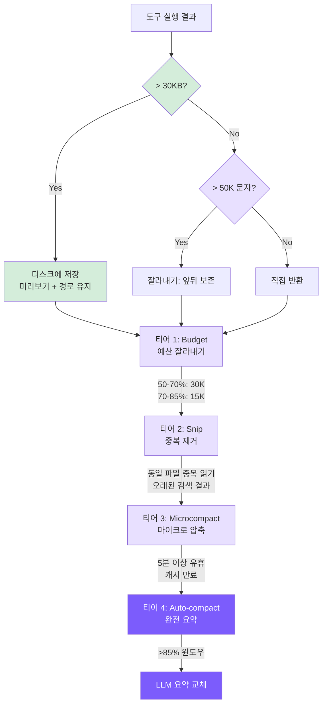

# 7. 컨텍스트 관리

## 챕터 목표

대화 히스토리가 LLM의 컨텍스트 윈도우를 초과하지 않도록 방지합니다: 4티어 단계적 압축 파이프라인으로, 가벼운 잘라내기에서 완전한 요약까지 점진적으로 에스컬레이션됩니다.



## Claude Code의 구현 방식

### 컨텍스트 구성

각 API 호출 전에 Claude Code는 세 가지 범주의 정보를 요청에 조립합니다:

**시스템 프롬프트**는 가장 안정적인 부분으로, 귀속 헤더, 도구 스키마, 보안 규칙 등으로 구성됩니다. `SYSTEM_PROMPT_DYNAMIC_BOUNDARY` 센티넬이 포함되어 정적 절반과 동적 절반으로 분할됩니다 -- 정적 절반은 모든 사용자에게 동일하며 전역 공유 캐싱을 위해 `scope: 'global'`로 표시됩니다; 동적 절반(MCP 도구, 언어 기본 설정 등)은 사용자마다 다르며 공유되지 않습니다. 이를 통해 전 세계 수백만 사용자가 동일한 캐시된 핵심 시스템 프롬프트를 공유할 수 있어 주요 비용 최적화 기법 중 하나입니다.

**시스템/사용자 컨텍스트**는 세션당 한 번 계산되고 메모이즈됩니다: git 상태(5개 명령 병렬 실행), CLAUDE.md 파일(CWD에서 위로 디렉토리 트리 순회), 현재 날짜 등. 주입 순서는 의도적입니다 -- 시스템 컨텍스트는 시스템 프롬프트 뒤에 위치하고, 사용자 컨텍스트는 메시지 배열 앞에 추가됩니다. 이는 가장 안정적인 콘텐츠가 먼저 와서 캐시 적중률을 최대화하기 위해서입니다.

**메시지 히스토리**는 대화의 모든 것을 기록하며 압축 파이프라인의 주요 대상입니다. API에 보내기 전에 `normalizeMessagesForAPI()`를 거쳐 형식 문제를 수정합니다: 첨부 파일 재정렬, 사고 블록 처리, 분할 메시지 병합, `tool_use`/`tool_result` 쌍 검증 등.

### 5단계 압축 파이프라인

설계 철학은 **점진적 압축**입니다: 가장 저렴한 방법을 먼저 사용하고, 필요할 때만 더 무거운 수단으로 에스컬레이션합니다.

**레벨 1: 도구 결과 예산 잘라내기** -- 도구는 `maxResultSizeChars`(기본 50K 문자)를 선언합니다; 초과하면 결과가 **디스크에 저장**되고, 2KB 미리보기와 참조만 컨텍스트에 유지됩니다. 잘라내기 대신 저장을 선택하는 것은 의도적입니다: 데이터 손실이 없고, 모델이 언제든 Read 도구로 전체 파일을 검색할 수 있습니다.

**레벨 2: 히스토리 Snip** -- 히스토리의 중복 부분을 정리하는 기능 게이트 기능입니다. 해제된 양은 이후 autocompact 임계값 계산에 전달됩니다. Snip이 메시지를 제거한 후에도 마지막 어시스턴트 메시지의 `usage`는 Snip 이전 크기를 반영하기 때문입니다 -- 수정 없이는 autocompact가 너무 일찍 트리거됩니다.

**레벨 3: Microcompact** -- 더 이상 필요하지 않은 오래된 도구 결과를 정리합니다. 두 가지 경로:
- **캐시 만료** (N분 이상 유휴): 메시지 콘텐츠를 직접 수정하여 오래된 도구 결과를 플레이스홀더로 교체합니다. 캐시가 만료되었으므로 수정이 추가적인 무효화를 일으키지 않습니다.
- **캐시 유지 중**: API 수준 `cache_edits` 메커니즘을 사용하여 서버 측에서 제자리에 삭제합니다. 로컬 메시지를 전혀 수정하지 않아 캐시 접두사 무효화를 방지합니다.

**레벨 4: Context Collapse** -- 프로젝션 기반 접기로, **원본 메시지를 수정하지 않고** 접힌 뷰만 생성하는 것이 핵심 특성입니다. 데이터베이스 View와 유사합니다: 기본 테이블은 변경되지 않지만 쿼리는 필터링된 결과를 봅니다. 활성화되면 Autocompact를 억제하여 두 가지가 경쟁하지 않도록 합니다.

**레벨 5: Autocompact** -- 최후의 수단으로, 서브 에이전트를 포크하여 API를 호출하고 요약을 생성합니다. 트리거 임계값은 약 85.5% 컨텍스트 사용률입니다. 압축 프롬프트는 "분석-요약" 2단계 방식을 사용합니다: 먼저 모델이 `<analysis>` 블록에서 추론하고, 표준화된 `<summary>`(9개 섹션)를 생성하고, 마지막으로 추론 과정을 제거하고 요약만 유지합니다 -- 전형적인 연쇄 사고 초안 기법입니다.

### 토큰 예산과 캐싱

**토큰 추정**은 추가 API를 호출하지 않습니다: 가장 최근 API 응답의 `usage`를 앵커로 사용하고, 새 메시지는 문자 수 / 4로 추정합니다. 이는 순수 추정의 30%+ 오차를 5% 미만으로 줄입니다.

**프롬프트 캐싱**은 접두사의 바이트 변경이 무효화를 일으키므로 취약합니다. Claude Code는 여러 수준에서 안정성을 유지합니다: 정적/동적 경계 마커, 베타 헤더 고정 래칭(한 번 보내면 기능 플래그 변경과 무관하게 유지), 도구 배열 끝의 캐시 중단점, 파열 감지(`cache_read_input_tokens`가 5% 이상 떨어질 때 자동 귀속).

**서킷 브레이커**: autocompact가 연속 3,272번 실패하여 막대한 API 호출을 낭비한 세션이 있었습니다. 이제는 연속 3번 실패 후 재시도를 중단합니다.

## 우리의 구현

4티어 파이프라인: 실행 시 잘라내기 + Budget + Snip + Microcompact + Auto-compact.

### 티어 0: 실행 시 잘라내기 (truncateResult)

<!-- tabs:start -->
#### **TypeScript**
```typescript
// tools.ts
const MAX_RESULT_CHARS = 50000;

function truncateResult(result: string): string {
  if (result.length <= MAX_RESULT_CHARS) return result;
  const keepEach = Math.floor((MAX_RESULT_CHARS - 60) / 2);
  return (
    result.slice(0, keepEach) +
    "\n\n[... truncated " + (result.length - keepEach * 2) + " chars ...]\n\n" +
    result.slice(-keepEach)
  );
}
```
#### **Python**
```python
# tools.py
MAX_RESULT_CHARS = 50000

def _truncate_result(result: str) -> str:
    if len(result) <= MAX_RESULT_CHARS:
        return result
    keep_each = (MAX_RESULT_CHARS - 60) // 2
    return (
        result[:keep_each]
        + f"\n\n[... truncated {len(result) - keep_each * 2} chars ...]\n\n"
        + result[-keep_each:]
    )
```
<!-- tabs:end -->

앞부분만 유지하는 대신 앞뒤 양쪽을 유지합니다: 파일 시작에는 임포트, 클래스 정의 등 구조적 정보가 있고, 명령 출력 오류 요약은 보통 끝에 있기 때문입니다.

Claude Code와의 차이점: Claude Code는 디스크에 저장하고 모델이 나중에 Read 도구로 전체 내용을 검색할 수 있습니다. 우리도 이제 저장을 구현했습니다 -- 아래 persistLargeResult 참조. 두 티어가 함께 작동하며 순서가 중요합니다: 도구 계층은 **전체** 결과를 반환하고, 에이전트 계층이 먼저 persistLargeResult를 통해 30KB 이상을 디스크에 전체 저장하며(컨텍스트에는 미리보기만 유지), truncateResult는 **저장 후** 안전망으로 실행됩니다 -- 비정상적인 경우(예: 미리보기 메시지가 엄청나게 긴 한 줄로 지배되는 경우)에만 작동합니다. truncateResult는 도구 계층에서 먼저 실행되어서는 안 됩니다: 이미 잘려진 결과가 디스크에 저장되어 저장 전에 정보를 잃게 됩니다(이것이 정확히 이슈 #6에서 수정된 버그입니다).

### 티어 0.5: 대용량 결과 저장 (persistLargeResult)

도구가 30KB를 초과하는 결과를 반환하면 전체 내용이 디스크에 기록되고, 컨텍스트에는 미리보기와 파일 경로만 유지됩니다. 모델은 나중에 `read_file`을 사용하여 전체 출력을 요청 시 검색할 수 있습니다.

```typescript
// agent.ts -- persistLargeResult

private persistLargeResult(toolName: string, result: string): string {
  const THRESHOLD = 30 * 1024; // 30 KB
  if (Buffer.byteLength(result) <= THRESHOLD) return result;

  const dir = join(homedir(), ".mini-claude", "tool-results");
  mkdirSync(dir, { recursive: true });
  const filename = `${Date.now()}-${toolName}.txt`;
  const filepath = join(dir, filename);
  writeFileSync(filepath, result);

  const lines = result.split("\n");
  const preview = lines.slice(0, 200).join("\n");
  const sizeKB = (Buffer.byteLength(result) / 1024).toFixed(1);

  return `[Result too large (${sizeKB} KB, ${lines.length} lines). Full output saved to ${filepath}. You can use read_file to see the full result.]\n\nPreview (first 200 lines):\n${preview}`;
}
```

이 티어의 핵심 설계 포인트:

- **30KB 임계값이 truncateResult의 50K 제한보다 낮습니다**: 잘라내기 전에 대용량 결과를 가로채어 돌이킬 수 없는 정보 손실을 방지합니다. 결과가 80KB라면 persistLargeResult가 전체 내용을 디스크에 저장하고 미리보기를 반환합니다 -- truncateResult가 중간 부분을 영구적으로 버리게 두는 대신.
- **200줄 미리보기**: 모델이 전체 출력을 읽어야 할지 결정하기에 충분한 컨텍스트를 제공합니다. 대부분의 경우 처음 200줄에 이미 핵심 정보가 담겨 있습니다(파일 목록의 시작, 검색 결과의 처음 몇 개, 명령 출력의 주요 내용).
- **복구 가능 vs 복구 불가능**: 이것이 truncateResult와의 근본적인 차이입니다. truncateResult는 되돌릴 수 없습니다 -- 잘려진 내용은 영원히 사라집니다. persistLargeResult는 `~/.mini-claude/tool-results/{timestamp}-{toolName}.txt`에 데이터를 저장하며, 모델이 언제든 `read_file`로 검색할 수 있습니다.
- **호출 시점**: 각 도구 실행 완료 후 결과가 메인 루프의 메시지에 추가되기 전에 호출됩니다. 저장 후 반환되는 미리보기 텍스트는 보통 50K 미만이므로 잘라내기가 트리거되지 않습니다.
- **Claude Code와의 정렬**: 이 설계는 Claude Code의 레벨 1 전략(디스크 저장, 컨텍스트에는 참조만 유지)에 직접 대응합니다. 차이점은 Claude Code가 2KB 미리보기를 사용하는 반면 우리는 200줄을 사용합니다 -- 같은 개념, 단순화된 구현.

### 티어 1: Budget -- 동적 도구 결과 축소

컨텍스트 압박에 따라 히스토리의 도구 결과 크기를 동적으로 조입니다:

<!-- tabs:start -->
#### **TypeScript**
```typescript
// agent.ts
private budgetToolResultsAnthropic(): void {
  const utilization = this.lastInputTokenCount / this.effectiveWindow;
  if (utilization < 0.5) return;

  const budget = utilization > 0.7 ? 15000 : 30000;

  for (const msg of this.anthropicMessages) {
    if (msg.role !== "user" || !Array.isArray(msg.content)) continue;
    for (let i = 0; i < msg.content.length; i++) {
      const block = msg.content[i] as any;
      if (block.type === "tool_result" && typeof block.content === "string"
          && block.content.length > budget) {
        const keepEach = Math.floor((budget - 80) / 2);
        block.content = block.content.slice(0, keepEach) +
          `\n\n[... budgeted: ${block.content.length - keepEach * 2} chars truncated ...]\n\n` +
          block.content.slice(-keepEach);
      }
    }
  }
}
```
#### **Python**
```python
# agent.py
def _budget_tool_results_anthropic(self) -> None:
    utilization = self.last_input_token_count / self.effective_window if self.effective_window else 0
    if utilization < 0.5:
        return
    budget = 15000 if utilization > 0.70 else 30000
    for msg in self._anthropic_messages:
        if msg.get("role") != "user" or not isinstance(msg.get("content"), list):
            continue
        for block in msg["content"]:
            if (isinstance(block, dict) and block.get("type") == "tool_result"
                    and isinstance(block.get("content"), str) and len(block["content"]) > budget):
                keep = (budget - 80) // 2
                block["content"] = (
                    block["content"][:keep]
                    + f"\n\n[... budgeted: {len(block['content']) - keep * 2} chars truncated ...]\n\n"
                    + block["content"][-keep:]
                )
```
<!-- tabs:end -->

티어 0은 1회성 50K 하드 제한이고; Budget은 모든 API 호출 전에 재계산하며, 사용률이 증가할수록 예산이 자동으로 조여집니다. 단일 임계값 대신 이중 임계값(50%/70%)을 사용하여 컨텍스트 공간이 충분할 때 더 많은 세부 정보를 보존합니다.

### 티어 2: Snip -- 오래된 도구 결과 교체

<!-- tabs:start -->
#### **TypeScript**
```typescript
// agent.ts
const SNIPPABLE_TOOLS = new Set(["read_file", "grep_search", "list_files", "run_shell"]);
const SNIP_PLACEHOLDER = "[Content snipped - re-read if needed]";
const KEEP_RECENT_RESULTS = 3;
```
#### **Python**
```python
# agent.py
SNIPPABLE_TOOLS = {"read_file", "grep_search", "list_files", "run_shell"}
SNIP_PLACEHOLDER = "[Content snipped - re-read if needed]"
KEEP_RECENT_RESULTS = 3
```
<!-- tabs:end -->

Snip 전략(사용률 > 60% 시 트리거):
- `read_file`로 동일 파일 여러 번 읽기 -> 최신 것만 유지, 오래된 것은 Snip
- 같은 유형의 검색 결과 3개 초과 -> 가장 오래된 것 Snip
- 가장 최근 3개의 `tool_result` 항목은 항상 보존

핵심 포인트: **`tool_result` 콘텐츠만 지워지고; `tool_use` 블록은 그대로 유지됩니다**. 모델은 여전히 "이전에 /src/main.ts를 읽었다"는 것을 볼 수 있습니다 -- 내용을 볼 수 없을 뿐입니다. 필요하면 `read_file`을 다시 호출할 수 있습니다. 데이터보다 메타데이터 보존이 더 중요합니다.

### 티어 3: Microcompact -- 캐시 만료 시 공격적 정리

<!-- tabs:start -->
#### **TypeScript**
```typescript
// agent.ts
const MICROCOMPACT_IDLE_MS = 5 * 60 * 1000;

private microcompactAnthropic(): void {
  if (!this.lastApiCallTime ||
      (Date.now() - this.lastApiCallTime) < MICROCOMPACT_IDLE_MS) return;
  // 가장 최근 3개를 제외한 모든 오래된 tool_result -> "[Old result cleared]"
}
```
#### **Python**
```python
# agent.py
MICROCOMPACT_IDLE_S = 5 * 60

def _microcompact_anthropic(self) -> None:
    if not self.last_api_call_time or (time.time() - self.last_api_call_time) < MICROCOMPACT_IDLE_S:
        return
    # 가장 최근 3개를 제외한 모든 오래된 tool_result -> "[Old result cleared]"
```
<!-- tabs:end -->

시간 기반 트리거를 사용하는 이유: 프롬프트 캐시에는 TTL이 있으며, 5분 이상 유휴 상태라면 캐시가 대부분 만료되었을 것입니다. 오래된 메시지 내용을 계속 유지해도 비용 이점이 없으므로 공격적인 정리가 바람직합니다.

Snip은 선택적(오직 "오래된" 결과만 교체); Microcompact는 무차별적(최신 3개 제외 모두 지움) -- 더 공격적이지만 더 엄격한 트리거 조건을 가집니다.

우리는 시간 기반 경로만 구현했습니다. Claude Code의 캐시 편집 경로는 `cache_edits` API 메커니즘에 의존하는데, 교육용 구현에는 너무 복잡합니다.

### 티어 4: Auto-compact -- 완전 요약 압축

#### 트리거 조건

<!-- tabs:start -->
#### **TypeScript**
```typescript
// agent.ts
private async checkAndCompact(): Promise<void> {
  if (this.lastInputTokenCount > this.effectiveWindow * 0.85) {
    printInfo("Context window filling up, compacting conversation...");
    await this.compactConversation();
  }
}
```
#### **Python**
```python
# agent.py
async def _check_and_compact(self) -> None:
    if self.last_input_token_count > self.effective_window * 0.85:
        print_info("Context window filling up, compacting conversation...")
        await self._compact_conversation()
```
<!-- tabs:end -->

`effectiveWindow = 모델 컨텍스트 윈도우 - 20000`, 새 입력/출력을 위한 공간을 예약합니다. Claude(200K 윈도우)의 경우 트리거 지점은 전체 사용률 약 76.5%입니다.

> ⚠️ **호출자 계약**: `checkAndCompact`는 반드시 턴 경계에서만 호출해야 합니다 -- 사용자 메시지가 메시지 배열에 추가된 후, API 호출 전의 `while` 루프 시작 전. 아래 `compactAnthropic` / `compactOpenAI` 함수는 마지막 메시지가 일반 사용자 텍스트 메시지라고 가정합니다: 요약 요청을 빌드할 때 `slice(0, -1)`로 제거하고 요약이 완료된 후 다시 추가합니다. 도구 루프 중간에 호출하면 마지막 메시지가 `tool_result` (Anthropic) 또는 `tool` 역할 메시지(OpenAI)가 됩니다; 이를 잘라내면 앞선 `assistant` 메시지의 `tool_use` / `tool_calls`와의 쌍이 끊어지고 Anthropic API는 "tool_use ids were found without tool_result blocks immediately after"로 요약 요청을 거부합니다. `lastInputTokenCount`는 새 위치에서도 사용 가능합니다 -- 이전 턴의 마지막 API 호출 상태를 반영하며, 트리거 여부를 결정하기에 충분합니다. 파이프라인 내 순서도 의도적입니다: Budget이 먼저 대용량 결과를 압축하여 Snip의 중복 제거 판단을 더 정확하게 만들고, Microcompact는 시간 조건이 충족될 때 마지막에 무차별적 정리를 수행합니다.

#### Anthropic 백엔드 압축

<!-- tabs:start -->
#### **TypeScript**
```typescript
// agent.ts
private async compactAnthropic(): Promise<void> {
  if (this.anthropicMessages.length < 4) return;

  const lastUserMsg = this.anthropicMessages[this.anthropicMessages.length - 1];

  const summaryResp = await this.anthropicClient!.messages.create({
    model: this.model,
    max_tokens: 2048,
    system: "You are a conversation summarizer. Be concise but preserve important details.",
    messages: [
      ...this.anthropicMessages.slice(0, -1),
      {
        role: "user",
        content: "Summarize the conversation so far in a concise paragraph, "
               + "preserving key decisions, file paths, and context needed to continue the work.",
      },
    ],
  });

  const summaryText = summaryResp.content[0]?.type === "text"
    ? summaryResp.content[0].text
    : "No summary available.";

  this.anthropicMessages = [
    {
      role: "user",
      content: `[Previous conversation summary]\n${summaryText}`,
    },
    {
      role: "assistant",
      content: "Understood. I have the context from our previous conversation. "
             + "How can I continue helping?",
    },
  ];

  if (lastUserMsg.role === "user") {
    this.anthropicMessages.push(lastUserMsg);
  }

  this.lastInputTokenCount = 0;
}
```
#### **Python**
```python
# agent.py
async def _compact_anthropic(self) -> None:
    if len(self._anthropic_messages) < 4:
        return

    last_user_msg = self._anthropic_messages[-1]

    summary_resp = await self._anthropic_client.messages.create(
        model=self.model,
        max_tokens=2048,
        system="You are a conversation summarizer. Be concise but preserve important details.",
        messages=[
            *self._anthropic_messages[:-1],
            {"role": "user", "content": "Summarize the conversation so far in a concise paragraph, "
             "preserving key decisions, file paths, and context needed to continue the work."},
        ],
    )
    summary_text = (summary_resp.content[0].text
                    if summary_resp.content and summary_resp.content[0].type == "text"
                    else "No summary available.")

    self._anthropic_messages = [
        {"role": "user", "content": f"[Previous conversation summary]\n{summary_text}"},
        {"role": "assistant", "content": "Understood. I have the context from our previous conversation. How can I continue helping?"},
    ]

    if last_user_msg.get("role") == "user":
        self._anthropic_messages.append(last_user_msg)
    self.last_input_token_count = 0
```
<!-- tabs:end -->

Claude Code와의 주요 차이점: Claude Code는 고품질 요약을 위한 "분석-요약" 2단계 프롬프트를 사용하고, 압축 후 최근 5개 파일과 활성 스킬을 복원하며, 무한 루프를 방지하는 서킷 브레이커가 있습니다. 우리의 것은 단순화된 버전 -- 단일 단락 요약, 복원 메커니즘 없음, 서킷 브레이커 없음.

#### OpenAI 백엔드 압축

OpenAI의 시스템 프롬프트는 메시지 배열에 있으므로(`role: "system"`), 압축 중에 별도로 보존해야 합니다:

<!-- tabs:start -->
#### **TypeScript**
```typescript
// agent.ts
private async compactOpenAI(): Promise<void> {
  if (this.openaiMessages.length < 5) return;

  const systemMsg = this.openaiMessages[0];
  const lastUserMsg = this.openaiMessages[this.openaiMessages.length - 1];

  const summaryResp = await this.openaiClient!.chat.completions.create({
    model: this.model,
    max_tokens: 2048,
    messages: [
      { role: "system", content: "You are a conversation summarizer. Be concise but preserve important details." },
      ...this.openaiMessages.slice(1, -1),
      { role: "user", content: "Summarize the conversation so far..." },
    ],
  });

  const summaryText = summaryResp.choices[0]?.message?.content || "No summary available.";

  this.openaiMessages = [
    systemMsg,
    { role: "user", content: `[Previous conversation summary]\n${summaryText}` },
    { role: "assistant", content: "Understood. I have the context..." },
  ];

  if ((lastUserMsg as any).role === "user") {
    this.openaiMessages.push(lastUserMsg);
  }

  this.lastInputTokenCount = 0;
}
```
#### **Python**
```python
# agent.py
async def _compact_openai(self) -> None:
    if len(self._openai_messages) < 5:
        return

    system_msg = self._openai_messages[0]
    last_user_msg = self._openai_messages[-1]

    summary_resp = await self._openai_client.chat.completions.create(
        model=self.model,
        max_tokens=2048,
        messages=[
            {"role": "system", "content": "You are a conversation summarizer. Be concise but preserve important details."},
            *self._openai_messages[1:-1],
            {"role": "user", "content": "Summarize the conversation so far..."},
        ],
    )
    summary_text = summary_resp.choices[0].message.content or "No summary available."

    self._openai_messages = [
        system_msg,
        {"role": "user", "content": f"[Previous conversation summary]\n{summary_text}"},
        {"role": "assistant", "content": "Understood. I have the context..."},
    ]

    if last_user_msg.get("role") == "user":
        self._openai_messages.append(last_user_msg)
    self.last_input_token_count = 0
```
<!-- tabs:end -->

가드 조건이 `< 4` 대신 `< 5`인 것은 OpenAI 메시지 배열이 최소한 system + 2개 대화 턴 + 최신 사용자 메시지 = 5개 항목을 포함하기 때문입니다.

### 수동 압축

```
> /compact
  ℹ Conversation compacted.
```

호출 체인: `cli.ts` -> `agent.compact()` -> `compactConversation()` -> `compactAnthropic()` / `compactOpenAI()`

### 토큰 통계와 파이프라인 오케스트레이션

각 API 호출 후 업데이트됩니다:

<!-- tabs:start -->
#### **TypeScript**
```typescript
this.totalInputTokens += response.usage.input_tokens;
this.totalOutputTokens += response.usage.output_tokens;
this.lastInputTokenCount = response.usage.input_tokens;
```
#### **Python**
```python
self.total_input_tokens += response.usage.input_tokens
self.total_output_tokens += response.usage.output_tokens
self.last_input_token_count = response.usage.input_tokens
```
<!-- tabs:end -->

`lastInputTokenCount`는 윈도우 제한에 근접했는지 판단하는 데 사용됩니다; `totalInputTokens`는 비용 추정을 위해 모든 호출에 걸쳐 누적됩니다. API 반환값을 직접 사용하므로 Claude Code의 앵커+추정 방식보다 단순하며, 우리 요구사항에 충분합니다.

4개 티어는 각 API 호출 전에 순차적으로 실행됩니다:

<!-- tabs:start -->
#### **TypeScript**
```typescript
private runCompressionPipeline(): void {
  this.budgetToolResultsAnthropic();   // 티어 1
  this.snipStaleResultsAnthropic();    // 티어 2
  this.microcompactAnthropic();         // 티어 3
}
```
#### **Python**
```python
def _run_compression_pipeline(self) -> None:
    if self.use_openai:
        self._budget_tool_results_openai()
        self._snip_stale_results_openai()
        self._microcompact_openai()
    else:
        self._budget_tool_results_anthropic()
        self._snip_stale_results_anthropic()
        self._microcompact_anthropic()
```
<!-- tabs:end -->

티어 1-3은 모든 API 호출 **전에** 실행됩니다(API 비용 없음). 티어 4는 **턴 경계**에서 실행됩니다 -- 사용자 메시지가 배열에 추가된 후, `while` 루프 시작 전. 티어 4를 도구 루프 끝에 배치하지 마세요: 그 시점에 마지막 메시지는 `{role: "user", content: [tool_result, ...]}`이며, `compactAnthropic`의 `slice(0, -1)`이 앞선 `assistant` 메시지의 `tool_use`와의 쌍을 끊어 Anthropic API가 *"tool_use ids were found without tool_result blocks immediately after"*로 요약 호출을 거부합니다.

## 비교

| 차원 | Claude Code | mini-claude |
|------|------------|-------------|
| **압축 티어** | 5단계 파이프라인 | 4티어 (budget + snip + microcompact + 요약) |
| **토큰 계산** | 앵커 + 대략 추정, 추가 API 호출 없음 | API 반환 input_tokens 직접 사용 |
| **Budget 트리거** | 잔여 예산 기반 | 50%/70% 이중 임계값 |
| **Snip 전략** | 선택적 잘라내기 + 캐시 인식 | 동일 파일 중복 제거 + 최근 3개 유지 |
| **Microcompact** | 시간 경로 + 캐시 편집 경로 | 5분 유휴 트리거만 |
| **Auto-compact** | 2단계 요약 + 압축 후 복원 + 서킷 브레이커 | 단일 단락 요약, 복원 없음 |
| **오버플로우 저장** | 디스크 저장, 요청 시 검색 가능 | 디스크 저장(>30KB), 요청 시 검색 가능 |

---

> **다음 챕터**: 에이전트가 세션에 걸쳐 정보를 기억하게 합니다 -- 메모리 시스템.
