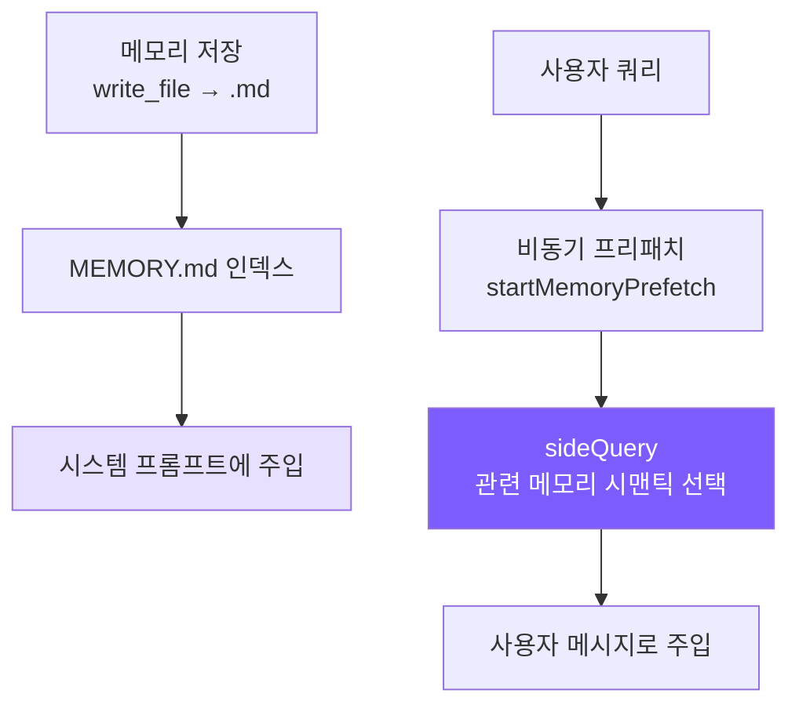

# 8. 메모리 시스템

## 챕터 목표

세션 간 메모리를 구현합니다: 에이전트가 대화 히스토리에 의존하지 않고 여러 대화에 걸쳐 사용자와 프로젝트에 대한 인식을 유지하도록 합니다.



---

## Claude Code의 구현 방식

Claude Code 메모리 시스템의 핵심 제약은 하나의 규칙으로 요약됩니다: **현재 프로젝트 상태에서 도출할 수 없는 정보만 기억하세요**. 코드 패턴, 아키텍처, 파일 경로, git 히스토리, 진행 중인 디버깅 -- 이것들은 코드 읽기와 `git log`로 모두 얻을 수 있으며, 메모리에 저장하면 드리프트만 생깁니다. 사용자가 명시적으로 저장을 요청한 정보도 예외가 아닙니다 -- 사용자가 "이 PR 목록을 기억해줘"라고 하면, 에이전트는 반론해야 합니다: 이 목록에서 도출 불가능한 것이 무엇인가요? 특정 마감일? 예상치 못한 발견?

메모리는 네 가지 유형으로 나뉩니다:

| 유형 | 기억할 내용 | 트리거 시점 |
|------|------------|------------|
| **user** | 사용자 신원, 선호도, 지식 배경 | 사용자 역할/선호도 파악 시 |
| **feedback** | 에이전트 행동에 대한 수정 **및 긍정** | 사용자가 행동을 수정하거나 긍정할 때 |
| **project** | 프로젝트 진행 상황, 결정, 마감일 | 프로젝트 역학 파악 시 |
| **reference** | 외부 시스템의 위치 정보 | 외부 시스템 위치 파악 시 |

자유 형식 태그 대신 닫힌 분류법 -- 태그 증식으로 인해 리콜 시 매칭이 흐려지는 것을 방지합니다.

`feedback` 유형에는 뉘앙스가 있습니다: 수정 사항뿐만 아니라 사용자의 긍정도 기록합니다. 이유는 실용적입니다: "실수"만 기록하면 모델이 반복을 피하는 데 도움이 되지만, 사용자가 이미 좋다고 검증한 관행을 버리게 만들 수도 있습니다. 두 유형 모두 본문에 `Why`와 `How to apply`를 포함해야 합니다 -- "왜"를 알아야 엣지 케이스를 판단할 수 있기 때문입니다; 규칙을 맹목적으로 따르는 것은 종종 역효과를 냅니다.

`project` 유형에는 특정 요구사항이 있습니다: 상대적 날짜를 절대 날짜로 변환해야 합니다. "목요일 이후 머지 동결" -> "2026-03-05 이후 머지 동결". 메모리는 몇 주 후에 읽힐 수 있는데, 그때 "목요일"은 의미가 없어집니다.

**MEMORY.md는 인덱스이지 컨테이너가 아닙니다.** 매 세션마다 시스템 프롬프트에 전체가 로드되므로 간결해야 합니다 -- 항목당 한 줄과 링크, 실제 내용은 필요 시 읽습니다. 200줄 / 25KB에서 이중으로 잘라내며, 초과 시 힌트가 추가됩니다: "인덱스 항목을 ~200자 이하의 한 줄로 유지하세요." 오류 메시지에는 수정 지침이 포함됩니다 -- 전체 시스템에 걸쳐 나타나는 설계 습관입니다.

**리콜 메커니즘**은 키워드 검색 대신 `sideQuery`를 사용하여 모델에게 시맨틱 매칭을 맡깁니다. 사용자가 "배포 프로세스"에 대해 물으면 시맨틱 매칭으로 "CI/CD 고려사항"이라는 제목의 메모리를 찾을 수 있지만 키워드 매칭으로는 불가능합니다. 리콜은 모델이 응답을 생성하기 시작하는 동안 비동기적으로 실행됩니다(`pendingMemoryPrefetch`). 사용자 관점에서 지연은 거의 0입니다. 각 리콜은 최대 5개 항목을 반환하여 컨텍스트 비용을 제어합니다.

각 메모리는 **신선도 경고**도 가집니다 -- 1일이 넘은 메모리에는 며칠이 지났는지 주석이 달려 모델에게 메모리는 실시간 상태가 아닌 특정 시점의 스냅샷임을 상기시킵니다. "마감일이 다음 주"라는 메모리는 모델이 2주 후에 그것이 구식일 수 있다는 것을 모르면 오도할 수 있습니다.

---

## 우리의 구현

### 저장 구조

```
~/.mini-claude/projects/{sha256-hash}/memory/
├── MEMORY.md                          # 인덱스 파일
├── user_prefers_concise_output.md
├── feedback_no_summary_at_end.md
├── project_auth_migration_q2.md
└── reference_ci_dashboard_url.md
```

경로의 해시는 `process.cwd()`의 sha256 첫 16자입니다 -- 동일한 프로젝트 디렉토리는 항상 동일한 메모리 공간으로 매핑됩니다.

### 메모리 파일 형식

```markdown
---
name: Don't summarize at the end of responses
description: User explicitly asked to skip summary paragraphs
type: feedback
---
User said "don't summarize at the end of responses" because they can review diffs and code changes themselves.

**Why:** User finds summaries a waste of time and prefers getting results directly.
**How to apply:** After completing a task, end immediately without adding "Summary" or "In summary..." paragraphs.
```

### 프론트매터 파싱 (공유 모듈)

메모리와 스킬 모두 YAML 프론트매터를 파싱해야 하므로 `frontmatter.ts`로 추출됩니다:

<!-- tabs:start -->
#### **TypeScript**
```typescript
// frontmatter.ts

export function parseFrontmatter(content: string): FrontmatterResult {
  const lines = content.split("\n");
  if (lines[0]?.trim() !== "---") return { meta: {}, body: content };

  let endIdx = -1;
  for (let i = 1; i < lines.length; i++) {
    if (lines[i].trim() === "---") { endIdx = i; break; }
  }
  if (endIdx === -1) return { meta: {}, body: content };

  const meta: Record<string, string> = {};
  for (let i = 1; i < endIdx; i++) {
    const colonIdx = lines[i].indexOf(":");
    if (colonIdx === -1) continue;
    const key = lines[i].slice(0, colonIdx).trim();
    const value = lines[i].slice(colonIdx + 1).trim();
    if (key) meta[key] = value;
  }

  const body = lines.slice(endIdx + 1).join("\n").trim();
  return { meta, body };
}
```
#### **Python**
```python
# frontmatter.py

@dataclass
class FrontmatterResult:
    meta: dict[str, str] = field(default_factory=dict)
    body: str = ""


def parse_frontmatter(content: str) -> FrontmatterResult:
    lines = content.split("\n")
    if not lines or lines[0].strip() != "---":
        return FrontmatterResult(body=content)

    end_idx = -1
    for i in range(1, len(lines)):
        if lines[i].strip() == "---":
            end_idx = i
            break
    if end_idx == -1:
        return FrontmatterResult(body=content)

    meta: dict[str, str] = {}
    for i in range(1, end_idx):
        colon_idx = lines[i].find(":")
        if colon_idx == -1:
            continue
        key = lines[i][:colon_idx].strip()
        value = lines[i][colon_idx + 1:].strip()
        if key:
            meta[key] = value

    body = "\n".join(lines[end_idx + 1:]).strip()
    return FrontmatterResult(meta=meta, body=body)
```
<!-- tabs:end -->

`js-yaml` 같은 라이브러리를 사용하지 않습니다 -- 우리의 프론트매터는 단순한 `key: value` 쌍이며, 20줄짜리 직접 작성 파서로 의존성 없이 충분합니다.

### 저장과 인덱싱

<!-- tabs:start -->
#### **TypeScript**
```typescript
// memory.ts -- saveMemory

export function saveMemory(entry: Omit<MemoryEntry, "filename">): string {
  const dir = getMemoryDir();
  const filename = `${entry.type}_${slugify(entry.name)}.md`;
  const content = formatFrontmatter(
    { name: entry.name, description: entry.description, type: entry.type },
    entry.content
  );
  writeFileSync(join(dir, filename), content);
  updateMemoryIndex();
  return filename;
}

function updateMemoryIndex(): void {
  const memories = listMemories();
  const lines = ["# Memory Index", ""];
  for (const m of memories) {
    lines.push(`- **[${m.name}](${m.filename})** (${m.type}) — ${m.description}`);
  }
  writeFileSync(getIndexPath(), lines.join("\n"));
}
```
#### **Python**
```python
# memory.py -- save_memory

def save_memory(name: str, description: str, type: str, content: str) -> str:
    d = get_memory_dir()
    filename = f"{type}_{_slugify(name)}.md"
    text = format_frontmatter(
        {"name": name, "description": description, "type": type}, content
    )
    (d / filename).write_text(text)
    _update_memory_index()
    return filename

def _update_memory_index() -> None:
    memories = list_memories()
    lines = ["# Memory Index", ""]
    for m in memories:
        lines.append(f"- **[{m.name}]({m.filename})** ({m.type}) — {m.description}")
    _get_index_path().write_text("\n".join(lines))
```
<!-- tabs:end -->

파일명 형식 `{type}_{slugified_name}.md`는 파일시스템에서 정렬 시 파일이 유형별로 자동 그룹화되고, 시각적으로 스캔하기 쉽습니다. 인덱스는 매 쓰기 후 즉시 재빌드되어 MEMORY.md가 파일시스템과 동기화됩니다.

### 인덱스 잘라내기

<!-- tabs:start -->
#### **TypeScript**
```typescript
// memory.ts -- loadMemoryIndex

const MAX_INDEX_LINES = 200;
const MAX_INDEX_BYTES = 25000;

export function loadMemoryIndex(): string {
  // ...
  const lines = content.split("\n");
  if (lines.length > MAX_INDEX_LINES) {
    content = lines.slice(0, MAX_INDEX_LINES).join("\n") +
      "\n\n[... truncated, too many memory entries ...]";
  }
  if (Buffer.byteLength(content) > MAX_INDEX_BYTES) {
    content = content.slice(0, MAX_INDEX_BYTES) +
      "\n\n[... truncated, index too large ...]";
  }
  return content;
}
```
#### **Python**
```python
# memory.py -- load_memory_index

MAX_INDEX_LINES = 200
MAX_INDEX_BYTES = 25000

def load_memory_index() -> str:
    index_path = _get_index_path()
    if not index_path.exists():
        return ""
    content = index_path.read_text()
    lines = content.split("\n")
    if len(lines) > MAX_INDEX_LINES:
        content = "\n".join(lines[:MAX_INDEX_LINES]) + "\n\n[... truncated, too many memory entries ...]"
    if len(content.encode()) > MAX_INDEX_BYTES:
        content = content[:MAX_INDEX_BYTES] + "\n\n[... truncated, index too large ...]"
    return content
```
<!-- tabs:end -->

두 잘라내기 계층은 서로 다른 목적을 가집니다: 줄 잘라내기(200줄)는 완전한 항목 경계에서 자르는 일반적인 보호이고; 바이트 잘라내기(25KB)는 줄 수는 적지만 개별 줄이 극도로 긴 경우를 잡는 비정상적 방어입니다 -- Claude Code 팀은 프로덕션에서 200줄 안에 197KB가 들어간 사례를 본 적이 있습니다.

### 시스템 프롬프트 주입

`buildMemoryPromptSection()`은 시스템 프롬프트에 주입되는 텍스트를 생성하여 모델에게 메모리 시스템의 존재와 사용법을 알립니다:

<!-- tabs:start -->
#### **TypeScript**
```typescript
// memory.ts -- buildMemoryPromptSection (단순화)

export function buildMemoryPromptSection(): string {
  const index = loadMemoryIndex();
  const memoryDir = getMemoryDir();

  return `# Memory System

You have a persistent, file-based memory system at \`${memoryDir}\`.

## Memory Types
- **user**: User's role, preferences, knowledge level
- **feedback**: Corrections and guidance from the user
- **project**: Ongoing work, goals, deadlines, decisions
- **reference**: Pointers to external resources

## How to Save Memories
Use the write_file tool to create a memory file with YAML frontmatter:
...
Save to: \`${memoryDir}/\`
Filename format: \`{type}_{slugified_name}.md\`

## What NOT to Save
- Code patterns or architecture (read the code instead)
- Git history (use git log)
- Anything already in CLAUDE.md
- Ephemeral task details

${index ? `## Current Memory Index\n${index}` : "(No memories saved yet.)"}`;
}
```
#### **Python**
```python
# memory.py -- build_memory_prompt_section (단순화)

def build_memory_prompt_section() -> str:
    index = load_memory_index()
    memory_dir = str(get_memory_dir())

    return f"""# Memory System

You have a persistent, file-based memory system at `{memory_dir}`.

## Memory Types
- **user**: User's role, preferences, knowledge level
- **feedback**: Corrections and guidance from the user
- **project**: Ongoing work, goals, deadlines, decisions
- **reference**: Pointers to external resources

## How to Save Memories
Use the write_file tool to create a memory file with YAML frontmatter:
...
Save to: `{memory_dir}/`
Filename format: `{{type}}_{{slugified_name}}.md`

## What NOT to Save
- Code patterns or architecture (read the code instead)
- Git history (use git log)
- Anything already in CLAUDE.md
- Ephemeral task details

{"## Current Memory Index" + chr(10) + index if index else "(No memories saved yet.)"}"""
```
<!-- tabs:end -->

이 프롬프트는 세 가지 일을 합니다: 모델에게 분류 방법을 가르치고(네 가지 유형), 작업 방법을 가르치고(`write_file` 사용, 저장 위치, 형식), 자제를 가르칩니다("저장하지 말아야 할 것"). "모델이 메모리를 사용하게 만드는 것"은 단순히 도구를 제공하는 것만이 아닙니다 -- 모델이 좋은 결정을 내릴 수 있도록 프롬프트에 완전한 유형 시스템과 경계를 설명해야 합니다.

마지막으로 `prompt.ts`에서 플레이스홀더를 통해 주입됩니다:

<!-- tabs:start -->
#### **TypeScript**
```typescript
systemPrompt = systemPrompt.replace("{{memory}}", buildMemoryPromptSection());
```
#### **Python**
```python
result = result.replace("{{memory}}", build_memory_prompt_section())
```
<!-- tabs:end -->

### CLI 인터랙션

사용자는 REPL에서 `/memory`를 입력하여 모든 메모리를 나열할 수 있습니다:

<!-- tabs:start -->
#### **TypeScript**
```typescript
if (input === "/memory") {
  const memories = listMemories();
  if (memories.length === 0) {
    printInfo("No memories saved yet.");
  } else {
    printInfo(`${memories.length} memories:`);
    for (const m of memories) {
      console.log(`    [${m.type}] ${m.name} — ${m.description}`);
    }
  }
}
```
#### **Python**
```python
if inp == "/memory":
    memories = list_memories()
    if not memories:
        print_info("No memories saved yet.")
    else:
        print_info(f"{len(memories)} memories:")
        for m in memories:
            print(f"    [{m.type}] {m.name} — {m.description}")
    continue
```
<!-- tabs:end -->

---

### 시맨틱 리콜 (sideQuery)

초기 버전은 키워드 매칭으로 메모리 리콜을 했습니다 -- 쿼리를 단어로 분리하고 각 메모리 항목의 히트 수를 세어 랭킹을 매겼습니다. 단순하지만 한계가 있었습니다: 사용자가 "배포 프로세스"를 물으면 "CI/CD 고려사항"이라는 제목의 메모리는 공통 키워드가 없어 0점을 받습니다.

새 버전은 시맨틱 리콜을 위해 `sideQuery`를 사용합니다: 모든 메모리 파일명과 설명을 모델에 보내고 현재 쿼리와 관련성을 판단하게 합니다.

```typescript
// memory.ts -- selectRelevantMemories

const SELECT_MEMORIES_PROMPT = `You are selecting memories that will be useful to an AI coding assistant as it processes a user's query. You will be given the user's query and a list of available memory files with their filenames and descriptions.

Return a JSON object with a "selected_memories" array of filenames for the memories that will clearly be useful (up to 5). Only include memories that you are certain will be helpful based on their name and description.
- If you are unsure if a memory will be useful, do not include it.
- If no memories would clearly be useful, return an empty array.`;

export async function selectRelevantMemories(
  query: string,
  sideQuery: SideQueryFn,
  alreadySurfaced: Set<string>,
  signal?: AbortSignal,
): Promise<RelevantMemory[]> {
  const headers = scanMemoryHeaders();
  if (headers.length === 0) return [];

  // 이번 세션에서 이미 표시된 메모리 필터링
  const candidates = headers.filter((h) => !alreadySurfaced.has(h.filePath));
  if (candidates.length === 0) return [];

  const manifest = formatMemoryManifest(candidates);

  try {
    const text = await sideQuery(
      SELECT_MEMORIES_PROMPT,
      `Query: ${query}\n\nAvailable memories:\n${manifest}`,
      signal,
    );

    // 응답에서 JSON 추출 (모델이 마크다운 코드 블록으로 감쌀 수 있음)
    const jsonMatch = text.match(/\{[\s\S]*\}/);
    if (!jsonMatch) return [];

    const parsed = JSON.parse(jsonMatch[0]);
    const selectedFilenames: string[] = parsed.selected_memories || [];

    // 파일명을 헤더로 역매핑, 전체 내용 읽기
    const filenameSet = new Set(selectedFilenames);
    const selected = candidates.filter((h) => filenameSet.has(h.filename));

    return selected.slice(0, 5).map((h) => {
      let content = readFileSync(h.filePath, "utf-8");
      // 파일당 잘라내기 (4KB)
      if (Buffer.byteLength(content) > MAX_MEMORY_BYTES_PER_FILE) {
        content = content.slice(0, MAX_MEMORY_BYTES_PER_FILE) +
          "\n\n[... truncated, memory file too large ...]";
      }
      const freshness = memoryFreshnessWarning(h.mtimeMs);
      const headerText = freshness
        ? `${freshness}\n\nMemory: ${h.filePath}:`
        : `Memory (saved ${memoryAge(h.mtimeMs)}): ${h.filePath}:`;

      return { path: h.filePath, content, mtimeMs: h.mtimeMs, header: headerText };
    });
  } catch (err: any) {
    // 조용한 실패 -- 메모리 리콜은 절대 메인 루프를 차단해서는 안 됨
    if (signal?.aborted) return [];
    console.error(`[memory] semantic recall failed: ${err.message}`);
    return [];
  }
}
```

몇 가지 핵심 설계 포인트:

**sideQuery는 별도의 작은 모델이 아니라 동일한 모델을 사용합니다.** Claude Code는 sideQuery에 Sonnet을 사용하지만 우리는 사용자가 설정한 모델을 재사용하여 단순화합니다. sideQuery는 메모리 매니페스트(파일명 + 설명)만 보내고 전체 내용은 보내지 않으므로 입력 토큰이 최소화됩니다.

**모델의 시맨틱 선택은 키워드 매칭보다 훨씬 강력합니다.** "배포 프로세스"가 "CI/CD 고려사항"을 매칭할 수 있고, "데이터베이스 성능"이 "PostgreSQL 인덱스 최적화 경험"을 매칭할 수 있습니다 -- 모델이 문자적 중복이 아닌 시맨틱 관계를 이해하기 때문입니다.

**`alreadySurfaced` Set이 중복 리콜을 방지합니다.** 현재 세션에서 이미 표시된 메모리는 다시 나타나지 않아 사용자가 매 질문마다 같은 메모리를 보는 것을 방지합니다. 이 Set은 세션 전체 동안 증가합니다.

**파일당 4KB 잘라내기 + 60KB 세션 예산.** 하나의 큰 메모리나 누적된 리콜이 컨텍스트를 가득 채우는 것을 방지합니다. 예산은 토큰 수준이 아닌 바이트 수준으로 제어됩니다 -- 바이트 계산이 더 빠르고 다국어 텍스트에 더 공정합니다.

> **구 키워드 매칭과의 비교(현재 교체됨):** 구 구현은 쿼리를 단어로 분리하고 하나씩 매칭했습니다 -- API 호출 없이 단순하지만 정확도가 낮았습니다. 새 버전은 리콜당 1회 API 호출을 소비하지만 시맨틱 이해 능력은 질적 도약입니다. 메모리가 적은 튜토리얼 프로젝트에서 이 API 비용은 완전히 수용 가능합니다.

### 비동기 프리패치 (startMemoryPrefetch)

시맨틱 리콜은 API 호출이 필요하며, 동기적으로 실행하면 사용자 대기 시간이 늘어납니다. 해결책: **사용자가 입력을 제출하는 즉시 리콜을 시작하고, 첫 번째 모델 API 호출과 병렬로 실행합니다.**

```typescript
// memory.ts -- startMemoryPrefetch

export function startMemoryPrefetch(
  query: string,
  sideQuery: SideQueryFn,
  alreadySurfaced: Set<string>,
  sessionMemoryBytes: number,
  signal?: AbortSignal,
): MemoryPrefetch | null {
  // 게이트 1: 단어 하나 쿼리 건너뜀 (시맨틱 매칭에 너무 짧음)
  if (!/\s/.test(query.trim())) return null;

  // 게이트 2: 세션 예산 초과
  if (sessionMemoryBytes >= MAX_SESSION_MEMORY_BYTES) return null;

  // 게이트 3: 메모리 파일 없음
  const dir = getMemoryDir();
  const hasMemories = readdirSync(dir).some(
    (f) => f.endsWith(".md") && f !== "MEMORY.md"
  );
  if (!hasMemories) return null;

  const handle: MemoryPrefetch = {
    promise: selectRelevantMemories(query, sideQuery, alreadySurfaced, signal),
    settled: false,
    consumed: false,
  };
  handle.promise.then(() => { handle.settled = true; }).catch(() => { handle.settled = true; });
  return handle;
}
```

`agent.ts`에서의 사용:

```typescript
// agent.ts -- 프리패치 시작과 소비

// 사용자 메시지 도착 즉시 프리패치 시작
this.anthropicMessages.push({ role: "user", content: userMessage });
let memoryPrefetch: MemoryPrefetch | null = null;
if (!this.isSubAgent) {
  const sq = this.buildSideQuery();
  if (sq) {
    memoryPrefetch = startMemoryPrefetch(
      userMessage, sq,
      this.alreadySurfacedMemories, this.sessionMemoryBytes,
      this.abortController?.signal,
    );
  }
}

// while 루프에서 비차단 폴링, 각 API 호출 전
if (memoryPrefetch && memoryPrefetch.settled && !memoryPrefetch.consumed) {
  memoryPrefetch.consumed = true;
  const memories = await memoryPrefetch.promise;
  if (memories.length > 0) {
    const injectionText = formatMemoriesForInjection(memories);
    this.anthropicMessages.push({ role: "user", content: injectionText });
    // 표시된 메모리와 세션 예산 추적
    for (const m of memories) {
      this.alreadySurfacedMemories.add(m.path);
      this.sessionMemoryBytes += Buffer.byteLength(m.content);
    }
  }
}
```

이 설계의 핵심은 **비차단 폴링**입니다:

1. **프리패치는 사용자 입력 시 시작됩니다** -- 첫 번째 모델 API 호출과 병렬로 실행되므로 사용자가 추가 지연을 느끼지 못합니다
2. **매 루프 반복마다 확인됩니다** -- 프리패치가 완료되지 않으면 기다리지 않고 건너뛰며, 다음 반복에서 다시 확인합니다
3. **`settled` 플래그가 `.then()`으로 설정됩니다** -- `await` 없이, 완료가 확인된 후에만 결과를 읽습니다
4. **사용 후 `consumed = true`로 표시됩니다** -- 같은 프리패치가 한 번만 주입되도록 보장합니다

세 가지 게이트 조건이 API 호출 낭비를 방지합니다:
- **다중 단어 쿼리**: 단어 하나("안녕")는 의미 있는 시맨틱 매칭에 너무 짧습니다
- **세션 예산**: 60KB 누적 초과 후 리콜 중단, 컨텍스트 과부하 방지
- **메모리 존재**: 메모리 파일이 없으면 건너뛰어 API 호출 절약

`formatMemoriesForInjection`은 각 메모리를 `<system-reminder>` 태그로 감싸고 사용자 메시지로 주입합니다:

```typescript
export function formatMemoriesForInjection(memories: RelevantMemory[]): string {
  return memories
    .map((m) => `<system-reminder>\n${m.header}\n\n${m.content}\n</system-reminder>`)
    .join("\n\n");
}
```

### 신선도 경고

메모리는 실시간 상태가 아닌 특정 시점의 스냅샷입니다. "프로젝트 마감일이 다음 주"라는 메모리는 2주 후에 읽히면 구식이 되고, 모델이 이것을 모르면 잘못된 조언을 할 수 있습니다.

```typescript
// memory.ts -- memoryFreshnessWarning

export function memoryFreshnessWarning(mtimeMs: number): string {
  const days = Math.max(0, Math.floor((Date.now() - mtimeMs) / 86_400_000));
  if (days <= 1) return "";
  return `This memory is ${days} days old. Memories are point-in-time observations, not live state — claims about code behavior may be outdated. Verify against current code before asserting as fact.`;
}
```

규칙은 단순합니다: 1일 이내에는 프롬프트 없음(정보가 본질적으로 신선함), 1일 이후에는 경고가 첨부됩니다. 경고 텍스트는 모델에게 두 가지를 명시적으로 알립니다: "이것은 과거 특정 시점의 관찰이다"와 "사실로 명시하기 전에 현재 코드와 대조 검증하라." 단순히 "X일 전"이라고 레이블링하는 것보다 더 효과적입니다 -- 정보가 아닌 행동 지시를 제공합니다.

---

## 핵심 설계 결정

**메모리에 데이터베이스 대신 파일시스템을 사용하는 이유?** 세 가지 이점: 사용자가 에디터로 메모리 파일을 직접 읽고 쓸 수 있습니다; 모델이 전용 메모리 API 없이 기존 `write_file`/`read_file` 도구로 작업할 수 있습니다; 원하면 git 버전 관리에 넣을 수 있습니다. 메모리 시스템은 도구 시스템에 "편승"하여 노출해야 하는 인터페이스 수를 줄입니다.

**키워드 매칭 대신 시맨틱 리콜을 사용하는 이유?** 키워드 매칭은 문자적 중복이 있는 메모리만 찾을 수 있습니다. 시맨틱 리콜은 "배포 프로세스"와 "CI/CD 고려사항" 사이의 연결을 이해합니다. 비용은 리콜당 1회 API 호출이지만 sideQuery는 메모리 매니페스트(파일명 + 설명)만 보내므로 입력 토큰이 최소화되고 비용이 낮습니다. 메모리가 제한된 시나리오에서 이 트레이드오프는 충분히 가치 있습니다.

**동기적 리콜 대신 비동기 프리패치를 사용하는 이유?** 동기적 리콜은 매 질문마다 사용자가 추가 API 라운드트립을 기다려야 함을 의미합니다. 프리패치는 첫 번째 모델 호출과 병렬로 실행됩니다 -- 프리패치가 먼저 완료되면 메모리가 첫 번째 응답에서 보입니다; 아니면 두 번째 라운드에서 따라옵니다. 최악의 경우 메모리가 한 라운드 늦게 도착하지만 사용자는 기다릴 필요가 없습니다.

**세션 수준 예산을 사용하는 이유?** 무제한 리콜은 컨텍스트를 메모리로 채워 실제 대화 내용을 밀어낼 것입니다. 60KB 예산은 대략 20-30개의 중간 길이 메모리에 해당하며, 세션의 컨텍스트 요구를 충족하기에 충분합니다. `alreadySurfaced` Set과 예산 상한의 조합으로 세션이 진행될수록 메모리 리콜이 점점 정확해집니다 -- 이미 표시된 항목은 반복되지 않고, 예산 내에서 진정으로 필요한 항목만 들어옵니다.

### 비교 개요

| 차원 | Claude Code | mini-claude |
|------|------------|-------------|
| **리콜 방법** | Sonnet sideQuery 시맨틱 매칭 | sideQuery 시맨틱 매칭 (동일 모델) |
| **비동기 프리패치** | pendingMemoryPrefetch | startMemoryPrefetch |
| **세션 예산** | 60KB | 60KB |
| **신선도** | 구식 경고 | 구식 경고 |
| **API 호출** | 리콜당 1회 | 리콜당 1회 |

---

> **다음 챕터**: 재사용 가능한 프롬프트 모듈 -- 스킬 시스템.
