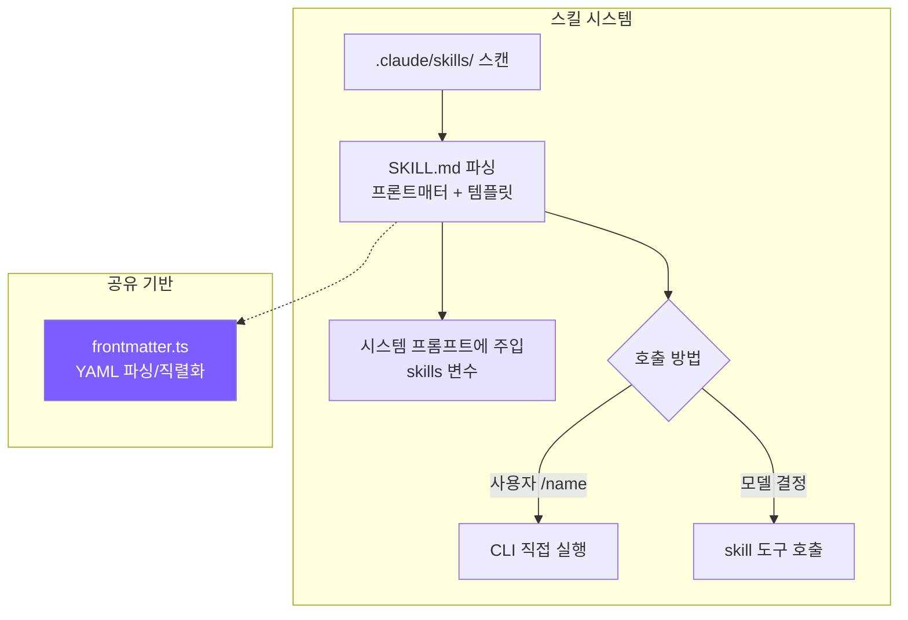
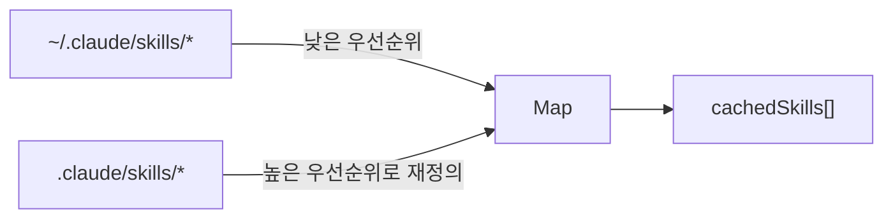
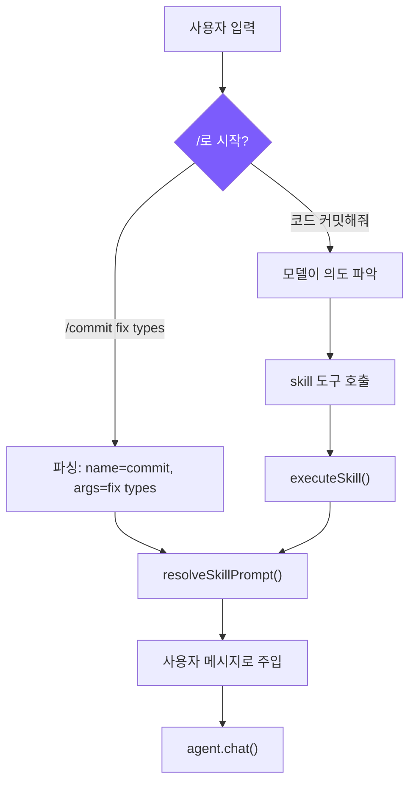

# 9. 스킬 시스템

## 챕터 목표

에이전트에게 재사용 가능한 프롬프트 모듈을 제공합니다: 사용자가 한 번 정의하고 반복적으로 호출합니다. 셸 스크립트처럼 -- 설치하고 사용합니다.



---

## Claude Code의 구현 방식

스킬은 Claude Code의 "AI 셸 스크립트"입니다 -- AI 워크플로우를 템플릿화하여 한 번 정의하고 반복 재사용합니다. `/commit` 스킬은 "diff 읽기 -> 변경사항 분석 -> 커밋 메시지 작성 -> 커밋"의 완전한 프롬프트를 캡슐화합니다.

스킬은 6개 소스에서 로드되며, 우선순위는 높은 것부터: 기업 정책(관리됨) > 프로젝트 수준 > 사용자 수준 > 플러그인 > 내장(번들) > MCP. 패턴은 단순합니다: 사용자 제어에 더 가까운 소스가 더 높은 우선순위를 가지며, MCP는 신뢰할 수 없는 원격 서버에서 오므로 맨 아래에 위치합니다. 각 스킬은 디렉토리 형식 `skill-name/SKILL.md`여야 하며, `${CLAUDE_SKILL_DIR}`을 통해 참조되는 리소스 파일을 번들링할 수 있습니다.

시작 시에는 프론트매터만 사전 로드됩니다(name/description/whenToUse); 전체 프롬프트는 호출 시에만 읽힙니다. 수십 개의 스킬을 모두 완전히 로드하면 상당한 컨텍스트 공간을 소비하므로, 지연 로딩은 실제로 필요한 순간까지 비용을 미룹니다. 프론트매터만으로도 토큰 공간이 필요합니다 -- `formatCommandsWithinBudget()`은 3단계 알고리즘을 사용합니다: 예산이 충분하면 모두 표시; 초과하면 내장 스킬(`/commit`, `/review`)은 항상 전체 설명을 유지하고 나머지는 남은 예산을 균등 분배; 각 스킬이 20자 미만이 되면 이름만 표시로 저하됩니다.

스킬 프롬프트는 실행 전에 다중 레이어 치환을 거칩니다: `$ARGUMENTS`는 사용자 인수로 교체되고, `${CLAUDE_SKILL_DIR}`은 스킬 디렉토리 경로로 교체되고, `` !`command` ``는 인라인 셸 명령을 실행합니다(MCP 스킬에는 비활성화 -- 원격 프롬프트 인젝션이 임의 명령을 실행하는 것을 방지).

두 가지 실행 모드가 있습니다: **인라인**(기본값)은 현재 대화에 직접 주입하고, **포크**는 독립적인 서브 에이전트를 생성하여 실행하고 결과를 반환합니다. 포크는 많은 도구 호출이 필요한 스킬에 적합합니다 -- 예를 들어 코드 리뷰는 여러 파일을 읽어야 하는데, 그 호출들이 메인 대화 컨텍스트를 오염시킵니다. 포크를 사용하면 최종 결과만 메인 스레드로 반환됩니다.

---

## 우리의 구현

### SKILL.md 형식

```markdown
---
name: commit
description: Create a git commit with a descriptive message
when_to_use: When the user asks to commit changes or says "commit"
allowed-tools: run_shell, read_file
user-invocable: true
---
Look at the current git diff and staged changes. Write a clear, concise
commit message following conventional commits format.

The user's request: $ARGUMENTS

Project skill directory: ${CLAUDE_SKILL_DIR}
```

- `when_to_use`: 모델에게 표시되는 트리거 조건, 자동 호출 여부를 모델이 결정
- `allowed-tools`: 보안 경계, 스킬이 사용할 수 있는 도구 제한
- `user-invocable`: `false`인 스킬은 모델이 자동으로만 트리거할 수 있음

### 발견과 로드



<!-- tabs:start -->
#### **TypeScript**
```typescript
// skills.ts -- discoverSkills

let cachedSkills: SkillDefinition[] | null = null;

export function discoverSkills(): SkillDefinition[] {
  if (cachedSkills) return cachedSkills;

  const skills = new Map<string, SkillDefinition>();

  loadSkillsFromDir(join(homedir(), ".claude", "skills"), "user", skills);
  loadSkillsFromDir(join(process.cwd(), ".claude", "skills"), "project", skills);

  cachedSkills = Array.from(skills.values());
  return cachedSkills;
}
```
#### **Python**
```python
# skills.py -- discover_skills

_cached_skills: list[SkillDefinition] | None = None


def discover_skills() -> list[SkillDefinition]:
    global _cached_skills
    if _cached_skills is not None:
        return _cached_skills

    skills: dict[str, SkillDefinition] = {}

    _load_skills_from_dir(Path.home() / ".claude" / "skills", "user", skills)
    _load_skills_from_dir(Path.cwd() / ".claude" / "skills", "project", skills)

    _cached_skills = list(skills.values())
    return _cached_skills
```
<!-- tabs:end -->

중복 제거를 위해 Map을 사용하면 자연스럽게 "프로젝트 수준이 사용자 수준을 재정의"가 구현됩니다 -- 먼저 사용자를 로드하고 그 다음 프로젝트를 로드하면 동일 이름 키가 후자로 덮어씌워집니다. Claude Code가 6개 소스를 가지는 것은 기업 및 MCP 시나리오를 지원해야 하기 때문입니다; 프로젝트 + 사용자로 개인 개발자의 핵심 요구사항을 충족합니다.

### 스킬 파싱

<!-- tabs:start -->
#### **TypeScript**
```typescript
// skills.ts -- parseSkillFile

function parseSkillFile(
  filePath: string, source: "project" | "user", skillDir: string
): SkillDefinition | null {
  const raw = readFileSync(filePath, "utf-8");
  const { meta, body } = parseFrontmatter(raw);

  const name = meta.name || skillDir.split("/").pop() || "unknown";
  const userInvocable = meta["user-invocable"] !== "false";

  let allowedTools: string[] | undefined;
  if (meta["allowed-tools"]) {
    const raw = meta["allowed-tools"];
    if (raw.startsWith("[")) {
      try { allowedTools = JSON.parse(raw); } catch {
        allowedTools = raw.replace(/[\[\]]/g, "").split(",").map((s) => s.trim());
      }
    } else {
      allowedTools = raw.split(",").map((s) => s.trim());
    }
  }

  return {
    name, description: meta.description || "",
    whenToUse: meta.when_to_use || meta["when-to-use"],
    allowedTools, userInvocable,
    promptTemplate: body, source, skillDir,
  };
}
```
#### **Python**
```python
# skills.py -- _parse_skill_file

def _parse_skill_file(
    file_path: Path, source: str, skill_dir: str
) -> SkillDefinition | None:
    try:
        raw = file_path.read_text()
        result = parse_frontmatter(raw)
        meta = result.meta

        name = meta.get("name") or file_path.parent.name or "unknown"
        user_invocable = meta.get("user-invocable", "true") != "false"
        context = "fork" if meta.get("context") == "fork" else "inline"

        allowed_tools: list[str] | None = None
        if "allowed-tools" in meta:
            raw_tools = meta["allowed-tools"]
            if raw_tools.startswith("["):
                try:
                    allowed_tools = json.loads(raw_tools)
                except Exception:
                    allowed_tools = [s.strip() for s in raw_tools.strip("[]").split(",")]
            else:
                allowed_tools = [s.strip() for s in raw_tools.split(",")]

        return SkillDefinition(
            name=name, description=meta.get("description", ""),
            when_to_use=meta.get("when_to_use") or meta.get("when-to-use"),
            allowed_tools=allowed_tools, user_invocable=user_invocable,
            context=context, prompt_template=result.body,
            source=source, skill_dir=skill_dir,
        )
    except Exception:
        return None
```
<!-- tabs:end -->

`allowed-tools`는 쉼표 구분과 JSON 배열 형식을 모두 지원하며, 먼저 JSON.parse를 시도하고 실패하면 쉼표 분할로 폴백합니다 -- 두 형식 모두 YAML 작성 시 자연스러우며, 장애 허용 파싱이 형식 문제로 인한 스킬 로드 실패를 방지합니다. `when_to_use`는 같은 이유로 언더스코어와 하이픈 키 이름을 모두 허용합니다.

### 프롬프트 템플릿 치환

<!-- tabs:start -->
#### **TypeScript**
```typescript
// skills.ts -- resolveSkillPrompt

export function resolveSkillPrompt(skill: SkillDefinition, args: string): string {
  let prompt = skill.promptTemplate;
  prompt = prompt.replace(/\$ARGUMENTS|\$\{ARGUMENTS\}/g, args);
  prompt = prompt.replace(/\$\{CLAUDE_SKILL_DIR\}/g, skill.skillDir);
  return prompt;
}
```
#### **Python**
```python
# skills.py -- resolve_skill_prompt

def resolve_skill_prompt(skill: SkillDefinition, args: str) -> str:
    prompt = skill.prompt_template
    prompt = re.sub(r"\$ARGUMENTS|\$\{ARGUMENTS\}", args, prompt)
    prompt = prompt.replace("${CLAUDE_SKILL_DIR}", skill.skill_dir)
    return prompt
```
<!-- tabs:end -->

`$ARGUMENTS`는 사용자 제공 인수로 교체되고, `${CLAUDE_SKILL_DIR}`은 스킬 디렉토리 경로로 교체됩니다(스킬은 디렉토리에 템플릿 파일을 두고 프롬프트에서 `read_file`로 참조할 수 있습니다). Claude Code는 `` !`shell_command` `` 인라인 실행도 지원하는데 우리는 구현하지 않았습니다 -- 보안 위험이 추가되고 튜토리얼 시나리오에는 필요하지 않습니다.

### 이중 호출 경로



**경로 1: 사용자 수동 호출** (cli.ts)

<!-- tabs:start -->
#### **TypeScript**
```typescript
if (input.startsWith("/")) {
  const spaceIdx = input.indexOf(" ");
  const cmdName = spaceIdx > 0 ? input.slice(1, spaceIdx) : input.slice(1);
  const cmdArgs = spaceIdx > 0 ? input.slice(spaceIdx + 1) : "";
  const skill = getSkillByName(cmdName);
  if (skill && skill.userInvocable) {
    const resolved = resolveSkillPrompt(skill, cmdArgs);
    printInfo(`Invoking skill: ${skill.name}`);
    await agent.chat(resolved);
    return;
  }
}
```
#### **Python**
```python
if inp.startswith("/"):
    space_idx = inp.find(" ")
    cmd_name = inp[1:space_idx] if space_idx > 0 else inp[1:]
    cmd_args = inp[space_idx + 1:] if space_idx > 0 else ""
    skill = get_skill_by_name(cmd_name)
    if skill and skill.user_invocable:
        resolved = resolve_skill_prompt(skill, cmd_args)
        print_info(f"Invoking skill: {skill.name}")
        await agent.chat(resolved)
        continue
```
<!-- tabs:end -->

**경로 2: 모델 프로그래밍 방식 호출** (tools.ts)

<!-- tabs:start -->
#### **TypeScript**
```typescript
// tools.ts -- skill 도구 정의와 실행

{
  name: "skill",
  description: "Invoke a registered skill by name...",
  input_schema: {
    properties: {
      skill_name: { type: "string" },
      args: { type: "string" },
    },
    required: ["skill_name"],
  },
}

function runSkillTool(input: { skill_name: string; args?: string }): string {
  const result = executeSkill(input.skill_name, input.args || "");
  if (!result) return `Unknown skill: ${input.skill_name}`;
  return `[Skill "${input.skill_name}" activated]\n\n${result.prompt}`;
}
```
#### **Python**
```python
# tools.py -- skill 도구 정의와 실행

{
    "name": "skill",
    "description": "Invoke a registered skill by name...",
    "input_schema": {
        "type": "object",
        "properties": {
            "skill_name": {"type": "string"},
            "args": {"type": "string"},
        },
        "required": ["skill_name"],
    },
}

async def _execute_skill_tool(self, inp: dict) -> str:
    result = execute_skill(inp.get("skill_name", ""), inp.get("args", ""))
    if not result:
        return f"Unknown skill: {inp.get('skill_name', '')}"
    return f'[Skill "{inp.get("skill_name", "")}" activated]\n\n{result["prompt"]}'
```
<!-- tabs:end -->

모델이 `skill` 도구를 호출하면 확장된 프롬프트 텍스트를 받고 이후 턴에서 해당 프롬프트에 따라 작업을 실행합니다. 이것은 본질적으로 **메타 도구**입니다 -- 도구의 반환값이 데이터가 아니라 지시문입니다.

### 실행 모드: 인라인 vs 포크

<!-- tabs:start -->
#### **TypeScript**
```typescript
// agent.ts -- executeSkillTool

private async executeSkillTool(input: Record<string, any>): Promise<string> {
  const result = executeSkill(input.skill_name, input.args || "");
  if (!result) return `Unknown skill: ${input.skill_name}`;

  if (result.context === "fork") {
    const tools = result.allowedTools
      ? this.tools.filter(t => result.allowedTools!.includes(t.name))
      : this.tools.filter(t => t.name !== "agent");
    const subAgent = new Agent({
      customSystemPrompt: result.prompt,
      customTools: tools,
      isSubAgent: true,
      permissionMode: "bypassPermissions",
    });
    const subResult = await subAgent.runOnce(input.args || "Execute this skill task.");
    return subResult.text;
  }

  return `[Skill "${input.skill_name}" activated]\n\n${result.prompt}`;
}
```
#### **Python**
```python
# agent.py -- _execute_skill_tool

async def _execute_skill_tool(self, inp: dict) -> str:
    result = execute_skill(inp.get("skill_name", ""), inp.get("args", ""))
    if not result:
        return f"Unknown skill: {inp.get('skill_name', '')}"

    if result["context"] == "fork":
        tools = (
            [t for t in self.tools if t["name"] in result["allowed_tools"]]
            if result.get("allowed_tools")
            else [t for t in self.tools if t["name"] != "agent"]
        )
        sub_agent = Agent(
            model=self.model,
            custom_system_prompt=result["prompt"],
            custom_tools=tools,
            is_sub_agent=True,
            permission_mode="bypassPermissions",
        )
        sub_result = await sub_agent.run_once(inp.get("args") or "Execute this skill task.")
        return sub_result["text"] or "(Skill produced no output)"

    return f'[Skill "{inp.get("skill_name", "")}" activated]\n\n{result["prompt"]}'
```
<!-- tabs:end -->

포크 시 서브 에이전트의 도구는 `allowedTools` 화이트리스트로 제한됩니다; 지정하지 않으면 재귀를 방지하기 위해 `agent` 도구가 제외됩니다. 스킬이 여러 라운드의 도구 호출이 필요할 때(코드 리뷰가 여러 파일을 읽는 것처럼) 포크를 사용하여 메인 대화를 깔끔하게 유지합니다.

### 시스템 프롬프트 설명

<!-- tabs:start -->
#### **TypeScript**
```typescript
// skills.ts -- buildSkillDescriptions

export function buildSkillDescriptions(): string {
  const skills = discoverSkills();
  if (skills.length === 0) return "";

  const lines = ["# Available Skills", ""];
  const invocable = skills.filter((s) => s.userInvocable);
  const autoOnly = skills.filter((s) => !s.userInvocable);

  if (invocable.length > 0) {
    lines.push("User-invocable skills (user types /<name> to invoke):");
    for (const s of invocable) {
      lines.push(`- **/${s.name}**: ${s.description}`);
      if (s.whenToUse) lines.push(`  When to use: ${s.whenToUse}`);
    }
  }

  if (autoOnly.length > 0) {
    lines.push("Auto-invocable skills (use the skill tool when appropriate):");
    for (const s of autoOnly) {
      lines.push(`- **${s.name}**: ${s.description}`);
      if (s.whenToUse) lines.push(`  When to use: ${s.whenToUse}`);
    }
  }

  lines.push("To invoke a skill programmatically, use the `skill` tool.");
  return lines.join("\n");
}
```
#### **Python**
```python
# skills.py -- build_skill_descriptions

def build_skill_descriptions() -> str:
    skills = discover_skills()
    if not skills:
        return ""

    lines = ["# Available Skills", ""]
    invocable = [s for s in skills if s.user_invocable]
    auto_only = [s for s in skills if not s.user_invocable]

    if invocable:
        lines.append("User-invocable skills (user types /<name> to invoke):")
        for s in invocable:
            lines.append(f"- **/{s.name}**: {s.description}")
            if s.when_to_use:
                lines.append(f"  When to use: {s.when_to_use}")
        lines.append("")

    if auto_only:
        lines.append("Auto-invocable skills (use the skill tool when appropriate):")
        for s in auto_only:
            lines.append(f"- **{s.name}**: {s.description}")
            if s.when_to_use:
                lines.append(f"  When to use: {s.when_to_use}")
        lines.append("")

    lines.append("To invoke a skill programmatically, use the `skill` tool.")
    return "\n".join(lines)
```
<!-- tabs:end -->

스킬은 두 그룹으로 표시됩니다: 사용자 호출 가능한 것은 `/` 접두사를 가지고, 모델 전용은 가지지 않습니다. `whenToUse`는 모델이 능동적으로 트리거할지 결정하는 판단 조건입니다. Claude Code는 토큰 예산 제어(`formatCommandsWithinBudget()`)도 구현하는데 우리는 건너뜁니다 -- 튜토리얼 시나리오에는 스킬 수가 제한적입니다.

---

## 핵심 설계 결정

**스킬에 JSON/YAML 대신 마크다운을 사용하는 이유?** 스킬의 본질은 큰 자연어 프롬프트 블록입니다. 마크다운의 본문이 직접 프롬프트이며, 프론트매터가 구조화된 메타데이터를 제공합니다. JSON에 저장하면 프롬프트의 줄바꿈과 따옴표를 이스케이프해야 해서 가독성이 나빠집니다.

**이중 호출 경로가 필요한 이유?** 수동 호출용 `/commit`만 지원하는 것으로는 충분하지 않습니다 -- 사용자가 스킬이 존재하는지 모르고 "코드 커밋해줘"라고 말할 수 있습니다. 모델 자동 호출만 지원하는 것도 충분하지 않습니다 -- 사용자가 때로는 트리거 시점을 정확히 제어하고 싶습니다. 두 경로 모두 결국 같은 `resolveSkillPrompt()`로 수렴하므로 로직이 중복되지 않습니다.

### 비교 개요

| 차원 | Claude Code | mini-claude |
|------|------------|-------------|
| **스킬 소스** | 6개 (관리됨/프로젝트/사용자/플러그인/내장/MCP) | 2개 (프로젝트 + 사용자) |
| **스킬 로드** | 지연 로딩 + 토큰 예산 제어 | 시작 시 전체 로드 + 캐싱 |
| **프롬프트 치환** | `$ARGUMENTS` + `${CLAUDE_SKILL_DIR}` + `` !`shell` `` | `$ARGUMENTS` + `${CLAUDE_SKILL_DIR}` |

---

> **다음 챕터**: 에이전트가 행동하기 전에 생각하게 합니다 -- 플랜 모드, 읽기 전용 계획 모드.
