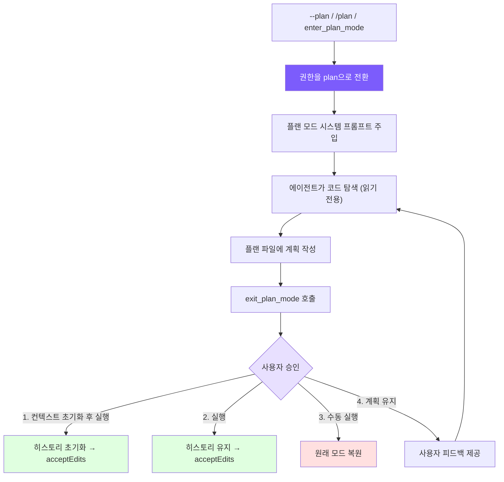

# 10. 플랜 모드: 읽기 전용 계획 수립 모드

## 챕터 목표

플랜 모드를 구현합니다. 에이전트가 실행 전에 계획을 수립하도록 하여 무분별한 코드 수정을 방지합니다. 모드 전환, 플랜 파일 영속성, 권한 통합, 4가지 옵션의 승인 워크플로우를 포함합니다.



## Claude Code의 구현 방식

Claude Code의 플랜 모드는 완전한 EnterPlanMode / ExitPlanMode 도구 쌍으로 구현됩니다.

1. **진입**: 읽기 전용 모드로 전환하고, 플랜 파일(`~/.claude/plans/` 디렉토리)을 생성하며, 에이전트 동작을 제한하는 플랜 시스템 프롬프트를 주입합니다.
2. **계획 수립**: 에이전트는 읽기 전용 도구를 사용하여 코드를 탐색하고 구현 계획을 플랜 파일에 작성합니다.
3. **종료**: 에이전트가 ExitPlanMode를 호출하면, 사용자는 계획을 검토하고 실행 방식을 선택합니다.
4. **승인**: 사용자는 컨텍스트를 초기화하고 실행, 컨텍스트를 유지하고 실행, 각 수정을 수동으로 승인, 또는 계속 수정 중 하나를 선택합니다.

핵심 설계 인사이트: **플랜 모드는 "에이전트가 무언가를 하지 못하게 막는 것"이 아니라 "에이전트가 행동하기 전에 생각하도록 만드는 것"입니다**. 플랜 파일을 디스크에 영속적으로 저장하면 컨텍스트가 초기화되더라도 계획이 사라지지 않아 에이전트가 승인된 계획을 바탕으로 새롭게 시작할 수 있습니다.

## 구현 내용

### 도구 정의

플랜 모드는 두 가지 도구를 필요로 하며, `deferred`(지연 로딩, [챕터 2](/en/docs/02-tools.md) 참고)로 표시됩니다.

<!-- tabs:start -->
#### **TypeScript**
```typescript
// tools.ts — 플랜 모드 도구 정의

// ─── Plan mode tools ────────────────────────────────────────
{
  name: "enter_plan_mode",
  description:
    "Enter plan mode to switch to a read-only planning phase. In plan mode, you can only read files and write to the plan file. Use this when you need to explore the codebase and design an implementation plan before making changes.",
  input_schema: {
    type: "object" as const,
    properties: {},
  },
  deferred: true,
},
{
  name: "exit_plan_mode",
  description:
    "Exit plan mode after you have finished writing your plan to the plan file. The user will review and approve the plan before you proceed with implementation.",
  input_schema: {
    type: "object" as const,
    properties: {},
  },
  deferred: true,
},
```
#### **Python**
```python
# tools.py — 플랜 모드 도구 정의

{
    "name": "enter_plan_mode",
    "description": "Enter plan mode to switch to a read-only planning phase. ...",
    "input_schema": {"type": "object", "properties": {}},
    "deferred": True,
},
{
    "name": "exit_plan_mode",
    "description": "Exit plan mode after you have finished writing your plan to the plan file. ...",
    "input_schema": {"type": "object", "properties": {}},
    "deferred": True,
},
```
<!-- tabs:end -->

두 도구 모두 파라미터를 받지 않습니다. 진입과 종료는 순수한 상태 전환이며, 모든 데이터(플랜 파일 경로, 승인 결과)는 에이전트 내부에서 관리됩니다. 대부분의 세션은 플랜 모드가 필요하지 않으므로 `deferred`로 표시하여 지연 로딩함으로써 프롬프트 공간 낭비를 방지합니다.

### 모드 전환

플랜 모드는 4개의 상태 변수를 사용합니다.

<!-- tabs:start -->
#### **TypeScript**
```typescript
// agent.ts — 플랜 모드 상태

// Plan mode state
private prePlanMode: PermissionMode | null = null;    // 진입 전 모드 (복원용)
private planFilePath: string | null = null;            // 플랜 파일 경로
private baseSystemPrompt: string = "";                 // 플랜 주입 전 기본 프롬프트
private contextCleared: boolean = false;               // 승인 중 컨텍스트가 초기화되었는지 여부
```
#### **Python**
```python
# agent.py — 플랜 모드 상태

self._pre_plan_mode: str | None = None      # 진입 전 모드
self._plan_file_path: str | None = None     # 플랜 파일 경로
self._base_system_prompt: str = ""           # 기본 프롬프트
self._context_cleared: bool = False          # 컨텍스트가 초기화되었는지 여부
```
<!-- tabs:end -->

`prePlanMode`는 중요한 변수입니다. 플랜 모드 진입 전의 권한 모드를 기억하여 종료 시 정확하게 복원할 수 있게 합니다. 사용자가 `acceptEdits` 모드에 있었다면, 플랜 모드 종료 후 `default`가 아닌 `acceptEdits`로 돌아가야 합니다.

전환 로직은 대칭적인 진입/종료 구조를 가집니다.

<!-- tabs:start -->
#### **TypeScript**
```typescript
// agent.ts — togglePlanMode()

togglePlanMode(): string {
  if (this.permissionMode === "plan") {
    // 종료: 원래 모드 복원, 상태 초기화, 플랜 프롬프트 제거
    this.permissionMode = this.prePlanMode || "default";
    this.prePlanMode = null;
    this.planFilePath = null;
    this.systemPrompt = this.baseSystemPrompt;
    if (this.useOpenAI && this.openaiMessages.length > 0) {
      (this.openaiMessages[0] as any).content = this.systemPrompt;
    }
    printInfo(`Exited plan mode → ${this.permissionMode} mode`);
    return this.permissionMode;
  } else {
    // 진입: 현재 모드 저장, 권한 전환, 플랜 파일 생성, 프롬프트 주입
    this.prePlanMode = this.permissionMode;
    this.permissionMode = "plan";
    this.planFilePath = this.generatePlanFilePath();
    this.systemPrompt = this.baseSystemPrompt + this.buildPlanModePrompt();
    if (this.useOpenAI && this.openaiMessages.length > 0) {
      (this.openaiMessages[0] as any).content = this.systemPrompt;
    }
    printInfo(`Entered plan mode. Plan file: ${this.planFilePath}`);
    return "plan";
  }
}
```
#### **Python**
```python
# agent.py — toggle_plan_mode()

def toggle_plan_mode(self) -> str:
    if self.permission_mode == "plan":
        self.permission_mode = self._pre_plan_mode or "default"
        self._pre_plan_mode = None
        self._plan_file_path = None
        self._system_prompt = self._base_system_prompt
        if self.use_openai and self._openai_messages:
            self._openai_messages[0]["content"] = self._system_prompt
        print_info(f"Exited plan mode → {self.permission_mode} mode")
        return self.permission_mode
    else:
        self._pre_plan_mode = self.permission_mode
        self.permission_mode = "plan"
        self._plan_file_path = self._generate_plan_file_path()
        self._system_prompt = self._base_system_prompt + self._build_plan_mode_prompt()
        if self.use_openai and self._openai_messages:
            self._openai_messages[0]["content"] = self._system_prompt
        print_info(f"Entered plan mode. Plan file: {self._plan_file_path}")
        return "plan"
```
<!-- tabs:end -->

시스템 프롬프트 업데이트 방식을 주목하세요. 진입 시 `baseSystemPrompt` 뒤에 플랜 프롬프트가 추가되고, 종료 시 `baseSystemPrompt`로 복원됩니다. OpenAI 형식에서는 메시지 배열의 첫 번째 메시지(시스템 메시지)를 직접 수정해야 합니다.

### 플랜 파일 및 시스템 프롬프트

플랜 파일 경로는 세션 ID를 기반으로 생성되어 각 세션이 독립적인 플랜 파일을 갖도록 합니다.

<!-- tabs:start -->
#### **TypeScript**
```typescript
// agent.ts — 플랜 파일 생성

private generatePlanFilePath(): string {
  const dir = join(homedir(), ".claude", "plans");
  if (!existsSync(dir)) mkdirSync(dir, { recursive: true });
  return join(dir, `plan-${this.sessionId}.md`);
}
```
#### **Python**
```python
# agent.py — 플랜 파일 생성

def _generate_plan_file_path(self) -> str:
    d = Path.home() / ".claude" / "plans"
    d.mkdir(parents=True, exist_ok=True)
    return str(d / f"plan-{self.session_id}.md")
```
<!-- tabs:end -->

플랜 시스템 프롬프트는 엄격한 읽기 전용 제약과 워크플로우 안내를 주입합니다.

<!-- tabs:start -->
#### **TypeScript**
```typescript
// agent.ts — buildPlanModePrompt()

private buildPlanModePrompt(): string {
  return `

# Plan Mode Active

Plan mode is active. You MUST NOT make any edits (except the plan file below),
run non-readonly tools, or make any changes to the system.

## Plan File: ${this.planFilePath}
Write your plan incrementally to this file using write_file or edit_file.
This is the ONLY file you are allowed to edit.

## Workflow
1. **Explore**: Read code to understand the task. Use read_file, list_files, grep_search.
2. **Design**: Design your implementation approach.
3. **Write Plan**: Write a structured plan to the plan file including:
   - **Context**: Why this change is needed
   - **Steps**: Implementation steps with critical file paths
   - **Verification**: How to test the changes
4. **Exit**: Call exit_plan_mode when your plan is ready for user review.

IMPORTANT: When your plan is complete, you MUST call exit_plan_mode.
Do NOT ask the user to approve — exit_plan_mode handles that.`;
}
```
#### **Python**
```python
# agent.py — _build_plan_mode_prompt()

def _build_plan_mode_prompt(self) -> str:
    return f"""

# Plan Mode Active

Plan mode is active. You MUST NOT make any edits (except the plan file below),
run non-readonly tools, or make any changes to the system.

## Plan File: {self._plan_file_path}
Write your plan incrementally to this file using write_file or edit_file.
This is the ONLY file you are allowed to edit.

## Workflow
1. **Explore**: Read code to understand the task. Use read_file, list_files, grep_search.
2. **Design**: Design your implementation approach.
3. **Write Plan**: Write a structured plan to the plan file including:
   - **Context**: Why this change is needed
   - **Steps**: Implementation steps with critical file paths
   - **Verification**: How to test the changes
4. **Exit**: Call exit_plan_mode when your plan is ready for user review.

IMPORTANT: When your plan is complete, you MUST call exit_plan_mode.
Do NOT ask the user to approve — exit_plan_mode handles that."""
```
<!-- tabs:end -->

이 프롬프트는 세 가지 역할을 수행합니다.
1. **동작 제한**: 수정 및 셸 접근을 명시적으로 금지합니다 (권한 검사와의 이중 보호 장치)
2. **플랜 파일 선언**: 모델에게 유일하게 쓰기 가능한 파일 경로를 알립니다
3. **워크플로우 정의**: 탐색 -> 설계 -> 작성 -> 종료 순서를 정하여 모델이 단계를 건너뛰지 않도록 합니다

마지막 문장 "Do NOT ask the user to approve"는 매우 중요합니다. 이 문장이 없으면 모델이 계획 작성 후 `exit_plan_mode`를 호출하는 대신 "이 계획이 괜찮으신가요?"라고 묻는 경우가 많아 승인 워크플로우가 트리거되지 않습니다.

### 권한 통합

플랜 모드의 읽기 전용 제약은 `checkPermission()`을 통해 적용됩니다 (자세한 내용은 [챕터 6](/en/docs/06-permissions.md) 참고).

<!-- tabs:start -->
#### **TypeScript**
```typescript
// tools.ts — checkPermission()의 플랜 모드 처리

// plan mode: 모든 쓰기/수정 도구(플랜 파일 제외) 및 셸 차단
if (mode === "plan") {
  if (EDIT_TOOLS.has(toolName)) {
    const filePath = input.file_path || input.path;
    if (planFilePath && filePath === planFilePath) {
      return { action: "allow" };  // 유일한 예외: 플랜 파일 자체
    }
    return { action: "deny", message: `Blocked in plan mode: ${toolName}` };
  }
  if (toolName === "run_shell") {
    return { action: "deny", message: "Shell commands blocked in plan mode" };
  }
}

// plan mode 도구: 항상 허용 (agent.ts에서 처리)
if (toolName === "enter_plan_mode" || toolName === "exit_plan_mode") {
  return { action: "allow" };
}
```
#### **Python**
```python
# tools.py — check_permission()의 플랜 모드 처리

if mode == "plan":
    if tool_name in EDIT_TOOLS:
        file_path = inp.get("file_path") or inp.get("path")
        if plan_file_path and file_path == plan_file_path:
            return {"action": "allow"}
        return {"action": "deny", "message": f"Blocked in plan mode: {tool_name}"}
    if tool_name == "run_shell":
        return {"action": "deny", "message": "Shell commands blocked in plan mode"}

if tool_name in ("enter_plan_mode", "exit_plan_mode"):
    return {"action": "allow"}
```
<!-- tabs:end -->

여기에는 우아한 설계가 있습니다. **플랜 파일 경로가 `checkPermission()`의 파라미터로 전달됩니다**. 에이전트가 파일 쓰기를 시도하면 권한 검사가 대상 경로와 플랜 파일 경로를 비교하여 정확히 일치하는 경우만 허용합니다. 즉, 시스템 프롬프트의 "플랜 파일만 작성하라"는 지시는 단순한 권고가 아니라 코드로 강제되는 제약입니다.

이중 보호 장치:
- **시스템 프롬프트**: 모델이 다른 파일 쓰기를 시도하지 않도록 안내합니다 (불필요한 API 호출 감소)
- **권한 검사**: 모델이 프롬프트를 무시하더라도 쓰기 작업이 차단되어 오류를 반환합니다

### 도구 실행 로직

`executePlanModeTool()`은 `enter_plan_mode`와 `exit_plan_mode`의 실행을 담당합니다.

<!-- tabs:start -->
#### **TypeScript**
```typescript
// agent.ts — executePlanModeTool()

private async executePlanModeTool(name: string): Promise<string> {
  if (name === "enter_plan_mode") {
    if (this.permissionMode === "plan") {
      return "Already in plan mode.";
    }
    this.prePlanMode = this.permissionMode;
    this.permissionMode = "plan";
    this.planFilePath = this.generatePlanFilePath();
    this.systemPrompt = this.baseSystemPrompt + this.buildPlanModePrompt();
    if (this.useOpenAI && this.openaiMessages.length > 0) {
      (this.openaiMessages[0] as any).content = this.systemPrompt;
    }
    printInfo("Entered plan mode (read-only). Plan file: " + this.planFilePath);
    return `Entered plan mode. You are now in read-only mode.\n\n` +
      `Your plan file: ${this.planFilePath}\n` +
      `Write your plan to this file. This is the only file you can edit.\n\n` +
      `When your plan is complete, call exit_plan_mode.`;
  }

  if (name === "exit_plan_mode") {
    if (this.permissionMode !== "plan") {
      return "Not in plan mode.";
    }
    // 플랜 파일 내용 읽기
    let planContent = "(No plan file found)";
    if (this.planFilePath && existsSync(this.planFilePath)) {
      planContent = readFileSync(this.planFilePath, "utf-8");
    }

    // 대화형 승인 워크플로우
    if (this.planApprovalFn) {
      const result = await this.planApprovalFn(planContent);

      if (result.choice === "keep-planning") {
        // 사용자가 거절 — 플랜 모드 유지, 피드백을 모델의 도구 결과로 반환
        const feedback = result.feedback || "Please revise the plan.";
        return `User rejected the plan and wants to keep planning.\n\n` +
          `User feedback: ${feedback}\n\n` +
          `Please revise your plan based on this feedback. When done, call exit_plan_mode again.`;
      }

      // 사용자가 승인 — 대상 권한 모드 결정
      let targetMode: PermissionMode;
      if (result.choice === "clear-and-execute" || result.choice === "execute") {
        targetMode = "acceptEdits";
      } else {
        targetMode = this.prePlanMode || "default";  // manual-execute: 원래 모드 복원
      }

      // 플랜 모드 종료
      this.permissionMode = targetMode;
      this.prePlanMode = null;
      const savedPlanPath = this.planFilePath;
      this.planFilePath = null;
      this.systemPrompt = this.baseSystemPrompt;

      // 컨텍스트 초기화 (clear-and-execute 선택 시)
      if (result.choice === "clear-and-execute") {
        this.clearHistoryKeepSystem();
        this.contextCleared = true;
        printInfo(`Plan approved. Context cleared, executing in ${targetMode} mode.`);
        return `User approved the plan. Context was cleared. Permission mode: ${targetMode}\n\n` +
          `Plan file: ${savedPlanPath}\n\n## Approved Plan:\n${planContent}\n\nProceed with implementation.`;
      }

      printInfo(`Plan approved. Executing in ${targetMode} mode.`);
      return `User approved the plan. Permission mode: ${targetMode}\n\n` +
        `## Approved Plan:\n${planContent}\n\nProceed with implementation.`;
    }

    // 폴백: 승인 함수가 없을 때 직접 종료 (예: 서브 에이전트)
    this.permissionMode = this.prePlanMode || "default";
    this.prePlanMode = null;
    this.planFilePath = null;
    this.systemPrompt = this.baseSystemPrompt;
    printInfo("Exited plan mode. Restored to " + this.permissionMode + " mode.");
    return `Exited plan mode. Permission mode restored to: ${this.permissionMode}\n\n` +
      `## Your Plan:\n${planContent}`;
  }

  return `Unknown plan mode tool: ${name}`;
}
```
#### **Python**
```python
# agent.py — _execute_plan_mode_tool()

async def _execute_plan_mode_tool(self, name: str) -> str:
    if name == "enter_plan_mode":
        if self.permission_mode == "plan":
            return "Already in plan mode."
        self._pre_plan_mode = self.permission_mode
        self.permission_mode = "plan"
        self._plan_file_path = self._generate_plan_file_path()
        self._system_prompt = self._base_system_prompt + self._build_plan_mode_prompt()
        if self.use_openai and self._openai_messages:
            self._openai_messages[0]["content"] = self._system_prompt
        print_info("Entered plan mode (read-only). Plan file: " + self._plan_file_path)
        return (
            f"Entered plan mode. You are now in read-only mode.\n\n"
            f"Your plan file: {self._plan_file_path}\n"
            f"Write your plan to this file. This is the only file you can edit.\n\n"
            f"When your plan is complete, call exit_plan_mode."
        )

    if name == "exit_plan_mode":
        if self.permission_mode != "plan":
            return "Not in plan mode."
        plan_content = "(No plan file found)"
        if self._plan_file_path and Path(self._plan_file_path).exists():
            plan_content = Path(self._plan_file_path).read_text()

        if self._plan_approval_fn:
            result = await self._plan_approval_fn(plan_content)
            choice = result.get("choice", "manual-execute")

            if choice == "keep-planning":
                feedback = result.get("feedback") or "Please revise the plan."
                return (
                    f"User rejected the plan and wants to keep planning.\n\n"
                    f"User feedback: {feedback}\n\n"
                    f"Please revise your plan based on this feedback. "
                    f"When done, call exit_plan_mode again."
                )

            if choice in ("clear-and-execute", "execute"):
                target_mode = "acceptEdits"
            else:
                target_mode = self._pre_plan_mode or "default"

            self.permission_mode = target_mode
            self._pre_plan_mode = None
            saved_plan_path = self._plan_file_path
            self._plan_file_path = None
            self._system_prompt = self._base_system_prompt

            if choice == "clear-and-execute":
                self._clear_history_keep_system()
                self._context_cleared = True
                print_info(f"Plan approved. Context cleared, executing in {target_mode} mode.")
                return (
                    f"User approved the plan. Context was cleared. "
                    f"Permission mode: {target_mode}\n\n"
                    f"Plan file: {saved_plan_path}\n\n"
                    f"## Approved Plan:\n{plan_content}\n\n"
                    f"Proceed with implementation."
                )

            print_info(f"Plan approved. Executing in {target_mode} mode.")
            return (
                f"User approved the plan. Permission mode: {target_mode}\n\n"
                f"## Approved Plan:\n{plan_content}\n\n"
                f"Proceed with implementation."
            )

        # 폴백: 승인 함수 없음
        self.permission_mode = self._pre_plan_mode or "default"
        self._pre_plan_mode = None
        self._plan_file_path = None
        self._system_prompt = self._base_system_prompt
        print_info("Exited plan mode. Restored to " + self.permission_mode + " mode.")
        return (
            f"Exited plan mode. Permission mode restored to: {self.permission_mode}\n\n"
            f"## Your Plan:\n{plan_content}"
        )

    return f"Unknown plan mode tool: {name}"
```
<!-- tabs:end -->

핵심 로직은 세 가지 레이어로 구성됩니다.

1. **enter_plan_mode**: 상태 전환 + 플랜 파일 생성 + 프롬프트 주입. 멱등성 설계 — 이미 플랜 모드에 있을 때 오류 대신 힌트를 반환합니다.

2. **exit_plan_mode (승인 함수 있음)**: 플랜 파일 읽기 -> 승인 콜백 호출 -> 사용자 선택에 따라 처리:
   - `keep-planning`: 플랜 모드 유지, 사용자 피드백을 도구 결과로 모델에 반환
   - `clear-and-execute`: 메시지 히스토리 초기화 (컨텍스트 확보) -> `acceptEdits`로 전환
   - `execute`: 히스토리 유지 -> `acceptEdits`로 전환
   - `manual-execute`: 진입 전 모드로 복원 (사용자가 각 수정을 수동으로 승인)

3. **exit_plan_mode (승인 함수 없음)**: 직접 종료하고 원래 모드 복원. 서브 에이전트 시나리오를 위한 브랜치로, 서브 에이전트는 대화형 사용자 승인이 필요하지 않습니다.

### 승인 워크플로우

승인은 콜백 함수로 주입되어 에이전트와 UI 레이어를 분리합니다.

<!-- tabs:start -->
#### **TypeScript**
```typescript
// cli.ts — 승인 콜백 설정

agent.setPlanApprovalFn((planContent: string) => {
  return new Promise((resolve) => {
    printPlanForApproval(planContent);   // 플랜 내용 표시
    printPlanApprovalOptions();          // 4가지 옵션 표시

    const askChoice = () => {
      rl.question("  Enter choice (1-4): ", (answer) => {
        const choice = answer.trim();
        if (choice === "1") {
          resolve({ choice: "clear-and-execute" });
        } else if (choice === "2") {
          resolve({ choice: "execute" });
        } else if (choice === "3") {
          resolve({ choice: "manual-execute" });
        } else if (choice === "4") {
          rl.question("  Feedback (what to change): ", (feedback) => {
            resolve({ choice: "keep-planning", feedback: feedback.trim() || undefined });
          });
        } else {
          console.log("  Invalid choice. Enter 1, 2, 3, or 4.");
          askChoice();  // 잘못된 입력 시 재시도
        }
      });
    };
    askChoice();
  });
});
```
#### **Python**
```python
# __main__.py — 승인 콜백 설정

async def plan_approval(plan_content: str) -> dict:
    print_plan_for_approval(plan_content)
    print_plan_approval_options()
    while True:
        choice = input("  Enter choice (1-4): ").strip()
        if choice == "1":
            return {"choice": "clear-and-execute"}
        elif choice == "2":
            return {"choice": "execute"}
        elif choice == "3":
            return {"choice": "manual-execute"}
        elif choice == "4":
            feedback = input("  Feedback (what to change): ").strip()
            return {"choice": "keep-planning", "feedback": feedback or None}
        else:
            print("  Invalid choice. Enter 1, 2, 3, or 4.")

agent.set_plan_approval_fn(plan_approval)
```
<!-- tabs:end -->

UI 부분은 플랜 내용과 4가지 옵션을 표시합니다.

```typescript
// ui.ts — 플랜 승인 UI

export function printPlanForApproval(planContent: string) {
  console.log(chalk.cyan("\n  ━━━ Plan for Approval ━━━"));
  const lines = planContent.split("\n");
  const maxLines = 60;
  const display = lines.slice(0, maxLines);
  for (const line of display) {
    console.log(chalk.white("  " + line));
  }
  if (lines.length > maxLines) {
    console.log(chalk.gray(`  ... (${lines.length - maxLines} more lines)`));
  }
  console.log(chalk.cyan("  ━━━━━━━━━━━━━━━━━━━━━━━━\n"));
}

export function printPlanApprovalOptions() {
  console.log(chalk.yellow("  Choose an option:"));
  console.log("    1) Yes, clear context and execute — fresh start with auto-accept edits");
  console.log("    2) Yes, and execute — keep context, auto-accept edits");
  console.log("    3) Yes, manually approve edits — keep context, confirm each edit");
  console.log("    4) No, keep planning — provide feedback to revise");
}
```

4가지 옵션은 서로 다른 사용 케이스를 위해 설계되었습니다.

| 옵션 | 권한 전환 | 컨텍스트 | 사용 케이스 |
|------|----------|---------|-----------|
| 1. 초기화 후 실행 | -> acceptEdits | 초기화 | 계획이 확실하고, 컨텍스트가 길어 새로 시작하는 것이 가장 효율적인 경우 |
| 2. 실행 | -> acceptEdits | 유지 | 계획이 확실하고, 에이전트가 이미 충분한 컨텍스트를 갖고 있어 바로 실행 가능한 경우 |
| 3. 수동 | -> 원래 모드 복원 | 유지 | 계획이 대체로 괜찮지만 각 수정 단계를 하나씩 승인하고 싶은 경우 |
| 4. 계획 유지 | 변경 없음 | 유지 | 계획 수정이 필요하여 에이전트에게 피드백을 주고 계속 수정하게 하는 경우 |

### CLI 진입점

플랜 모드에는 세 가지 진입점이 있습니다.

<!-- tabs:start -->
#### **TypeScript**
```typescript
// cli.ts — CLI 인수

// 1. 커맨드라인 인수 --plan
} else if (args[i] === "--plan") {
  permissionMode = "plan";

// 2. REPL 명령어 /plan
if (input === "/plan") {
  const newMode = agent.togglePlanMode();
  askQuestion();
  return;
}

// 3. 에이전트가 자율적으로 enter_plan_mode 도구 호출 (ToolSearch로 지연 로딩)
```
#### **Python**
```python
# __main__.py — CLI 인수

# 1. 커맨드라인 인수 --plan
elif arg == "--plan":
    permission_mode = "plan"

# 2. REPL 명령어 /plan
if user_input == "/plan":
    agent.toggle_plan_mode()
    continue

# 3. 에이전트가 자율적으로 enter_plan_mode 도구 호출
```
<!-- tabs:end -->

세 진입점의 차이:
- `--plan`: 시작 시 플랜 모드로 진입, 전체 세션을 계획 수립으로 시작
- `/plan`: 세션 중간에 전환, "먼저 대화하고 나중에 계획 수립" 워크플로우에 적합
- `enter_plan_mode` 도구: 에이전트가 스스로 실행 전에 계획이 필요하다고 판단 (ToolSearch를 통해 활성화 필요)

## 설계 결정 사항

### 왜 플랜 파일을 디스크에 저장하는가?

플랜 파일을 `~/.claude/plans/`에 영속적으로 저장하는 데는 두 가지 목적이 있습니다.

1. **컨텍스트 초기화 후 실행 옵션에 필수적**: 컨텍스트를 초기화하면 대화 히스토리의 플랜 내용이 사라집니다. 하지만 플랜 파일은 디스크에 남아 있어 에이전트가 다시 읽을 수 있습니다.
2. **세션 간 이용 가능**: `--resume`으로 세션 복원 시 이전 계획을 확인하거나 과거 플랜 파일을 수동으로 탐색할 수 있습니다.

### 왜 승인이 직접 구현이 아닌 콜백인가?

`planApprovalFn`은 에이전트 내부에 직접 구현되지 않고 외부에서 주입되는 콜백입니다. 이로써 에이전트 클래스가 특정 UI 구현에 독립적이 됩니다. CLI는 readline을 사용하고, IDE 통합은 GUI 다이얼로그를 사용하며, 테스트는 모의 함수를 주입할 수 있습니다. 승인 함수가 없는 서브 에이전트는 특별한 처리 없이 직접 종료됩니다.

### 왜 컨텍스트 초기화 후 실행이 acceptEdits로 전환되는가?

사용자가 계획을 승인하고 자동 실행을 선택했으므로 에이전트의 변경 방향을 신뢰한다는 의미입니다. `acceptEdits`로 전환하면 에이전트가 각 파일 수정을 반복적으로 확인받지 않고 진행할 수 있어 실행 효율이 크게 향상됩니다. 단계별 승인을 원하는 경우 옵션 3이 바로 그것을 위한 것입니다.

## 단순화 비교

| 차원 | Claude Code | mini-claude | 차이점 |
|------|------------|-------------|--------|
| 플랜 파일 | 글로벌 plans 디렉토리 + 시맨틱 파일명 | `~/.claude/plans/plan-{sessionId}.md` | 명명 단순화 |
| 승인 옵션 | 다양한 실행 모드 + 권한 프롬프트 | 4가지 옵션 (초기화/실행/수동/수정) | 핵심 일치 |
| 권한 통합 | 심층 통합 (7단계 권한 시스템) | checkPermission 특수 브랜치 + 플랜 파일 화이트리스트 | 단순화되었지만 동등 |
| 도구 로딩 | 항상 사용 가능 | deferred 지연 로딩 | 프롬프트 공간 절약 |
| 서브 에이전트 | Plan Agent 타입 | 폴백 직접 종료 | 브랜치 단순화 |

---

> **다음 챕터**: 단일 에이전트의 컨텍스트가 충분하지 않을 때 — 멀티 에이전트 아키텍처로 분할 정복하기.
