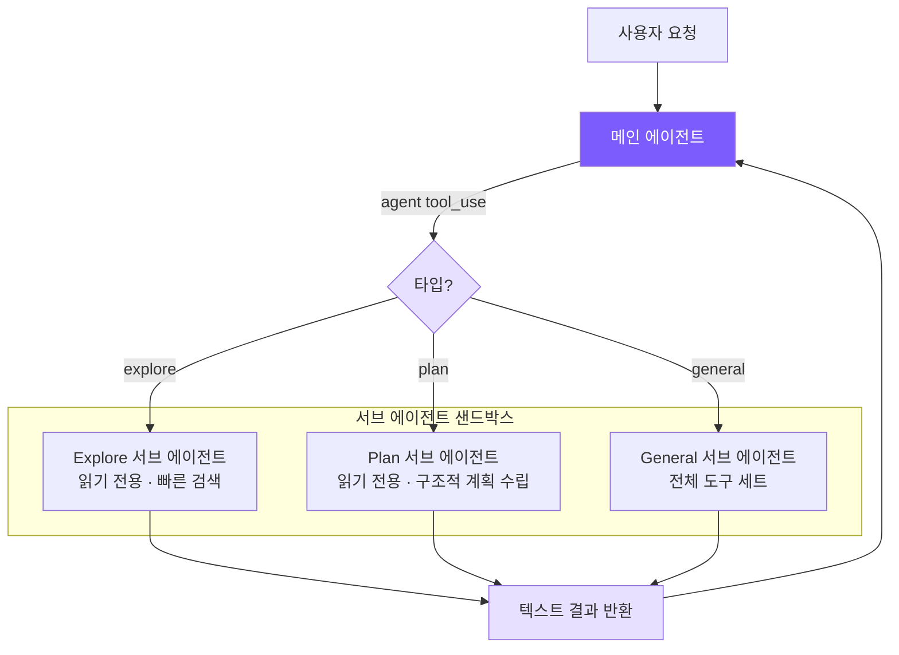

# 11. 멀티 에이전트 아키텍처

## 챕터 목표

서브 에이전트 시스템을 구현합니다. 메인 에이전트가 독립적인 서브 에이전트를 생성하여 탐색, 계획 수립, 일반 작업을 수행하고 완료 후 결과를 메인 에이전트에 반환하도록 합니다. 이것이 Claude Code의 가장 중요한 복잡한 작업 처리를 위한 "분할 정복" 메커니즘입니다.



## Claude Code의 구현 방식

Claude Code의 멀티 에이전트 시스템은 `src/tools/AgentTool/`에 구현되어 있으며, 세 가지 협업 모드를 지원합니다.

| 모드 | 특징 |
|------|------|
| **서브 에이전트** (fork-return) | 독립적으로 실행하도록 분기하고, 완료 시 결과 반환 |
| **오케스트레이터** | 오케스트레이터가 여러 워커에게 작업 할당 |
| **스웜 팀** | 여러 에이전트가 동료로서 협업하며 메일박스를 통해 통신 |

우리는 서브 에이전트 모드를 구현합니다. 이것이 가장 일반적으로 사용되는 모드입니다.

### 내장 에이전트 타입

- **Explore**: Haiku 모델(더 저렴함) 사용, 읽기 전용 도구 세트, 코드 검색 특화
- **Plan**: 읽기 전용 + 구조적 출력, 구현 계획 설계
- **General**: 전체 도구 세트(재귀적으로 서브 에이전트 생성 불가)
- **Custom**: `.claude/agents/*.md` 파일로 정의

### 오케스트레이터 모드의 핵심 설계

오케스트레이터는 메인 에이전트를 **순수한 오케스트레이터**로 변환합니다. 도구 세트가 `Agent`(워커 생성)와 `SendMessage`(워커 지속)만으로 엄격히 제한되어 파일 작업을 절대 수행할 수 없습니다. 이 엄격한 제약은 오케스트레이터가 "위임하기 귀찮아서 직접 처리"하는 것을 방지하여 일반적인 단일 에이전트로 퇴화하는 것을 막습니다.

표준 워크플로우는 네 단계로 구성됩니다. **조사(병렬, 읽기 전용) -> 종합(오케스트레이터, 직렬 이해) -> 구현(직렬, 파일 세트별) -> 검증**.

종합 단계에는 직관에 반하는 제약이 있습니다. 프롬프트가 "발견 내용에 기반하여" 쓰는 것을 명시적으로 금지합니다. 이는 오케스트레이터가 연구 결과를 다음 워커에게 이해를 맡기는 대신 파일 경로, 라인 번호 등을 포함하여 실제로 이해하고 구체화하도록 강제합니다.

각 워커는 처음부터 시작하는 독립적인 에이전트로, 오케스트레이터와 사용자 간의 대화를 볼 수 없습니다. 따라서 오케스트레이터가 워커를 위해 작성하는 프롬프트는 자체 완결적이어야 합니다. 이것이 오케스트레이터 모드의 가장 큰 함정입니다.

### 도구 필터링: 4단계 파이프라인

서브 에이전트 도구 접근은 심층 방어를 구현하는 4단계 필터를 거칩니다.

1. 메타 도구 제거(`TaskOutput`, `EnterPlanMode`, `AskUserQuestion` 등) — 서브 에이전트는 에이전트 실행 흐름을 제어해서는 안 됩니다
2. 커스텀 에이전트에 대한 추가 제한 — 사용자 정의 타입은 내장 타입과 동일한 신뢰 수준을 갖지 않습니다
3. 비동기 에이전트는 화이트리스트 모드 사용 — 백그라운드 실행은 대화형 UI를 표시할 수 없으므로 엄격한 제한 필요
4. 에이전트 타입 수준의 `disallowedTools` — 예: Explore는 쓰기 도구를 명시적으로 제외

처음 세 단계는 전역 정책이고, 네 번째는 타입 수준 정책입니다. 커스텀 에이전트가 `disallowedTools: []`를 설정하더라도 처음 세 단계는 여전히 적용됩니다.

### 컨텍스트 격리

서브 에이전트는 기본 거부 방식을 사용합니다. 메시지 히스토리는 완전히 독립적이고, `abortController`는 단방향으로 전파되며(부모 중단 -> 자식 중단, 반대는 불가), 서브 에이전트 상태 변화는 기본적으로 부모 UI에 전파되지 않습니다. 한 가지 예외가 있습니다. Bash로 시작된 백그라운드 프로세스는 루트 스토어에 등록되어야 하며, 그렇지 않으면 좀비 프로세스가 됩니다.

### 워크트리 격리

여러 에이전트가 병렬로 파일을 작성할 때, Claude Code는 각 쓰기 에이전트에 독립적인 Git 워크트리를 할당합니다. `.git` 디렉토리를 공유하지만 독립적인 작업 디렉토리를 가져 완전히 충돌이 없으며, `git clone`보다 오버헤드가 훨씬 적습니다.

## 구현 내용

`subagent.ts`의 **~199줄**과 에이전트 클래스의 소소한 변경으로 서브 에이전트 패턴의 핵심을 구현합니다.

| Claude Code | 우리의 구현 | 단순화 이유 |
|-------------|-----------|-----------|
| 5단계 실행 파이프라인 | 직접 new Agent + runOnce | fork 프로세스, 캐시 공유 불필요 |
| 4단계 도구 필터 파이프라인 | 1개 Set + 필터 | 고정된 3가지 타입만 있음 |
| Explore에 Haiku 모델 | 통합된 메인 모델 | 설정 복잡성 감소 |
| 기본 거부 컨텍스트 격리 | 자연 격리 (독립적인 에이전트 인스턴스) | new Agent가 독립적인 메시지 히스토리 내장 |

## 핵심 코드

### 1. 에이전트 타입 설정 — `subagent.ts`

<!-- tabs:start -->
#### **TypeScript**
```typescript
export type SubAgentType = "explore" | "plan" | "general";

const READ_ONLY_TOOLS = new Set([
  "read_file", "list_files", "grep_search", "run_shell"
]);

function getReadOnlyTools(): ToolDef[] {
  return toolDefinitions.filter((t) => READ_ONLY_TOOLS.has(t.name));
}
```
#### **Python**
```python
READ_ONLY_TOOLS = {"read_file", "list_files", "grep_search"}

def _get_read_only_tools() -> list[ToolDef]:
    return [t for t in tool_definitions if t["name"] in READ_ONLY_TOOLS]
```
<!-- tabs:end -->

왜 `run_shell`이 "읽기 전용" 도구 세트에 포함되어 있을까요? `git log`, `find`, `wc` 같은 읽기 전용 명령어는 코드 탐색에 필수적이며, 셸을 완전히 금지하면 Explore의 능력이 크게 약화됩니다. 시스템 프롬프트 제약으로 안전을 보장합니다.

<!-- tabs:start -->
#### **TypeScript**
```typescript
const EXPLORE_PROMPT = `You are an Explore agent — a fast, READ-ONLY sub-agent...

IMPORTANT CONSTRAINTS:
- You are READ-ONLY. Do NOT modify any files.
- If using run_shell, only use read commands (ls, cat, find, grep, git log, etc.)
- Do NOT use write, edit, rm, mv, or any destructive shell commands.

Be fast and thorough. Use multiple tool calls when possible.
Return a concise summary of your findings.`;
```
#### **Python**
```python
EXPLORE_PROMPT = """You are an Explore agent — a fast, READ-ONLY sub-agent specialized for codebase exploration.

IMPORTANT CONSTRAINTS:
- You are READ-ONLY. You only have access to read_file, list_files, and grep_search.
- Do NOT attempt to modify any files.

Be fast and thorough. Use multiple tool calls when possible. Return a concise summary of your findings."""
```
<!-- tabs:end -->

Plan 에이전트도 읽기 전용이지만, 프롬프트가 구조적인 계획 출력을 생성하도록 안내합니다.

<!-- tabs:start -->
#### **TypeScript**
```typescript
const PLAN_PROMPT = `You are a Plan agent — a READ-ONLY sub-agent specialized for designing implementation plans.

Your job:
- Analyze the codebase to understand the current architecture
- Design a step-by-step implementation plan
- Identify critical files that need modification
- Consider architectural trade-offs

Return a structured plan with:
1. Summary of current state
2. Step-by-step implementation steps
3. Critical files for implementation
4. Potential risks or considerations`;
```
#### **Python**
```python
PLAN_PROMPT = """You are a Plan agent — a READ-ONLY sub-agent specialized for designing implementation plans.

Return a structured plan with:
1. Summary of current state
2. Step-by-step implementation steps
3. Critical files for implementation
4. Potential risks or considerations"""
```
<!-- tabs:end -->

General 에이전트는 `agent`를 제외한 모든 도구를 사용할 수 있습니다.

<!-- tabs:start -->
#### **TypeScript**
```typescript
const GENERAL_PROMPT = `You are a General sub-agent handling an independent task.
Complete the assigned task and return a concise result. You have access to all tools.`;

export function getSubAgentConfig(type: SubAgentType): SubAgentConfig {
  // 먼저 커스텀 에이전트 확인
  const custom = discoverCustomAgents().get(type);
  if (custom) {
    const tools = custom.allowedTools
      ? toolDefinitions.filter(t => custom.allowedTools!.includes(t.name))
      : toolDefinitions.filter(t => t.name !== "agent");
    return { systemPrompt: custom.systemPrompt, tools };
  }
  switch (type) {
    case "explore":
      return { systemPrompt: EXPLORE_PROMPT, tools: getReadOnlyTools() };
    case "plan":
      return { systemPrompt: PLAN_PROMPT, tools: getReadOnlyTools() };
    case "general":
      return {
        systemPrompt: GENERAL_PROMPT,
        tools: toolDefinitions.filter((t) => t.name !== "agent"),
      };
  }
}
```
#### **Python**
```python
GENERAL_PROMPT = "You are a General sub-agent handling an independent task. Complete the assigned task and return a concise result. You have access to all tools."

def get_sub_agent_config(agent_type: str) -> dict:
    custom = _discover_custom_agents().get(agent_type)
    if custom:
        if custom["allowed_tools"]:
            tools = [t for t in tool_definitions if t["name"] in custom["allowed_tools"]]
        else:
            tools = [t for t in tool_definitions if t["name"] != "agent"]
        return {"system_prompt": custom["system_prompt"], "tools": tools}

    read_only = [t for t in tool_definitions if t["name"] in READ_ONLY_TOOLS]
    if agent_type == "explore":
        return {"system_prompt": EXPLORE_PROMPT, "tools": read_only}
    elif agent_type == "plan":
        return {"system_prompt": PLAN_PROMPT, "tools": read_only}
    else:
        return {"system_prompt": GENERAL_PROMPT, "tools": [t for t in tool_definitions if t["name"] != "agent"]}
```
<!-- tabs:end -->

### 2. 에이전트 도구 정의 — `tools.ts`

`agent`는 일반 도구로 등록됩니다. `type`은 필수가 아닙니다. LLM이 확신하지 못할 때 생략하면 `general`로 폴백됩니다.

<!-- tabs:start -->
#### **TypeScript**
```typescript
{
  name: "agent",
  description:
    "Launch a sub-agent to handle a task autonomously. Sub-agents have isolated context " +
    "and return their result. Types: 'explore' (read-only, fast search), " +
    "'plan' (read-only, structured planning), 'general' (full tools).",
  input_schema: {
    type: "object",
    properties: {
      description: { type: "string", description: "Short (3-5 word) description of the sub-agent's task" },
      prompt: { type: "string", description: "Detailed task instructions for the sub-agent" },
      type: {
        type: "string",
        enum: ["explore", "plan", "general"],
        description: "Agent type. Default: general",
      },
    },
    required: ["description", "prompt"],
  },
}
```
#### **Python**
```python
{
    "name": "agent",
    "description": "Launch a sub-agent to handle a task autonomously. Types: 'explore' (read-only), 'plan' (read-only, structured planning), 'general' (full tools).",
    "input_schema": {
        "type": "object",
        "properties": {
            "description": {"type": "string", "description": "Short (3-5 word) description of the sub-agent's task"},
            "prompt": {"type": "string", "description": "Detailed task instructions for the sub-agent"},
            "type": {"type": "string", "enum": ["explore", "plan", "general"], "description": "Agent type. Default: general"},
        },
        "required": ["description", "prompt"],
    },
}
```
<!-- tabs:end -->

### 3. 에이전트 클래스 수정 — `agent.ts`

동일한 에이전트 클래스가 메인 에이전트와 서브 에이전트 모두를 처리하도록 하는 데 4가지 변경만 필요합니다.

#### 3a. 생성자: 커스텀 설정 수락

<!-- tabs:start -->
#### **TypeScript**
```typescript
interface AgentOptions {
  // ...
  customSystemPrompt?: string;
  customTools?: ToolDef[];
  isSubAgent?: boolean;
}

constructor(options: AgentOptions = {}) {
  this.isSubAgent = options.isSubAgent || false;
  this.tools = options.customTools || toolDefinitions;
  this.systemPrompt = options.customSystemPrompt || buildSystemPrompt();
  // ...
}
```
#### **Python**
```python
class Agent:
    def __init__(
        self,
        *,
        # ...
        custom_system_prompt: str | None = None,
        custom_tools: list[ToolDef] | None = None,
        is_sub_agent: bool = False,
    ):
        self.is_sub_agent = is_sub_agent
        self.tools = custom_tools or tool_definitions
        self._base_system_prompt = custom_system_prompt or build_system_prompt()
```
<!-- tabs:end -->

`customTools`가 `None`이면 전체 도구 목록으로 폴백되므로 메인 에이전트에 아무 영향을 미치지 않습니다.

#### 3b. 출력 캡처: emitText + outputBuffer

서브 에이전트의 텍스트 출력은 직접 출력할 수 없고, 수집하여 메인 에이전트에 반환해야 합니다.

<!-- tabs:start -->
#### **TypeScript**
```typescript
private outputBuffer: string[] | null = null;

private emitText(text: string): void {
  if (this.outputBuffer) {
    this.outputBuffer.push(text);   // 서브 에이전트: 수집
  } else {
    printAssistantText(text);        // 메인 에이전트: 직접 출력
  }
}
```
#### **Python**
```python
self._output_buffer: list[str] | None = None

def _emit_text(self, text: str) -> None:
    if self._output_buffer is not None:
        self._output_buffer.append(text)
    else:
        print_assistant_text(text)
```
<!-- tabs:end -->

`outputBuffer`는 세 가지 상태를 가집니다. `null` = 메인 에이전트 모드(직접 출력), `[]` = 서브 에이전트 모드(수집 시작), `[...]` = 누적 중. 스트리밍 콜백은 `emitText`만 호출하면 되며, 어떤 모드로 실행 중인지 전혀 알 필요가 없습니다.

#### 3c. runOnce: 일회성 실행 진입점

<!-- tabs:start -->
#### **TypeScript**
```typescript
async runOnce(prompt: string): Promise<{ text: string; tokens: { input: number; output: number } }> {
  this.outputBuffer = [];
  const prevInput = this.totalInputTokens;
  const prevOutput = this.totalOutputTokens;
  await this.chat(prompt);                         // 전체 에이전트 루프 재사용
  const text = this.outputBuffer.join("");
  this.outputBuffer = null;
  return {
    text,
    tokens: {
      input: this.totalInputTokens - prevInput,
      output: this.totalOutputTokens - prevOutput,
    },
  };
}
```
#### **Python**
```python
async def run_once(self, prompt: str) -> dict:
    self._output_buffer = []
    prev_in = self.total_input_tokens
    prev_out = self.total_output_tokens
    await self.chat(prompt)
    text = "".join(self._output_buffer)
    self._output_buffer = None
    return {
        "text": text,
        "tokens": {
            "input": self.total_input_tokens - prev_in,
            "output": self.total_output_tokens - prev_out,
        },
    }
```
<!-- tabs:end -->

토큰은 증분 방식으로 계산됩니다(실행 후 값에서 실행 전 값을 빼는 방식). 에이전트 인스턴스의 카운터가 누적되기 때문입니다. `chat()`은 완전히 재사용됩니다. 도구 세트와 출력 대상이 이미 생성자에서 설정되었으므로, 메인 에이전트인지 서브 에이전트인지 알 필요가 없습니다.

#### 3d. executeAgentTool: 서브 에이전트 실행

<!-- tabs:start -->
#### **TypeScript**
```typescript
private async executeAgentTool(input: Record<string, any>): Promise<string> {
  const type = (input.type || "general") as SubAgentType;
  const description = input.description || "sub-agent task";
  const prompt = input.prompt || "";

  printSubAgentStart(type, description);

  const config = getSubAgentConfig(type);
  const subAgent = new Agent({
    model: this.model,
    customSystemPrompt: config.systemPrompt,
    customTools: config.tools,
    isSubAgent: true,
    permissionMode: this.permissionMode === "plan" ? "plan" : "bypassPermissions",
  });

  try {
    const result = await subAgent.runOnce(prompt);
    this.totalInputTokens += result.tokens.input;
    this.totalOutputTokens += result.tokens.output;
    printSubAgentEnd(type, description);
    return result.text || "(Sub-agent produced no output)";
  } catch (e: any) {
    printSubAgentEnd(type, description);
    return `Sub-agent error: ${e.message}`;
  }
}
```
#### **Python**
```python
async def _execute_agent_tool(self, inp: dict) -> str:
    agent_type = inp.get("type", "general")
    description = inp.get("description", "sub-agent task")
    prompt = inp.get("prompt", "")

    print_sub_agent_start(agent_type, description)

    config = get_sub_agent_config(agent_type)
    sub_agent = Agent(
        model=self.model,
        custom_system_prompt=config["system_prompt"],
        custom_tools=config["tools"],
        is_sub_agent=True,
        permission_mode="plan" if self.permission_mode == "plan" else "bypassPermissions",
    )

    try:
        result = await sub_agent.run_once(prompt)
        self.total_input_tokens += result["tokens"]["input"]
        self.total_output_tokens += result["tokens"]["output"]
        print_sub_agent_end(agent_type, description)
        return result["text"] or "(Sub-agent produced no output)"
    except Exception as e:
        print_sub_agent_end(agent_type, description)
        return f"Sub-agent error: {e}"
```
<!-- tabs:end -->

서브 에이전트에서 오류가 발생하면 부모 에이전트를 충돌시키는 대신 오류 문자열을 반환합니다. 부모 에이전트의 LLM이 오류 메시지를 보고 재시도할지 다른 전략을 시도할지 스스로 결정할 수 있습니다.

권한 상속: 서브 에이전트는 기본적으로 `bypassPermissions`를 사용합니다(메인 에이전트가 이미 권한을 부여받았으므로 서브 에이전트는 사용자에게 다시 묻지 않아도 됩니다). 하지만 플랜 모드는 반드시 상속되어야 합니다. 그렇지 않으면 서브 에이전트가 읽기 전용 제한을 우회할 수 있어 보안 구멍이 됩니다.

`agent` 도구는 현재 에이전트 인스턴스의 상태(model, permissionMode, 토큰 카운터)에 접근해야 하므로 상태 없는 일반 디스패치 함수를 거칠 수 없어 특수 디스패치가 필요합니다.

<!-- tabs:start -->
#### **TypeScript**
```typescript
private async executeToolCall(name: string, input: Record<string, any>): Promise<string> {
  if (name === "agent") {
    return this.executeAgentTool(input);
  }
  return executeTool(name, input);
}
```
#### **Python**
```python
async def _execute_tool_call(self, name: str, inp: dict) -> str:
    if name == "agent":
        return await self._execute_agent_tool(inp)
    if name == "skill":
        return await self._execute_skill_tool(inp)
    return await execute_tool(name, inp)
```
<!-- tabs:end -->

### 4. isSubAgent 플래그

서브 에이전트는 메인 에이전트에만 의미 있는 세 가지 작업을 건너뜁니다.

<!-- tabs:start -->
#### **TypeScript**
```typescript
if (!this.isSubAgent) {
  printDivider();
  this.autoSave();
}

if (!this.isSubAgent) {
  printCost(this.totalInputTokens, this.totalOutputTokens);
}
```
#### **Python**
```python
if not self.is_sub_agent:
    print_divider()
    self._auto_save()

if not self.is_sub_agent:
    print_cost(self.total_input_tokens, self.total_output_tokens)
```
<!-- tabs:end -->

- 구분선: 서브 에이전트 출력은 버퍼로 캡처되어 터미널에 나타나지 않습니다
- 세션 저장: 서브 에이전트는 일회성 작업이므로 세션 저장이 무의미하고 메인 에이전트의 파일을 덮어쓸 수 있습니다
- 비용 출력: 토큰이 이미 부모 에이전트에 합산되므로 서브 에이전트가 자체 비용을 출력하면 이중 청구처럼 보입니다

### 5. 터미널 UI — `ui.ts`

<!-- tabs:start -->
#### **TypeScript**
```typescript
export function printSubAgentStart(type: string, description: string) {
  console.log(chalk.magenta(`\n  ┌─ Sub-agent [${type}]: ${description}`));
}

export function printSubAgentEnd(type: string, description: string) {
  console.log(chalk.magenta(`  └─ Sub-agent [${type}] completed`));
}
```
#### **Python**
```python
def print_sub_agent_start(agent_type: str, description: str) -> None:
    console.print(f"\n  [magenta]┌─ Sub-agent [{agent_type}]: {description}[/magenta]")

def print_sub_agent_end(agent_type: str, _description: str) -> None:
    console.print(f"  [magenta]└─ Sub-agent [{agent_type}] completed[/magenta]")
```
<!-- tabs:end -->

### 6. 커스텀 에이전트 타입: `.claude/agents/*.md`

Claude Code의 `.claude/agents/`와 동일한 확장 메커니즘:

```markdown
<!-- .claude/agents/reviewer.md -->
---
name: reviewer
description: Reviews code for bugs and style issues
allowed-tools: read_file, list_files, grep_search, run_shell
---
You are a code reviewer. Analyze the code thoroughly and report:
1. Bugs and potential issues
2. Style inconsistencies
3. Performance concerns
```

발견 메커니즘: 프로젝트 수준(`.claude/agents/`)이 사용자 수준(`~/.claude/agents/`)보다 높은 우선순위를 가지며, 동일 이름의 경우 덮어씁니다. 프론트매터는 `parseFrontmatter()`를 재사용하여 메모리, 스킬과 동일한 파서를 공유합니다.

## 핵심 설계 결정

### 왜 오케스트레이터보다 Fork-Return이 더 나은 시작점인가?

Fork-return의 장점은 단순합니다. 공유 상태가 없어 메인 에이전트의 컨텍스트를 오염시키는 것이 불가능하고, 제어 흐름이 결정적이며(요청 전송, 결과 대기), 오류 허용성이 단순합니다(서브 에이전트 오류, 메인 에이전트는 계속 동작). 오케스트레이터는 작업 병렬화에 더 강력하지만 워커 간 정보 공유, 충돌 해결을 처리해야 합니다. 복잡도가 훨씬 높습니다.

### 왜 서브 에이전트는 서브 에이전트를 생성할 수 없는가?

General 에이전트의 도구 목록에서 `agent`를 필터링합니다. 이 제한이 없으면 A가 B를 생성하고 B가 C를 생성하는 재귀적 중첩으로 토큰이 기하급수적으로 소모됩니다. 각 레벨마다 자체 시스템 프롬프트와 메시지 히스토리가 있습니다. Claude Code도 동일한 제한을 가지며, 실제로 1단계로 대부분의 시나리오를 처리할 수 있습니다.

### 왜 Explore/Plan이 run_shell을 유지하는가?

`git log --oneline -20`, `find . -name "*.ts" | wc -l` 같은 읽기 전용 셸 명령어는 코드 탐색에 필수적입니다. 완전히 금지하면 능력이 크게 약화됩니다. 이 설계는 Claude Code의 Explore 에이전트와 일치합니다. 도구를 완전히 비활성화하는 대신 시스템 프롬프트로 제약합니다.

### 왜 콜백 대신 버퍼로 출력을 수집하는가?

콜백 방식은 생성자에 `onText`를 전달하고 에이전트 루프 전체에 검사를 추가해야 합니다. 버퍼 방식은 `emitText` 한 곳만 수정합니다. `runOnce`가 열고, `chat`이 쓰고, `runOnce`가 수집하고 닫습니다. 생명주기 경계가 명확하며 기존 코드에 전혀 영향을 미치지 않습니다.

---

전체 구현의 핵심 인사이트: **서브 에이전트는 본질적으로 다른 설정을 가진 에이전트 인스턴스일 뿐입니다**. 에이전트 클래스에 몇 가지 선택적 파라미터(`customTools`, `customSystemPrompt`, `isSubAgent`)를 추가함으로써 동일한 에이전트 루프가 메인 에이전트와 서브 에이전트 모두를 처리하여 코드 중복을 피합니다.

> **다음 챕터**: 에이전트를 외부 도구 서버에 연결하기 — MCP 통합.
