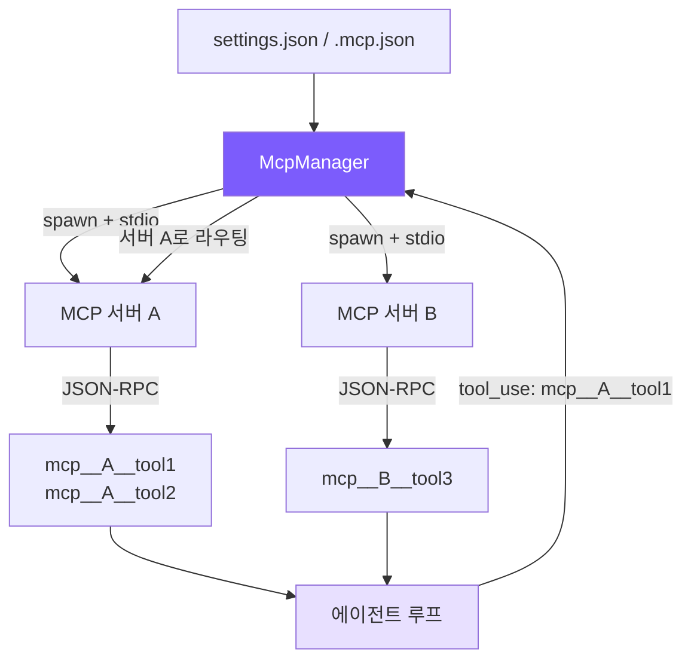

# 12. MCP 통합

## 챕터 목표

에이전트가 외부 도구를 동적으로 로드할 수 있도록 합니다. 소스 코드를 수정하지 않고 서버 주소만 선언하면 데이터베이스, Slack, GitHub 등 외부 서비스에 연결할 수 있습니다.



핵심 아이디어: **자식 프로세스 생성 -> JSON-RPC 핸드셰이크 -> 도구 발견 -> 프리픽스로 등록 -> 투명한 라우팅**. 에이전트 루프의 관점에서 MCP 도구와 내장 도구는 구별할 수 없습니다. 모두 이름 + 스키마 + 실행 함수로 이루어져 있습니다.

## Claude Code의 구현 방식

MCP(Model Context Protocol)는 AI 어시스턴트를 외부 도구에 연결하기 위해 Anthropic이 공개한 오픈 프로토콜입니다. Claude Code의 MCP 구현의 핵심 사항은 다음과 같습니다.

**설정 발견**: 세 곳에서 서버 설정을 읽습니다. `settings.json`(사용자 수준 및 프로젝트 수준)과 `.mcp.json`(프로젝트 루트). 나중에 읽은 설정이 이전 설정을 덮어씁니다. 엔터프라이즈 배포에서는 MDM 정책 배포도 지원합니다.

**전송 프로토콜**: 두 가지 전송 방식을 지원합니다. stdio(자식 프로세스 통신)와 SSE(HTTP 롱 폴링). stdio가 주류이고, SSE는 원격 서비스에 사용됩니다.

**도구 명명**: 모든 MCP 도구는 `mcp__serverName__toolName` 형식으로 등록됩니다. 이 3세그먼트 명명 방식은 이름 충돌 방지와 라우팅을 동시에 해결합니다. 이름만으로 어느 서버로 전달할지 알 수 있습니다.

**연결 생명주기**: 프로세스 생성 -> `initialize` 핸드셰이크(버전 및 기능 교환) -> `notifications/initialized` 확인 -> `tools/list` 도구 발견 -> 준비 완료. 초기화와 도구 발견 모두 15초 타임아웃이 있습니다.

**동적 갱신**: Claude Code는 런타임 도구 재발견을 지원합니다(서버가 클라이언트에게 도구 목록 변경을 알릴 수 있음). 우리는 일회성 발견으로 단순화합니다.

**SDK 의존성**: Claude Code는 `@anthropic-ai/sdk`의 내장 MCP 클라이언트를 사용하여 JSON-RPC 세부 사항을 래핑합니다. 우리는 원시 JSON-RPC를 직접 구현하여 MCP SDK에 의존하지 않습니다.

## 설정 형식

사용자는 설정 파일에 MCP 서버를 선언하기만 하면 에이전트가 시작 시 자동으로 연결합니다.

```json
// ~/.claude/settings.json (사용자 수준) 또는 .claude/settings.json (프로젝트 수준)
{
  "mcpServers": {
    "filesystem": {
      "command": "npx",
      "args": ["@modelcontextprotocol/server-filesystem", "/tmp"],
      "env": {}
    },
    "github": {
      "command": "npx",
      "args": ["@modelcontextprotocol/server-github"],
      "env": {
        "GITHUB_TOKEN": "ghp_xxx"
      }
    }
  }
}
```

프로젝트 루트의 `.mcp.json`도 사용할 수 있으며 형식이 동일합니다. 세 설정 소스의 서버가 모두 병합되어 연결됩니다. 동일 이름의 서버는 나중에 읽은 것으로 덮어씁니다.

## 구현 내용

`mcp.ts`의 **~266줄**로 완전한 MCP 클라이언트를 구현하며, SDK 의존성이 없습니다.

| Claude Code | 우리의 구현 | 단순화 이유 |
|-------------|-----------|-----------|
| `@anthropic-ai/sdk` MCP 클라이언트 | 원시 JSON-RPC (~100줄) | SDK 의존성 없음, 독자가 프로토콜 세부사항을 볼 수 있음 |
| stdio + SSE 전송 | stdio만 | stdio가 95% 시나리오 커버 |
| 동적 도구 갱신 | 일회성 발견 | 튜토리얼 시나리오는 핫 리로딩 불필요 |
| 엔터프라이즈 정책 + 3개 설정 소스 | settings.json + .mcp.json | 엔터프라이즈 수준 설정 제거 |
| 재시도 + 폴백 | 실패한 서버 조용히 건너뜀 | 오류 처리 단순화 |

## 핵심 코드

### 1. MCP 연결 — `McpConnection` 클래스

각 MCP 서버는 하나의 `McpConnection` 인스턴스에 대응하며, 자식 프로세스 관리와 JSON-RPC 통신을 담당합니다.

```typescript
class McpConnection {
  private process: ChildProcess | null = null;
  private nextId = 1;
  private pending = new Map<number, { resolve: (v: any) => void; reject: (e: Error) => void }>();
  private rl: Interface | null = null;

  constructor(private serverName: string, private config: McpServerConfig) {}
```

세 가지 핵심 상태: `process`는 자식 프로세스 핸들, `pending`은 요청-응답 상관 맵(id -> Promise), `rl`은 라인별 JSON-RPC 파싱을 위한 readline 인스턴스입니다.

#### 연결 및 메시지 파싱

```typescript
  async connect(): Promise<void> {
    const env = { ...process.env, ...(this.config.env || {}) };
    this.process = spawn(this.config.command, this.config.args || [], {
      stdio: ["pipe", "pipe", "pipe"],
      env,
    });

    // stdout에서 라인별로 JSON-RPC 메시지 파싱
    this.rl = createInterface({ input: this.process.stdout! });
    this.rl.on("line", (line: string) => {
      try {
        const msg = JSON.parse(line);
        if (msg.id !== undefined && this.pending.has(msg.id)) {
          const { resolve, reject } = this.pending.get(msg.id)!;
          this.pending.delete(msg.id);
          if (msg.error) {
            reject(new Error(`MCP error ${msg.error.code}: ${msg.error.message}`));
          } else {
            resolve(msg.result);
          }
        }
      } catch {
        // 비 JSON 라인(서버 로그 등) 무시
      }
    });
  }
```

stdio 모드의 핵심: 자식 프로세스의 stdin/stdout이 양방향 통신 채널 역할을 하며, 라인당 하나의 JSON-RPC 메시지가 있습니다. `pending` Map은 자동 증가 id를 사용하여 요청과 응답을 연결합니다. 전송 시 Promise를 저장하고 응답 도착 시 resolve 또는 reject합니다.

#### 요청과 알림

JSON-RPC에는 두 가지 메시지 타입이 있습니다. **요청**(id가 있고 응답을 기대함)과 **알림**(id가 없고 fire and forget).

```typescript
  /** 요청을 보내고 응답을 기다림 */
  private sendRequest(method: string, params: any = {}): Promise<any> {
    return new Promise((resolve, reject) => {
      if (!this.process?.stdin?.writable) {
        return reject(new Error(`MCP server '${this.serverName}' is not connected`));
      }
      const id = this.nextId++;
      this.pending.set(id, { resolve, reject });
      const msg = JSON.stringify({ jsonrpc: "2.0", id, method, params }) + "\n";
      this.process.stdin.write(msg);
    });
  }

  /** 알림을 보내고 응답을 기다리지 않음 */
  private sendNotification(method: string, params: any = {}): void {
    if (!this.process?.stdin?.writable) return;
    const msg = JSON.stringify({ jsonrpc: "2.0", method, params }) + "\n";
    this.process.stdin.write(msg);
  }
```

차이는 `id` 필드의 유무뿐입니다. `id`가 있는 메시지는 `pending`에 저장되어 매칭을 기다리고, `id`가 없는 메시지는 단순히 stdin에 쓰고 완료됩니다.

#### 핸드셰이크, 발견, 호출

```typescript
  /** MCP 초기화 핸드셰이크 */
  async initialize(): Promise<void> {
    await this.sendRequest("initialize", {
      protocolVersion: "2024-11-05",
      capabilities: {},
      clientInfo: { name: "mini-claude", version: "1.0.0" },
    });
    // 핸드셰이크 성공 후 확인 알림 전송
    this.sendNotification("notifications/initialized");
  }

  /** 서버가 제공하는 도구 발견 */
  async listTools(): Promise<McpToolInfo[]> {
    const result = await this.sendRequest("tools/list");
    if (!result?.tools || !Array.isArray(result.tools)) return [];
    return result.tools.map((t: any) => ({
      name: t.name,
      description: t.description || "",
      inputSchema: t.inputSchema,
      serverName: this.serverName,
    }));
  }

  /** 도구를 호출하고 텍스트 결과 반환 */
  async callTool(name: string, args: any): Promise<string> {
    const result = await this.sendRequest("tools/call", { name, arguments: args });
    if (result?.content && Array.isArray(result.content)) {
      return result.content
        .filter((c: any) => c.type === "text")
        .map((c: any) => c.text)
        .join("\n");
    }
    return JSON.stringify(result);
  }
```

3단계 표준 플로우: `initialize`(버전 협상) -> `listTools`(도구 발견) -> `callTool`(호출 실행). MCP 프로토콜은 `initialize` 후 `notifications/initialized` 알림을 전송하여 클라이언트가 준비되었음을 서버에 알려야 합니다.

`callTool`의 반환값 처리에 주목할 만합니다. MCP는 `{ content: [{ type: "text", text: "..." }] }` 형식으로 반환하며, 우리는 `text` 타입 콘텐츠만 추출하여 연결합니다. 이미지 등 다른 타입은 현재 처리하지 않습니다.

### 2. MCP 매니저 — `McpManager` 클래스

모든 MCP 연결의 생명주기를 관리하고 통합된 인터페이스를 제공합니다.

#### 설정 로딩

```typescript
export class McpManager {
  private connections = new Map<string, McpConnection>();
  private tools: McpToolInfo[] = [];
  private connected = false;

  private loadConfigs(): Record<string, McpServerConfig> {
    const merged: Record<string, McpServerConfig> = {};

    // 1. 사용자 수준: ~/.claude/settings.json
    const globalPath = join(homedir(), ".claude", "settings.json");
    this.mergeConfigFile(globalPath, merged);

    // 2. 프로젝트 수준: .claude/settings.json
    const projectPath = join(process.cwd(), ".claude", "settings.json");
    this.mergeConfigFile(projectPath, merged);

    // 3. MCP 전용: .mcp.json
    const mcpJsonPath = join(process.cwd(), ".mcp.json");
    this.mergeConfigFile(mcpJsonPath, merged);

    return merged;
  }

  private mergeConfigFile(filePath: string, target: Record<string, McpServerConfig>): void {
    if (!existsSync(filePath)) return;
    try {
      const raw = JSON.parse(readFileSync(filePath, "utf-8"));
      const servers = raw.mcpServers || raw;  // .mcp.json은 평면 서버 매핑일 수 있음
      for (const [name, config] of Object.entries(servers)) {
        if (this.isValidConfig(config)) {
          target[name] = config as McpServerConfig;
        }
      }
    } catch {
      // 잘못된 형식의 설정 파일 조용히 건너뜀
    }
  }
```

세 설정 소스를 순차적으로 읽어 병합합니다. 동일 이름의 서버는 나중에 읽은 것으로 덮어씁니다. `raw.mcpServers || raw` 라인은 두 가지 형식을 처리합니다. `settings.json`의 중첩된 `mcpServers` 구조와 `.mcp.json`의 평면 구조입니다.

#### 연결 및 발견

```typescript
  async loadAndConnect(): Promise<void> {
    if (this.connected) return;  // 멱등성: 여러 번 호출해도 한 번만 연결
    this.connected = true;

    const configs = this.loadConfigs();
    if (Object.keys(configs).length === 0) return;

    const TIMEOUT_MS = 15_000;

    for (const [name, config] of Object.entries(configs)) {
      const conn = new McpConnection(name, config);
      try {
        await conn.connect();
        // 핸드셰이크와 도구 발견 모두 15초 타임아웃
        await Promise.race([
          conn.initialize(),
          new Promise((_, rej) => setTimeout(() => rej(new Error("timeout")), TIMEOUT_MS)),
        ]);
        const serverTools = await Promise.race([
          conn.listTools(),
          new Promise<McpToolInfo[]>((_, rej) => setTimeout(() => rej(new Error("timeout")), TIMEOUT_MS)),
        ]);
        this.connections.set(name, conn);
        this.tools.push(...serverTools);
        console.error(`[mcp] Connected to '${name}' — ${serverTools.length} tools`);
      } catch (err: any) {
        console.error(`[mcp] Failed to connect to '${name}': ${err.message}`);
        conn.close();  // 실패한 연결 즉시 정리, 다른 서버에 영향 없음
      }
    }
  }
```

`Promise.race`와 `setTimeout`을 결합하여 타임아웃을 구현합니다. 왜 15초인가? MCP 서버는 종종 `npx`로 시작하는데, 첫 실행 시 패키지를 다운로드해야 합니다. 하지만 무한정 기다려서는 안 됩니다. 각 서버는 독립적으로 연결하며, 하나가 실패해도 다른 서버에 영향을 미치지 않습니다.

#### 도구 정의 변환

```typescript
  getToolDefinitions(): Array<{ name: string; description: string; input_schema: any }> {
    return this.tools.map((t) => ({
      name: `mcp__${t.serverName}__${t.name}`,
      description: t.description || `MCP tool ${t.name} from ${t.serverName}`,
      input_schema: t.inputSchema || { type: "object", properties: {} },
    }));
  }
```

핵심 작업: 원시 MCP 도구 이름을 3세그먼트 프리픽스 이름으로 변환합니다. `filesystem` 서버의 `read_file` 도구는 `mcp__filesystem__read_file`이 됩니다. 반환된 형식은 Anthropic API의 도구 정의 스펙을 직접 따르며 도구 목록에 바로 이어 붙일 수 있습니다.

#### 라우팅 및 호출

```typescript
  isMcpTool(name: string): boolean {
    return name.startsWith("mcp__");
  }

  async callTool(prefixedName: string, args: any): Promise<string> {
    // mcp__serverName__toolName → serverName, toolName
    const parts = prefixedName.split("__");
    if (parts.length < 3) throw new Error(`Invalid MCP tool name: ${prefixedName}`);
    const serverName = parts[1];
    const toolName = parts.slice(2).join("__");  // 도구 이름에 __가 포함될 수 있음
    const conn = this.connections.get(serverName);
    if (!conn) throw new Error(`MCP server '${serverName}' not connected`);
    return conn.callTool(toolName, args);
  }
```

라우팅 로직이 매우 간결합니다. 프리픽스 이름에서 서버 이름과 도구 이름을 추출하고, 해당 연결을 찾아 호출을 전달합니다. `parts.slice(2).join("__")`는 도구 이름 자체에 `__`가 포함될 수 있는 경우를 처리합니다(드물지만 프로토콜에서 금지하지 않음).

### 3. 에이전트 통합

MCP가 에이전트 루프에 미치는 영향은 최소화됩니다. 두 가지 변경만 필요합니다.

#### 첫 번째 채팅 시 지연 로딩

```typescript
// agent.ts — chat() 메서드 시작 부분
if (!this.mcpInitialized && !this.isSubAgent) {
  this.mcpInitialized = true;
  try {
    await this.mcpManager.loadAndConnect();
    const mcpDefs = this.mcpManager.getToolDefinitions();
    if (mcpDefs.length > 0) {
      this.tools = [...this.tools, ...mcpDefs as ToolDef[]];
    }
  } catch (err: any) {
    console.error(`[mcp] Init failed: ${err.message}`);
  }
}
```

세 가지 설계 결정:

1. **지연 로딩**(생성자가 아닌 첫 번째 채팅 시): 사용자가 간단한 질문을 하고 싶을 때 MCP 연결 시작 비용을 지불하지 않아도 됩니다
2. **메인 에이전트에서만 로딩**: 서브 에이전트는 메인 에이전트의 도구 목록을 상속하여 재연결이 불필요합니다
3. **실패해도 충돌 없음**: MCP 연결 실패 시 로그 출력만 하고 에이전트는 내장 도구로 계속 동작합니다

#### 도구 호출 라우팅

```typescript
// agent.ts — executeToolCall() 메서드
private async executeToolCall(name: string, input: Record<string, any>): Promise<string> {
  if (name === "enter_plan_mode" || name === "exit_plan_mode") return await this.executePlanModeTool(name);
  if (name === "agent") return this.executeAgentTool(input);
  if (name === "skill") return this.executeSkillTool(input);
  // MCP 도구: 프리픽스 매칭, McpManager로 전달
  if (this.mcpManager.isMcpTool(name)) return this.mcpManager.callTool(name, input);
  return executeTool(name, input, this.readFileState);
}
```

`if` 검사 하나, 전달 호출 하나. MCP 도구는 에이전트 루프에 완전히 투명합니다. 모델이 `mcp__filesystem__read_file`을 보고 tool_use 호출을 발행하면 텍스트 결과를 받으며, 내장 도구와 전혀 차이가 없습니다.

## 핵심 설계 결정

### 왜 HTTP 대신 stdio를 통한 JSON-RPC인가?

stdio의 장점은 **설정 불필요**입니다. 포트 관리, 서비스 발견이 필요 없고, 프로세스 생명주기가 부모 프로세스에 자동으로 연결됩니다. 자식 프로세스가 종료되면 모든 대기 중인 요청이 자동으로 거부됩니다. 연결 누수가 없습니다. HTTP 방식은 포트 충돌, 프로세스 발견, 하트비트 감지를 처리해야 합니다. 훨씬 복잡합니다.

### 왜 3세그먼트 프리픽스 이름(`mcp__server__tool`)인가?

하나의 이름으로 두 가지 문제를 동시에 해결합니다. **충돌 방지**(서로 다른 서버에 동일 이름의 도구가 있을 수 있음)와 **라우팅 정보 내장**(이름에서 직접 서버 이름을 추출, 추가 매핑 테이블 불필요). Claude Code도 동일한 명명 방식을 사용합니다.

### 왜 15초 타임아웃인가?

MCP 서버는 종종 `npx`로 시작하는데, 첫 실행 시 npm 패키지를 다운로드해야 하며 보통 3-8초가 걸립니다. 15초는 대부분의 경우를 커버하면서 사용자를 너무 오래 기다리게 하지 않습니다. 타임아웃 후 서버는 조용히 건너뛰어지고, 에이전트는 사용 가능한 다른 도구로 계속 동작합니다.

### 왜 지연 연결인가(시작 시가 아닌 첫 번째 채팅 시)?

사용자가 에이전트를 시작하여 "이 함수는 무슨 의미인가요?"라고만 물을 수도 있습니다. MCP 도구가 전혀 필요하지 않을 수 있습니다. 지연 연결은 이 시나리오를 제로 오버헤드로 만듭니다. 트레이드오프는 MCP 도구가 처음 필요할 때 몇 초의 지연이 발생하는 것이지만, 이는 한 번만 발생합니다.

### 왜 MCP SDK를 사용하지 않는가?

`@anthropic-ai/sdk`가 MCP 클라이언트 래퍼를 제공하지만, 원시 JSON-RPC를 직접 사용하는 데는 두 가지 이점이 있습니다. **제로 의존성**(패키지 크기 증가 없음)과 **교육적 가치**(독자가 완전한 프로토콜 세부사항을 보고 MCP가 실제로 무엇을 하는지 이해할 수 있음). 전체 JSON-RPC 통신은 ~60줄에 불과하여 충분히 단순합니다.

## 단순화 비교

| 차원 | Claude Code | mini-claude |
|------|------------|-------------|
| MCP SDK | `@anthropic-ai/sdk` 내장 클라이언트 | 원시 JSON-RPC (SDK 의존성 없음) |
| 서버 프로토콜 | stdio + SSE | stdio만 |
| 도구 발견 | 동적 갱신 (서버가 변경을 알릴 수 있음) | 일회성 발견 |
| 설정 소스 | settings.json + .mcp.json + 엔터프라이즈 정책 | settings.json + .mcp.json |
| 오류 처리 | 재시도 + 폴백 | 실패한 서버 조용히 건너뜀 |
| 연결 타이밍 | 첫 번째 채팅 시 지연 로딩 | 첫 번째 채팅 시 지연 로딩 |
| 서브 에이전트 지원 | 독립적인 MCP 연결 | 메인 에이전트만, 서브 에이전트는 연결하지 않음 |

---

> **다음 챕터**: 전체 아키텍처 비교 — ~3400줄에서 500,000줄까지, 격차는 어디에 있고 다음에 무엇을 해야 하는가.
