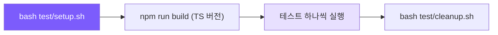

# 14. 기능 테스트 가이드

## 챕터 목표

mini-claude의 19가지 핵심 기능이 모두 올바르게 동작하는지 검증합니다. 모든 테스트는 수동 실행 + 시각적 검증 방식이며, 모두 `--yolo` 모드(권한 확인 건너뜀)를 사용합니다.



## 왜 수동 테스트가 필요한가

코딩 에이전트 테스트는 일반 소프트웨어 테스트와 다릅니다. 핵심 동작이 LLM 응답에 의존하며 출력이 비결정적입니다. 자동화된 단위 테스트는 도구 기능(파일 I/O, 권한 검사)을 커버할 수 있지만, 엔드 투 엔드 에이전트 동작은 수동으로만 관찰할 수 있습니다.

- 모델이 올바른 도구를 선택했는가?
- 병렬 실행이 실제로 병렬인가?
- 시맨틱 메모리 리콜 타이밍이 올바른가?
- 플랜 모드 승인 워크플로우 상호작용이 원활한가?

Claude Code 자체도 유사한 전략을 사용합니다. 핵심 도구에는 단위 테스트가 있지만, 에이전트 동작은 수동 QA + 평가 스위트(eval suite)에 의존합니다.

## 준비

```bash
cd claude-code-from-scratch

# 테스트 환경 원 커맨드 설정 (MCP, 스킬, CLAUDE.md, 대용량 파일, 따옴표 테스트 파일, 커스텀 에이전트)
bash test/setup.sh

# TS 버전 빌드 (Python 버전은 빌드 불필요)
npm run build
```

`.env`에 API 키가 설정되어 있는지 확인하세요.
```
ANTHROPIC_API_KEY=sk-xxx
ANTHROPIC_BASE_URL=https://aihubmix.com   # 선택 사항
```

> **팁**: 시스템 환경에 `OPENAI_API_KEY` + `OPENAI_BASE_URL`과 `ANTHROPIC_API_KEY`가 모두 있으면
> OpenAI 호환 경로를 선호합니다. 두 경로 모두 모든 기능을 지원합니다.

## 실행 방법

**TS 버전**:
```bash
# 대화형 REPL (권장, 스킬, 플랜 모드, REPL 명령어 테스트 가능)
node dist/cli.js --yolo

# 일회성 모드
node dist/cli.js --yolo "your prompt"
```

**Python 버전**:
```bash
python -m mini_claude --yolo

# 일회성 모드
python -m mini_claude --yolo "your prompt"
```

> 아래 테스트 단계의 커맨드라인 예시는 TS 버전을 사용합니다. Python 버전은 `node dist/cli.js`를 `python -m mini_claude`로 교체하세요. 기능은 동일합니다.

---

## 1단계: 기본 도구 (테스트 1-3)

### 1. MCP 도구 호출

**테스트 목표**: MCP 서버 연결 + 도구 발견 + 투명한 라우팅 검증.

**예상**: 시작 시 `[mcp] Connected to 'test' — 3 tools` 표시

```
Use the MCP 'add' tool to compute 17+25, then use the 'echo' tool to echo "hello MCP", then use the 'timestamp' tool.
```

통과 기준:
- add가 `42` 반환
- echo가 `hello MCP` 반환
- timestamp가 Unix 타임스탬프 반환
- 도구 이름에 `mcp__test__` 프리픽스가 있음

**설계 의도**: MCP는 에이전트 기능을 확장하는 핵심 메커니즘입니다. 3세그먼트 명명 `mcp__server__tool`은 이름 충돌 방지와 라우팅을 동시에 해결합니다. 이름만으로 어느 서버로 전달할지 알 수 있습니다.

---

### 2. WebFetch

**테스트 목표**: HTTP 가져오기 + HTML 정리 검증.

```
Fetch the URL https://httpbin.org/json and tell me the slideshow title.
```

통과 기준: `Sample Slide Show` 반환

```
Fetch https://example.com and tell me what the page is about.
```

통과 기준: HTML에서 변환된 일반 텍스트 내용 반환

---

### 3. 병렬 도구 실행

**테스트 목표**: 동시성 안전 도구가 동시에(직렬이 아닌) 실행될 수 있는지 검증.

```
Read the files src/frontmatter.ts, src/session.ts, and src/skills.ts at the same time, then tell me each file's line count.
```

Python 버전 대안 — Python 파일 읽기:
```
Read the files python/mini_claude/frontmatter.py and python/mini_claude/session.py at the same time, then tell me each file's line count.
```

통과 기준: 여러 `read_file` 호출이 동시에 나타남(하나씩이 아님)

**설계 의도**: `CONCURRENCY_SAFE_TOOLS` (read_file, list_files, grep_search, web_fetch)는 병렬 실행 가능으로 표시됩니다. 에이전트는 모델이 생성을 마치기를 기다리지 않고 스트리밍 출력 단계에서 이러한 도구를 실행하기 시작합니다.

---

## 2단계: 메모리 및 컨텍스트 (테스트 4-7)

### 4. 시맨틱 메모리 리콜

**테스트 목표**: 새 대화에서 메모리 저장 -> 시맨틱 리콜 검증 (비동기 프리페치 메커니즘).

**1단계: 메모리 저장**
```
Save these memories for me:
1. type=project, name="API migration", description="Moving from REST to GraphQL", content="We are migrating our API from REST to GraphQL. Deadline is end of Q2 2025."
2. type=feedback, name="code style", description="Prefers functional programming", content="User prefers functional patterns (map/filter/reduce) over for loops and OOP."
3. type=reference, name="staging server", description="Staging environment URL", content="Staging server: https://staging.example.com, credentials in 1Password."
```

통과 기준: 세 개의 메모리 파일이 작성됨

**2단계: 종료 후 새 대화 시작**, 그런 다음 도구 호출을 트리거하는 쿼리 입력:

> **작동 방식**: 시맨틱 리콜은 비동기 프리페치를 사용합니다 (Claude Code 동작과 일치, 대기 없는 비블로킹 방식).
> 프리페치는 사용자 메시지가 전송될 때 시작되며 완료까지 몇 초가 걸립니다. 모델이 도구를 호출하지 않고
> 바로 텍스트로 응답하면 루프가 한 번만 실행되어 프리페치가 소비되기 전에 완료됩니다.
> 따라서 테스트 쿼리는 프리페치가 두 번째 반복에 주입될 충분한 시간을 주기 위해 도구 호출을 트리거해야 합니다.

```
Read the file tsconfig.json, then tell me: where can I deploy to test my changes?
```
통과 기준: staging server 메모리를 리콜하여 `https://staging.example.com` 응답

```
List the files in the src/ directory, then tell me: what's the deadline for the backend rewrite?
```
통과 기준: API migration 메모리를 리콜하여 `end of Q2 2025` 응답

```
Read package.json, then tell me: how should I write code for this project?
```
통과 기준: code style 메모리를 리콜하여 함수형 프로그래밍 언급

---

### 5. @include 지시어 + Rules 자동 로딩

**테스트 목표**: CLAUDE.md의 `@path` include 지시어와 `.claude/rules/` 자동 로딩 검증.

setup.sh가 이미 다음을 생성했습니다:
- `CLAUDE.md`가 `@./.claude/rules/chinese-greeting.md` 포함
- 규칙 내용: `When the user greets you, respond in Chinese`

```
Hello! Who are you?
```

통과 기준: 모델이 **중국어**로 응답 (규칙이 중국어 인사를 요구하기 때문)

**설계 의도**: `@include` 메커니즘은 세 가지 형식을 지원합니다. `@./relative-path`, `@~/home-path`, `@/absolute-path`. 순환 참조 감지와 최대 깊이 제한(5단계)이 있습니다. rules 디렉토리의 모든 `.md` 파일은 알파벳 순으로 정렬되어 시스템 프롬프트에 연결됩니다.

---

### 6. 수정 전 읽기 보호

**테스트 목표**: 읽지 않은 파일 수정 시 안전 검사 검증.

```
Edit the file package.json and change the version to "9.9.9". Do NOT read it first.
```

통과 기준 (둘 중 하나):
- **최선**: 도구 계층에서 직접 `Error: You must read this file before editing` 반환
- **허용**: 모델이 시스템 프롬프트에 따라 수정 전 자동으로 읽기

테스트 후 복원:
```
Now change it back to "1.0.0".
```

---

### 7. 대용량 결과 영속성

**테스트 목표**: 과도하게 큰 도구 결과가 디스크에 작성 + 미리보기 잘림 검증.

```
Read the file test/large-file.txt
```

통과 기준 (출력 포함):
- `[Result too large (XX.X KB, 1000 lines). Full output saved to ...]`
- `Preview (first 200 lines):`
- 처음 200줄의 미리보기만 표시

이어서 다음 질문:
```
What does line 500 say?
```

통과 기준: 모델이 grep_search 또는 read_file을 사용하여 원본 파일에서 500번째 라인 내용 찾기

**설계 의도**: 30KB를 초과하는 도구 결과는 `~/.mini-claude/tool-results/`에 작성됩니다. 대화에는 미리보기만 유지됩니다. 이는 단일 대용량 파일이 전체 컨텍스트 창을 폭파시키는 것을 방지합니다. Claude Code의 `LargeResultPersistence` 로직과 일치합니다.

---

## 3단계: 스킬 및 도구 확장 (테스트 8-10)

### 8. 스킬 호출

**테스트 목표**: 스킬 발견, 인라인 호출, 슬래시 명령어 검증.

```
/skills
```
통과 기준: greet과 commit 스킬 목록 표시

```
/greet Alice
```
통과 기준: 모델이 Alice를 위한 개인화된 인사말 생성

```
/commit
```
통과 기준: 모델이 git diff/status를 실행한 후 커밋 생성 시도

---

### 9. ToolSearch / 지연 로딩 도구

**테스트 목표**: 지연 도구 메커니즘 검증 — 플랜 모드 도구는 처음에 스키마를 전송하지 않고 검색 후에만 활성화됩니다.

```
Use tool_search to find the "plan mode" tool.
```

통과 기준:
- 모델이 `tool_search` 호출
- `enter_plan_mode` 및/또는 `exit_plan_mode`의 전체 스키마 반환
- 이 도구들은 이전에 도구 목록에 없었고 검색 후에만 활성화됨

**설계 의도**: 지연 도구는 각 API 호출과 함께 전송되는 도구 스키마의 크기를 줄입니다. Claude Code에는 60개 이상의 도구가 있지만 대부분의 시나리오에서 5-6개만 사용합니다. 모든 스키마를 전송하면 토큰이 낭비됩니다. 지연 로딩은 필요 시 활성화됩니다.

---

### 10. REPL 명령어

```
/cost
```
통과 기준: 토큰 사용량과 비용 표시

```
/memory
```
통과 기준: 저장된 메모리 목록 표시

```
/compact
```
통과 기준: 수동으로 대화 압축 트리거

```
/plan
```
통과 기준: 플랜 모드로 전환 (다시 입력하면 되돌아옴)

---

## 4단계: 에이전트 아키텍처 (테스트 11-12)

### 11. 서브 에이전트 시스템 (Agent 도구)

**테스트 목표**: 세 가지 내장 에이전트 타입의 격리 실행과 도구 제한 검증.

**explore 에이전트** (읽기 전용 검색):
```
Use the agent tool with type "explore" to find all files that import from "./memory.js" in the src/ directory.
```

통과 기준:
- 출력에 `[sub-agent:explore]` 마커 표시
- `memory.js`를 참조하는 파일 목록 반환
- read_file / list_files / grep_search만 사용

**plan 에이전트** (구조적 계획 수립):
```
Use the agent tool with type "plan" to design a plan for adding a "help" REPL command. Identify which files need modification.
```

통과 기준: 출력에 `[sub-agent:plan]` 마커 표시, 구조적인 수정 계획 반환

**general 에이전트** (전체 도구):
```
Use the agent tool with type "general" to create a file called /tmp/mini-claude-agent-test.txt with the content "agent test passed", then read it back.
```

통과 기준:
- 출력에 `[sub-agent:general]` 마커 표시
- 파일 생성 및 읽기 성공
- 서브 에이전트 토큰 소비가 메인 에이전트에 합산됨 (`/cost`에서 확인 가능)

**설계 의도**: 서브 에이전트는 Claude Code의 "분할 정복" 전략입니다. 대규모 작업을 서브 에이전트로 분할하여 각 서브 에이전트가 격리된 컨텍스트로 메인 대화를 오염시키지 않습니다. explore 에이전트는 우발적인 수정을 방지하기 위해 읽기 전용 도구로 제한됩니다. general 에이전트는 무한 재귀를 방지하기 위해 agent 도구를 제외합니다.

---

### 12. 플랜 모드 (수동 진입)

**테스트 목표**: `/plan` 토글 + 읽기 전용 제한 + 플랜 파일 작성 + 승인 워크플로우 검증.

**1단계: 플랜 모드 진입**
```
/plan
```
통과 기준: 플랜 모드 활성화 표시

**2단계: 읽기 전용 제한 테스트**
```
Read package.json, then create a plan for changing the project name. Write your plan to the plan file.
```

통과 기준:
- 모델이 package.json을 읽을 수 있음 (읽기 도구는 항상 허용)
- 모델이 플랜 파일에 작성 (수정 가능한 유일한 파일)
- 다른 파일 수정 시도 시 거부됨: `Blocked in plan mode`

**3단계: 승인 워크플로우**

모델이 `exit_plan_mode`를 호출하면 4가지 옵션이 나타납니다:
1. `4` (keep-planning)를 선택하고 피드백 입력: "Also add a step for updating README"
2. 모델이 계획을 수정하고 exit_plan_mode를 다시 호출하면 `1` (clear-and-execute) 선택

통과 기준: 1 선택 후 컨텍스트가 초기화되고 모드가 실행으로 전환됨

**4단계: 플랜 모드 종료**
```
/plan
```
통과 기준: 일반 모드로 전환

**설계 의도**: 플랜 모드는 Claude Code의 "행동 전 생각" 메커니즘입니다. 읽기 전용 + 플랜 파일 작성으로 제한하면 계획 단계에서 모델이 코드를 변경하는 것을 방지합니다. 4가지 옵션 승인은 사용자가 실행 방법을 제어할 수 있게 합니다. 컨텍스트를 유지하고 실행(2)하거나, 컨텍스트를 초기화하고 실행(1)하여 계획 내용 자체가 토큰 예산을 소비하는 것을 피할 수 있습니다.

---

## 5단계: 수정 및 검색 (테스트 13, 17-18)

### 13. 수정 시 따옴표 정규화

**테스트 목표**: edit_file의 곱슬 따옴표 -> 직선 따옴표 폴백 매칭 검증.

```
Read the file test/quote-test.js
```

그런 다음 곱슬 따옴표를 사용하여 수정 요청:
```
Use edit_file on test/quote-test.js. In the old_string, use curly double quotes (Unicode U+201C and U+201D) around "Hello World". Replace with straight quotes saying "Hi Universe".
```

통과 기준:
- 수정 성공, 출력에 `(matched via quote normalization)` 포함
- 파일 내용이 `"Hello World"`에서 `"Hi Universe"`로 변경

테스트 후 복원:
```
Edit test/quote-test.js, replace "Hi Universe" with "Hello World"
```

**설계 의도**: LLM 출력과 문서에서 복사된 텍스트에는 종종 유니코드 곱슬 따옴표(`""`, `''`)가 포함됩니다. Claude Code의 `normalizeQuotes` 함수는 먼저 정확한 매칭을 시도하고, 실패하면 양쪽을 직선 따옴표로 정규화합니다. 이는 흔한 "대체할 내용을 찾을 수 없음" 오류를 방지합니다.

---

### 17. Grep Search 도구

**테스트 목표**: 정규식 검색 + 파일 포함 필터링 검증.

```
Use grep_search to find all lines containing "import.*chalk" in the src/ directory
```

통과 기준: `src/agent.ts` 및/또는 `src/ui.ts`에서 매칭 라인을 `filepath:line_number:matched_content` 형식으로 반환

```
Use grep_search to find the pattern "export function" in all .ts files under src/
```

통과 기준: `include: "*.ts"` 필터를 사용하고, 모든 익스포트된 함수의 위치를 반환

```
Use grep_search to find "DANGEROUS_PATTERNS" in the project
```

통과 기준: `src/tools.ts`의 정의 위치 반환

---

### 18. Write File (새 파일 + 자동 디렉토리 생성)

**테스트 목표**: 파일 생성, 자동 디렉토리 생성, 내용 미리보기 잘림 검증.

```
Create a new file at test/tmp/nested/hello.txt with the content:
Line 1: Hello from Mini Claude
Line 2: This is a write test
Line 3: End of file
```

통과 기준:
- 디렉토리 `test/tmp/nested/`가 자동으로 생성됨
- 라인 번호 미리보기와 함께 `Successfully wrote to test/tmp/nested/hello.txt (3 lines)` 반환

```
Read the file test/tmp/nested/hello.txt to verify.
```
통과 기준: 내용이 완전함

긴 파일 미리보기 잘림 테스트:
```
Create a file test/tmp/long-file.txt with 50 numbered lines like "Line 1: test data", etc.
```

통과 기준: 미리보기가 처음 30줄만 표시하고 끝에 `... (50 lines total)` 표시

---

## 6단계: 세션 및 CLI (테스트 14-16)

### 14. 세션 재개 (--resume)

**테스트 목표**: 세션 저장과 크로스 프로세스 복원 검증.

**첫 번째 세션**:
```bash
node dist/cli.js --yolo          # TS 버전
python -m mini_claude --yolo     # Python 버전
```
```
Remember this: The secret code is BANANA-42. Read package.json and tell me the version.
```
그런 다음 `exit`로 종료.

**두 번째 세션 (재개)**:
```bash
node dist/cli.js --yolo --resume          # TS 버전
python -m mini_claude --yolo --resume     # Python 버전
```

통과 기준: 시작 시 세션 복원 정보 표시

```
What was the secret code I told you earlier?
```

통과 기준: 모델이 `BANANA-42` 응답

**비교 (새 세션)**:
```bash
node dist/cli.js --yolo          # TS 버전
python -m mini_claude --yolo     # Python 버전
```
```
What was the secret code I told you earlier?
```
통과 기준: 모델이 응답 불가

**설계 의도**: 세션은 `~/.mini-claude/sessions/`에 JSON 형식으로 저장됩니다. Anthropic과 OpenAI 메시지 히스토리 모두 포함합니다(두 백엔드의 메시지 형식이 다르기 때문). `--resume`은 자동으로 가장 최근 세션을 찾아 대화를 이어갑니다.

---

### 15. 일회성 모드

**테스트 목표**: 프롬프트 인수가 전달될 때 자동으로 실행되고 종료되는지 검증.

```bash
# TS 버전
node dist/cli.js --yolo "Read the file package.json and tell me the project name. Only output the name."
# Python 버전
python -m mini_claude --yolo "Read the file package.json and tell me the project name. Only output the name."
```

통과 기준:
- 모델이 read_file을 호출하고 프로젝트 이름을 출력
- 프로그램이 **자동으로 종료** (셸 프롬프트로 돌아옴)

```bash
node dist/cli.js --yolo "List all TypeScript files in the src/ directory"
```

통과 기준: .ts 파일 목록을 출력하고 자동 종료

오류 시나리오:
```bash
node dist/cli.js --yolo "Read the file /nonexistent/path/file.txt"
```
통과 기준: 도구가 오류 메시지를 반환하지만 프로그램이 충돌하지 않고 정상 종료

---

### 16. 예산 제어 (--max-turns)

**테스트 목표**: 에이전트 루프 반복 제한 검증.

```bash
# TS 버전
node dist/cli.js --yolo --max-turns 2 "Read these files one by one: package.json, tsconfig.json, src/cli.ts, src/agent.ts, src/tools.ts. Tell me the line count of each."
# Python 버전
python -m mini_claude --yolo --max-turns 2 "Read these files one by one: package.json, tsconfig.json, src/cli.ts, src/agent.ts, src/tools.ts. Tell me the line count of each."
```

통과 기준:
- 모델이 파일 읽기를 시작하지만 2번의 에이전트 턴 후 중지
- 출력에 예산 초과 메시지 포함
- 5개 파일을 **모두** 읽지 않음

**설계 의도**: 예산 제어에는 두 가지 차원이 있습니다. `--max-cost` (USD 제한)와 `--max-turns` (루프 반복 제한). 각 에이전트 루프(하나의 API 호출 + 도구 실행)가 하나의 턴으로 계산됩니다. 제한을 초과하면 모델에게 "예산 초과"가 알려지고 중지됩니다. 에이전트가 무한 루프에 빠져 비용이 낭비되는 것을 방지합니다.

---

## 7단계: 확장 시스템 (테스트 19)

### 19. 커스텀 에이전트 (.claude/agents/)

**테스트 목표**: 사용자 정의 에이전트 타입이 올바르게 발견되고 사용되는지 검증.

```
What agent types are available? List them all.
```

통과 기준: 목록에 explore, plan, general과 **reviewer** 포함

```
Use the agent tool with type "reviewer" to review the file src/frontmatter.ts
```

통과 기준:
- 출력에 `[sub-agent:reviewer]` 마커 표시
- reviewer가 read_file / list_files / grep_search만 사용 (allowed-tools로 제한)
- 코드 리뷰 결과 반환

**설계 의도**: 커스텀 에이전트는 `.claude/agents/*.md` 파일로 정의되며, 프론트매터에 이름, 설명, 허용 도구를 지정합니다. 이를 통해 사용자는 소스 코드를 수정하지 않고 전문화된 에이전트(코드 리뷰, 문서 생성, 테스트 작성 등)를 생성할 수 있습니다. Claude Code도 마찬가지로 사용자 수준(`~/.claude/agents/`)과 프로젝트 수준(`.claude/agents/`) 두 계층 덮어쓰기를 지원합니다.

---

## 테스트 완료

```bash
bash test/cleanup.sh
```

테스트로 생성된 모든 파일(MCP 설정, 스킬, 규칙, 메모리 파일, 커스텀 에이전트, 임시 파일 등)을 정리합니다.

---

## 빠른 참조 표

| # | 기능 | 카테고리 | TS 통과 | PY 통과 | 메모 |
|---|-----|---------|:-------:|:-------:|------|
| 1 | MCP 도구 호출 | 기본 도구 | ☐ | ☐ | 3가지 도구 |
| 2 | WebFetch | 기본 도구 | ☐ | ☐ | httpbin.org |
| 3 | 병렬 도구 실행 | 기본 도구 | ☐ | ☐ | 다중 파일 동시 읽기 |
| 4 | 시맨틱 메모리 리콜 | 메모리 & 컨텍스트 | ☐ | ☐ | 저장 -> 새 대화 -> 시맨틱 쿼리 |
| 5 | @include + Rules | 메모리 & 컨텍스트 | ☐ | ☐ | 중국어 응답 |
| 6 | 수정 전 읽기 | 메모리 & 컨텍스트 | ☐ | ☐ | 코드 계층 또는 프롬프트 계층 |
| 7 | 대용량 결과 영속성 | 메모리 & 컨텍스트 | ☐ | ☐ | 75KB 파일 |
| 8 | 스킬 호출 | 스킬 & 확장 | ☐ | ☐ | /greet /commit |
| 9 | ToolSearch | 스킬 & 확장 | ☐ | ☐ | 플랜 모드 도구 |
| 10 | REPL 명령어 | 스킬 & 확장 | ☐ | ☐ | /cost /memory /compact /plan |
| 11 | 서브 에이전트 시스템 | 에이전트 아키텍처 | ☐ | ☐ | explore/plan/general |
| 12 | 플랜 모드 | 에이전트 아키텍처 | ☐ | ☐ | /plan 수동 진입 + 승인 |
| 13 | 따옴표 정규화 | 수정 & 검색 | ☐ | ☐ | 곱슬 -> 직선 따옴표 |
| 14 | 세션 재개 | 세션 & CLI | ☐ | ☐ | --resume 세션 복원 |
| 15 | 일회성 모드 | 세션 & CLI | ☐ | ☐ | 프롬프트 전달, 자동 종료 |
| 16 | 예산 제어 | 세션 & CLI | ☐ | ☐ | --max-turns 제한 |
| 17 | Grep Search | 수정 & 검색 | ☐ | ☐ | 정규식 검색 + include |
| 18 | Write File | 수정 & 검색 | ☐ | ☐ | 새 파일 + 자동 디렉토리 생성 |
| 19 | 커스텀 에이전트 | 확장 시스템 | ☐ | ☐ | .claude/agents/ 정의 |
